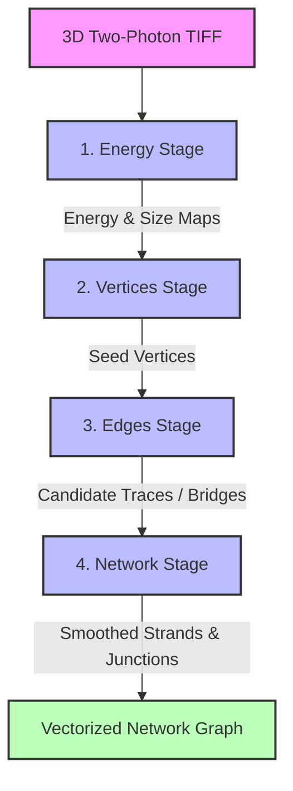
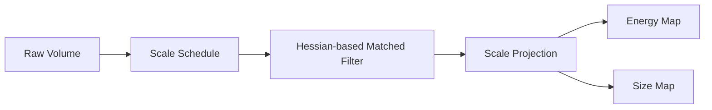
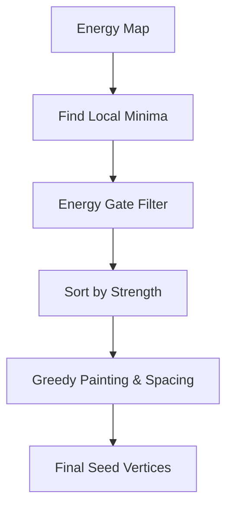
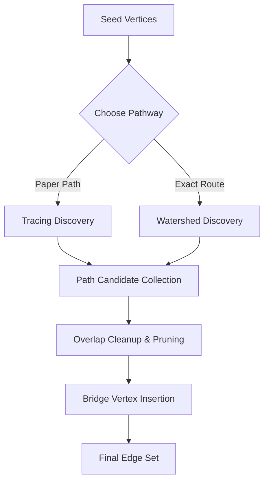

# How the SLAVV Method Works

Original method from Mihelic et al. (2021): how a 3D two-photon volume becomes a network of vessel centerlines.

**Paper:** Mihelic SA, Sikora WA, Hassan AM, Williamson MR, Jones TA, Dunn AK. *Segmentation-Less, Automated, Vascular Vectorization.* PLOS Computational Biology 17(10): e1009451 (2021).  
**DOI:** [10.1371/journal.pcbi.1009451](https://doi.org/10.1371/journal.pcbi.1009451) · **PDF:** [docs/reference/papers/journal.pcbi.1009451.pdf](docs/reference/papers/journal.pcbi.1009451.pdf)

---

## 🌟 Executive Summary

Unlike traditional vascular tracing pipelines that segment the image first (building a binary mask) and then skeletonize, SLAVV (Segmentation-Less, Automated, Vascular Vectorization) works directly on a continuous **energy field**. By bypassing the segmentation stage, it prevents discretization errors, maintains caliber-adaptive robustness, and handles noisy two-photon microscopy data without requiring machine learning classifiers.

The pipeline processes a 3D raw image stack and extracts a vectorized graph containing centerline positions, local vessel radii, and structural connectivity. It consists of four consecutive stages:



---

## 🧭 The Four Pipeline Stages

### 1. Energy Computation

The raw volume is processed using multi-scale matched filters to produce two 3D fields: an **energy map** (representing the likelihood of a voxel being a vessel center) and a **size map** (representing the estimated radius).



#### Mathematical Foundation
Vessels are modeled at different radii $r$ matching a scale ladder. The matched filter kernel balances two idealized models depending on the labeling method:
1.  **Solid/Lumen Model** ($K_S$): For plasma dye labeling (entire vessel lumen is bright).
    $$K_S(\rho) = \mathbf{1}_{\{\rho < r\}}$$
2.  **Annular/Wall Model** ($K_A$): For endothelial labeling (vessel walls are bright).
    $$K_A(\rho) = \delta(\rho - r)$$

Where $\rho$ is the radial distance from the kernel center, $\mathbf{1}$ is the indicator function, and $\delta$ is the Dirac delta function.

These kernels are convolved with a Gaussian blur kernel of width $\sigma$ to provide noise tolerance. The effective radius $R$ and the Gaussian weight factor $f_G$ are defined as:
$$R^2 = \sigma^2 + r^2$$
$$f_G = \frac{\sigma}{\sigma + r}$$

At each scale, the 3D Hessian matrix is diagonalized. Locations with strong negative principal curvatures (corresponding to tube-like structures) receive a negative energy score, representing strong vessel evidence.

#### Scale Projection Profiles
The 4D stack (space × scale) is collapsed into 3D using one of two projection profiles:
*   **MATLAB Projection (`matlab`)**: Minimum-energy projection across the scale dimension. The scale index with the most negative energy becomes the estimated size.
*   **Paper Projection (`paper`)**: Blends annular scale estimates and magnitude-weighted spherical scale estimates using the parameter `spherical_to_annular_ratio` to produce a smoother size estimation.

#### Implementation Architecture
*   **Facade:** [`EnergyManager`](file:///d:/2P_Data/Aaron/slavv2python/slavv_python/pipeline/energy/manager.py)
*   **Hessian Filters:** [`energy.py`](file:///d:/2P_Data/Aaron/slavv2python/slavv_python/pipeline/energy/energy.py)
*   **Key Parameters:** `radius_of_smallest_vessel_in_microns`, `radius_of_largest_vessel_in_microns`, `scales_per_octave`, `gaussian_to_ideal_ratio`, `spherical_to_annular_ratio`, `energy_projection_mode`.

> [!TIP]
> **Memory Optimization**: To prevent Out-Of-Memory (OOM) errors on large volumes, the Python engine utilizes **tiled processing** and **incremental octave-chunked scale evaluation**, avoiding storing large 4D intermediate buffers in memory.

---

### 2. Vertex Extraction (Seed Detection)

Continuous fields must be converted into discrete points (seeds) to begin building the graph.



#### Algorithm (Greedy Painting)
1.  **Candidate Identification**: Locate all spatial local minima in the 3D energy map.
2.  **Gating**: Filter out candidates whose energy is above the threshold (defaulting to `0`).
3.  **Sorting**: Sort the remaining candidates by energy strength (most negative first).
4.  **Greedy Selection**: For each candidate (starting with the strongest):
    *   Check a spherical region around the candidate, scaled by its estimated radius and multiplied by a `seed_spacing_factor`.
    *   If any voxel in this region has already been claimed (painted) by a stronger vertex, the candidate is discarded.
    *   Otherwise, the vertex is accepted, and its region is painted to block weaker candidates.

This ensures that vertices are placed at high-contrast vessel centers while preventing redundant, overlapping seeds on the same vessel segment.

#### Implementation Architecture
*   **Facade:** [`VertexManager`](file:///d:/2P_Data/Aaron/slavv2python/slavv_python/pipeline/vertices/manager.py)
*   **Candidate & Paint Logic:** [`detection.py`](file:///d:/2P_Data/Aaron/slavv2python/slavv_python/pipeline/vertices/detection.py) and [`painting.py`](file:///d:/2P_Data/Aaron/slavv2python/slavv_python/pipeline/vertices/painting.py)
*   **Key Parameters:** `vertex_energy_threshold`, `seed_spacing_factor`.

---

### 3. Edge Discovery

Edges represent the centerlines connecting the vertices. SLAVV traces pathways along low-energy corridors (valleys) between seeds.



#### The Two Tracing Strategies
1.  **Tracing Discovery (`TracingDiscovery`)**: A localized walk from each origin seed, propagating through low-energy neighbors and moving away from the starting point.
2.  **Watershed Discovery (`WatershedDiscovery`)**: A global watershed partition. Catchment basins (influence zones) grow outward from all seed vertices across the energy field. A sorted frontier manages the expansion. When two distinct basins meet, a collision is registered, defining a candidate edge.

#### Path Evaluation & Scoring
The score of a path is defined by its worst-case (maximum) energy value along the trace:
$$\text{score}(\text{path}) = \max_{x \in \text{path}} E(x)$$

Paths that stay entirely within low-energy vessel valleys are prioritized. If a path contains a high-energy step, it indicates the trace has strayed outside the vessel, leading to rejection.

#### Core Parity Primitives (Watershed Discovery)
To match the MATLAB global watershed exactly, the algorithm uses:
*   **Two-Tier Penalty System**: A static penalty is applied during strel LUT expansion (considering size, absolute distance, and direction), and an iterative directional suppression is applied within the seed loop.
*   **Stable Frontier Order**: Uses `SortedFrontier` (a stable sorted array insert/pop) rather than a binary heap to maintain bit-perfect tie-breaking.
*   **Grid Realignment**: Realigns the physical volume from `[Z, Y, X]` to `[Y, X, Z]` with Fortran (`order="F"`) contiguity to match MATLAB's column-major indexing priority.

#### Implementation Architecture
*   **Facade:** [`EdgeManager`](file:///d:/2P_Data/Aaron/slavv2python/slavv_python/pipeline/edges/manager.py)
*   **Strategy Selection:** [`discovery.py`](file:///d:/2P_Data/Aaron/slavv2python/slavv_python/pipeline/edges/discovery.py)
*   **Watershed Port:** [`matlab_get_edges_by_watershed.py`](file:///d:/2P_Data/Aaron/slavv2python/slavv_python/pipeline/edges/matlab_get_edges_by_watershed.py)
*   **Key Parameters:** `max_edge_length_per_origin_radius`, `number_of_edges_per_vertex`.

---

### 4. Network Assembly & Smoothing

This stage converts the set of individual edge traces into a cohesive graph topology.


#### Topology Definition
The final network graph consists of three topological elements based on voxel degree:
*   **Endpoints (Tips)**: Vertices with degree 1.
*   **Waypoints**: Vertices with degree 2 (internal trace points).
*   **Junctions (Bifurcations)**: Vertices with degree $\ge 3$.
*   **Strands**: A maximal path of connected edges starting and ending at a junction or endpoint, passing only through degree-2 waypoints.

#### Pruning and Smoothing
1.  **Pruning**: Small loops (cycles), dangling dead-ends (hair), and orphan segments are removed based on length and caliber constraints.
2.  **Smoothing**: Stair-stepped voxel paths are smoothed using a 1D Gaussian kernel along the strand. Higher-energy voxels (weaker signals) are weighted less than low-energy voxels (stronger centerline signals), aligning the smoothed line with the physical vessel core. True junctions and endpoints are held fixed to preserve connectivity.

#### Implementation Architecture
*   **Facade:** [`NetworkManager`](file:///d:/2P_Data/Aaron/slavv2python/slavv_python/pipeline/network/manager.py)
*   **Key Parameters:** `sigma_strand_smoothing`, `minimum_strand_length_in_microns`.

---

## ⚙️ The Running Pathways

The repository supports two major running pathways configured via execution profiles:

| Feature | Paper Path (`paper` profile) | Exact Route (`matlab_compat` / `exact`) |
| :--- | :--- | :--- |
| **Edge Strategy** | Tracing Discovery (`TracingDiscovery`) | Watershed Discovery (`WatershedDiscovery`) |
| **Scale Projection** | Annular/Spherical Blend (`paper`) | Minimum Energy (`matlab`) |
| **Grid Orientation** | Standard `[Z, Y, X]` (C-order) | Realigned `[Y, X, Z]` (F-order) |
| **Numeric Precision** | `float32` throughout | `float64` compute (persisted as `float32`) |
| **Primary Goal** | High-throughput, low-memory scale | Bit-perfect parity with MATLAB vectorization |

---

## 🔍 Parity and Verification

To ensure Python outputs perfectly match MATLAB results, developers utilize the **Exact Proof Coordinator**:

```powershell
slavv parity prove-exact --stage edges
```

### Key Parity Rules
*   **Lowest Linear Index Priority**: When energies are equal, the tie-breaking rule selects the voxel with the lowest Fortran-order linear index.
*   **Contiguity Protection**: All spatial maps must be kept in Fortran-contiguous memory (`np.asfortranarray`). Standard operations that return C-contiguous arrays (like `np.clip` or copies) must be explicitly cast back.
*   **Numeric Certification**: Energy and Vertices must achieve strict discrete equality and $np.allclose$ on floats ([ADR 0011](docs/adr/0011-energy-float-certification-policy.md)). Edges and Network must pass the spatial multiset comparison bars defined in [ADR 0012](docs/adr/0012-edge-watershed-parity-bar.md).

---

## 📊 Performance and Accuracy Benchmarks

As documented in the original PLOS Computational Biology paper:
*   **Accuracy:** On synthetic datasets evaluated across a sweep of contrast-to-noise ratios (CNR), voxel-level classification accuracy peaked above **97%**. The bulk geometry reconstructed by SLAVV was significantly more robust at low CNR than standard intensity thresholding techniques.
*   **Scale:** Validated on real in-vivo mouse brain volumes containing up to **$1.6 \times 10^8$ voxels**.
*   **Plausibility:** Extracted network statistics (such as length density $\sim 0.6\text{ m/mm}^3$ and volume fraction $\sim 6\%$) fell consistently within verified physiological literature ranges.
*   **Runtime:** The original MATLAB implementation clocked between **140–360 seconds** on a 10-core Xeon CPU of that era, scaling roughly linearly with volume.

---

## 📖 Glossary

| Term | Definition |
| :--- | :--- |
| **Energy** | Pre-processed image volume (vesselness/Hessian map) where more negative values indicate stronger evidence of a vessel center. |
| **Scale / Octave** | Size schedule where each octave represents a doubling of vessel volume. |
| **Vertex / Seed** | Discrete vessel point located at a local energy minimum. |
| **Bridge Vertex** | Structural junction inserted during the edge selection phase to maintain topological connectivity. |
| **Edge** | Centerline trace connecting two vertices. |
| **Strand** | Vessel segment between bifurcations or endpoints, composed of one or more edges. |
| **Bifurcation** | Branch point where degree is $\ge 3$. |
| **PSF** | Point-spread function (microscope depth blur correction). |
| **Vectorization** | Process of converting raw image voxels into a mathematical graph (points and lines). |

---

## 🔗 Related Documentation & Links

*   **Quickstart Guide:** [README.md](README.md)
*   **Tutorial:** [docs/TUTORIAL.md](docs/TUTORIAL.md)
*   **Domain Glossary:** [docs/reference/core/GLOSSARY.md](docs/reference/core/GLOSSARY.md) and [AGENTS.md](file:///d:/2P_Data/Aaron/slavv2python/AGENTS.md#domain-glossary)
*   **Technical Architecture:** [docs/reference/core/TECHNICAL_ARCHITECTURE.md](docs/reference/core/TECHNICAL_ARCHITECTURE.md)
*   **Watershed Implementation Details:** [docs/reference/core/WATERSHED_IMPLEMENTATION_NOTES.md](docs/reference/core/WATERSHED_IMPLEMENTATION_NOTES.md)
*   **Energy Methods Reference:** [docs/reference/core/ENERGY_METHODS.md](docs/reference/core/ENERGY_METHODS.md)
*   **MATLAB Source Reference:** [external/Vectorization-Public/README.md](external/Vectorization-Public/README.md)
