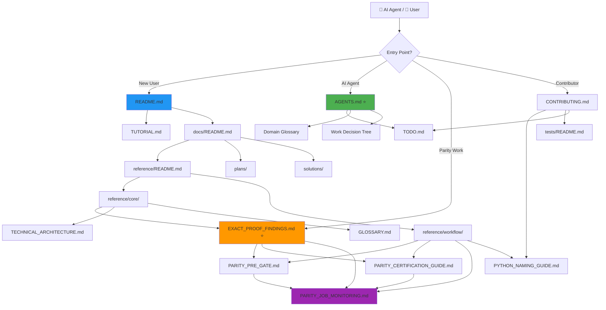

# Documentation Map

[Up: Documentation Index](README.md)

Visual guide to how all documentation files in the slavv2python repository relate to each other.

---

## 🎨 Visual Overview



---

## 📋 Hierarchy & Relationships

```
Repository Root
├── README.md ← Project overview, quick start
├── AGENTS.md ⭐ ← AI agent instructions (auto-loaded into context)
│   └── Domain Glossary → canonical source → reference/core/GLOSSARY.md (supplementary)
│
├── docs/
│   ├── README.md ← Documentation index (navigation hub)
│   ├── DOCUMENTATION_MAP.md ← This file (visual structure)
│   ├── DOCUMENTATION_AUDIT.md ← Audit findings and improvement plan
│   ├── TODO.md ← Active tasks ONLY (no status, no specs)
│   ├── TUTORIAL.md ← New user onboarding
│   ├── CONTRIBUTING.md ← Contributor workflow
│   ├── CHANGELOG.md ← Version history
│   │
│   ├── reference/ ← Maintained technical docs
│   │   ├── README.md ← Reference index
│   │   │
│   │   ├── core/ ← Core concepts & live status
│   │   │   ├── EXACT_PROOF_FINDINGS.md ⭐ ← Live parity status (active runs, blockers)
│   │   │   ├── GLOSSARY.md ← Domain terminology (supplementary to AGENTS.md)
│   │   │   ├── TECHNICAL_ARCHITECTURE.md ← System design
│   │   │   ├── MATLAB_METHOD_IMPLEMENTATION_PLAN.md ← Parity boundaries
│   │   │   ├── MATLAB_PARITY_MAPPING.md ← Function mappings
│   │   │   ├── ENERGY_METHODS.md ← Energy computation backends
│   │   │   └── WATERSHED_IMPLEMENTATION_NOTES.md ← Discovery algorithm
│   │   │
│   │   ├── workflow/ ← Operator guides
│   │   │   ├── PARITY_PRE_GATE.md ← Three-tier parity testing
│   │   │   ├── PARITY_CERTIFICATION_GUIDE.md ← Full certification
│   │   │   ├── PARITY_JOB_MONITORING.md ← Automated job tracking
│   │   │   ├── PYTHON_NAMING_GUIDE.md ← Code conventions
│   │   │   ├── PAPER_PROFILE.md ← Public workflow
│   │   │   ├── PERFORMANCE_BENCHMARKING_GUIDE.md ← Performance testing
│   │   │   ├── PRODUCTION_RELEASE_GUIDE.md ← Release process
│   │   │   └── ADDING_EXTRACTION_ALGORITHMS.md ← Contributor guide
│   │   │
│   │   ├── backends/ ← Specialized backends
│   │   │   ├── ZARR_ENERGY_STORAGE.md ← Zarr backend
│   │   │   └── NAPARI_CURATOR.md ← Napari integration
│   │   │
│   │   └── papers/ ← Academic references
│   │
│   ├── plans/ ← Active specs (requirements + implementation)
│   │   ├── README.md ← Plans index
│   │   └── phase-1-exact-route-spec.md ⭐ ← Phase 1 certification spec
│   │
│   ├── brainstorms/ ← Pre-spec ideas (promote to plans/ when ready)
│   ├── solutions/ ← Documented fixes and runbooks (/ce-compound)
│   ├── adr/ ← Architecture Decision Records
│   │   ├── 0001-typed-pipeline-results.md
│   │   ├── 0003-manager-lifecycle-pattern.md
│   │   ├── 0005-edge-discovery-strategy-seam.md
│   │   ├── 0006-network-manager.md
│   │   ├── 0007-vertex-manager.md
│   │   ├── 0008-exact-proof-coordinator.md
│   │   └── 0009-parity-pre-gate-tiers.md
│   │
│   └── investigations/ ← Archival deep dives (context, not current tasks)
│       └── v22-pointer-corruption/ ← Historical investigation
│
├── tests/
│   └── README.md ← Test placement rules
│
└── .kiro/
    └── specs/ ← Kiro spec files
        └── parity-job-monitoring/ ← Monitoring system spec
```

---

## 🔗 Cross-Reference Map

### Primary Entry Points

```
User Type          Entry Point                Next Steps
─────────────────  ─────────────────────────  ────────────────────────────────
New User        →  README.md               →  docs/TUTORIAL.md
                                           →  docs/reference/README.md

AI Agent        →  AGENTS.md ⭐            →  docs/TODO.md
                                           →  docs/reference/core/EXACT_PROOF_FINDINGS.md

Parity Work     →  docs/reference/core/    →  docs/reference/workflow/PARITY_PRE_GATE.md
                   EXACT_PROOF_FINDINGS.md  →  docs/reference/workflow/PARITY_CERTIFICATION_GUIDE.md
                                           →  docs/reference/workflow/PARITY_JOB_MONITORING.md

Contributor     →  docs/CONTRIBUTING.md    →  docs/reference/workflow/PYTHON_NAMING_GUIDE.md
                                           →  tests/README.md
                                           →  docs/TODO.md
```

### Parity Workflow Document Chain

```
EXACT_PROOF_FINDINGS.md (live status)
    ↓
    ├─→ PARITY_PRE_GATE.md (three-tier testing)
    │       ↓
    │       └─→ PARITY_JOB_MONITORING.md (monitoring commands)
    │
    ├─→ PARITY_CERTIFICATION_GUIDE.md (full certification)
    │       ↓
    │       └─→ PARITY_JOB_MONITORING.md (monitoring commands)
    │
    ├─→ plans/phase-1-exact-route-spec.md (requirements)
    │
    ├─→ MATLAB_METHOD_IMPLEMENTATION_PLAN.md (boundaries)
    │
    └─→ MATLAB_PARITY_MAPPING.md (function mappings)
```

### Architecture Understanding Chain

```
TECHNICAL_ARCHITECTURE.md (system design)
    ↓
    ├─→ PYTHON_NAMING_GUIDE.md (conventions)
    │
    ├─→ adr/ (design decisions)
    │   ├─→ 0001-typed-pipeline-results.md
    │   ├─→ 0003-manager-lifecycle-pattern.md
    │   └─→ 0008-exact-proof-coordinator.md
    │
    ├─→ WATERSHED_IMPLEMENTATION_NOTES.md (algorithm details)
    │
    └─→ ENERGY_METHODS.md (energy backends)
```

---

## 🎯 Navigation by Task

### "I need to fix a bug"
1. Read impacted module and tests
2. Check [PYTHON_NAMING_GUIDE.md](reference/workflow/PYTHON_NAMING_GUIDE.md)
3. Verify test placement with [tests/README.md](../tests/README.md)
4. If parity-sensitive, check [EXACT_PROOF_FINDINGS.md](reference/core/EXACT_PROOF_FINDINGS.md)

### "I need to add a feature"
1. Check [TODO.md](TODO.md) for active tasks
2. Review [ADDING_EXTRACTION_ALGORITHMS.md](reference/workflow/ADDING_EXTRACTION_ALGORITHMS.md)
3. Follow [PYTHON_NAMING_GUIDE.md](reference/workflow/PYTHON_NAMING_GUIDE.md)
4. Update [CHANGELOG.md](CHANGELOG.md) when done

### "I need to run parity tests"
1. Read [EXACT_PROOF_FINDINGS.md](reference/core/EXACT_PROOF_FINDINGS.md) first ⭐
2. Follow cold-start protocol
3. Use [PARITY_PRE_GATE.md](reference/workflow/PARITY_PRE_GATE.md) for commands
4. Monitor with `slavv jobs` (see [PARITY_JOB_MONITORING.md](reference/workflow/PARITY_JOB_MONITORING.md))

### "I don't understand a term"
1. Check [AGENTS.md § Domain Glossary](../AGENTS.md#domain-glossary) (canonical)
2. Or [GLOSSARY.md](reference/core/GLOSSARY.md) (supplementary details)

### "I need to understand the architecture"
1. Start with [TECHNICAL_ARCHITECTURE.md](reference/core/TECHNICAL_ARCHITECTURE.md)
2. Review relevant ADRs in [adr/](adr/)
3. Check [PYTHON_NAMING_GUIDE.md](reference/workflow/PYTHON_NAMING_GUIDE.md) for conventions

### "I need to debug a past issue"
1. Search [solutions/](solutions/) (compound docs with YAML frontmatter)
2. Or review [investigations/](investigations/) for historical context
3. Check [EXACT_PROOF_FINDINGS.md](reference/core/EXACT_PROOF_FINDINGS.md) for parity-specific issues

---

## 📊 Document Types & Purpose

| Type | Location | Purpose | Examples |
|------|----------|---------|----------|
| **Entry Points** | Root, docs/ | First docs users see | README.md, AGENTS.md, docs/README.md |
| **Live Status** | reference/core/ | Current state of work | EXACT_PROOF_FINDINGS.md |
| **Tasks** | docs/ | Active checkboxes | TODO.md |
| **Specs** | plans/ | Requirements + implementation | phase-1-exact-route-spec.md |
| **Guides** | reference/workflow/ | How-to documentation | PARITY_PRE_GATE.md, PYTHON_NAMING_GUIDE.md |
| **Reference** | reference/core/ | Technical details | TECHNICAL_ARCHITECTURE.md, GLOSSARY.md |
| **Decisions** | adr/ | Why we made choices | ADR 0001-0009 |
| **Solutions** | solutions/ | Documented fixes | Compound docs with YAML |
| **History** | investigations/ | Archival deep dives | v22-pointer-corruption/ |
| **Meta** | docs/ | About documentation | DOCUMENTATION_MAP.md, DOCUMENTATION_AUDIT.md |

---

## ⚠️ Common Pitfalls

### Don't Create Duplication

❌ **Wrong:** Writing parity status in both TODO.md and EXACT_PROOF_FINDINGS.md  
✅ **Right:** Tasks in TODO.md, status/blockers in EXACT_PROOF_FINDINGS.md

❌ **Wrong:** Creating separate brainstorm + spec files for same feature  
✅ **Right:** brainstorms/ only before spec exists, then promote to plans/

❌ **Wrong:** Documenting solved problem inline in multiple places  
✅ **Right:** Create one compound doc in solutions/, link from relevant places

### Use the Right Document Type

❌ **Wrong:** Putting implementation plans in investigations/  
✅ **Right:** investigations/ is for historical context only

❌ **Wrong:** Writing long-term guidance in TODO.md  
✅ **Right:** TODO.md is for active tasks with checkboxes only

❌ **Wrong:** Putting parity run status in README.md  
✅ **Right:** Live status belongs in EXACT_PROOF_FINDINGS.md

---

## 🔄 Document Lifecycle

### New Feature Development
```
Idea → brainstorms/ → plans/ (spec) → Implementation → CHANGELOG.md
                                              ↓
                                         If issues arise
                                              ↓
                                      solutions/ (compound doc)
```

### Parity Investigation
```
Issue found → investigations/ (deep dive) → Solution → solutions/ (compound)
                                                  ↓
                                    EXACT_PROOF_FINDINGS.md (status update)
```

### Architecture Changes
```
Proposal → Discussion → adr/ (decision) → Implementation → TECHNICAL_ARCHITECTURE.md update
```

---

## 📈 Metrics

### Current State
- **Total docs**: ~50 files
- **Entry points**: 4 (README.md, AGENTS.md, docs/README.md, reference/README.md)
- **Parity docs**: 6 core + supporting
- **Cross-references**: Comprehensive
- **Redundancy**: <5% (after Phase 1-2 improvements)

### Quality Indicators
✅ Clear ownership for each content type  
✅ Single source of truth for live status  
✅ Glossary sync strategy documented  
✅ Navigation time <30 seconds for common tasks  
✅ Anti-patterns documented to prevent duplication

---

**Last Updated**: 2026-06-09  
**Related**: [DOCUMENTATION_AUDIT.md](DOCUMENTATION_AUDIT.md), [README.md](README.md)
