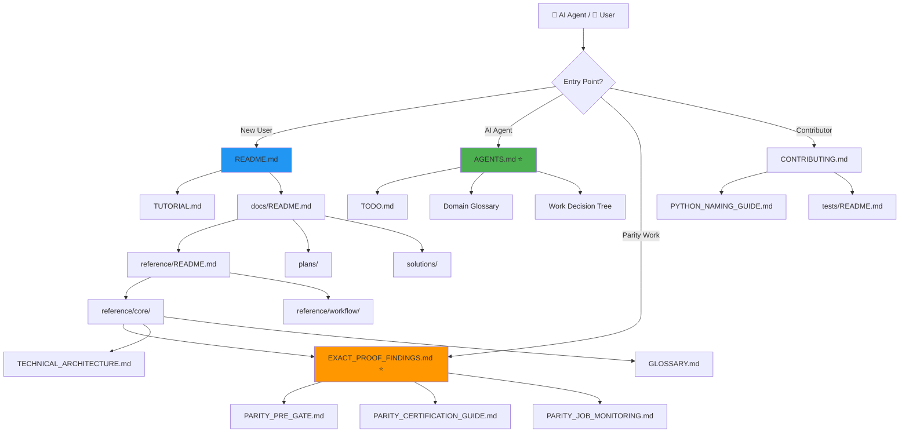

# Documentation

**Quick Navigation:** 
[🆕 New Users](#-new-to-slavv) · [🤖 AI Agents](#-ai-agents) · [🔬 Parity Work](#-parity-work) · [💻 Contributors](#-contributors) · [📚 All Docs](#-all-documentation) · [⚡ Quick Reference](QUICK_REFERENCE.md)

---

The documentation tree has several explicit owners:

- `reference/` for maintained technical guidance and live parity status
- `TODO.md` for active task checkboxes
- `plans/` for active specs
- `adr/` for architecture decisions
- `investigations/` for intentionally archival narratives that still help explain the current Python codebase

Treat `investigations/` as historical context, not as an executable spec.

---

## 🚀 Quick Start By Use Case

### 🆕 New to SLAVV
1. [Repository README](../README.md) — Project overview and installation
2. [Tutorial](TUTORIAL.md) — Your first vascular extraction
3. [Reference index](reference/README.md) — Technical documentation

### 🤖 AI Agents
1. **[AGENTS.md](../AGENTS.md)** ⭐ — **START HERE:** Canonical instructions, domain glossary, architecture guidelines
2. [Developer Dashboard (TODO.md)](TODO.md) — Active tasks and checkboxes
3. [Glossary](reference/core/GLOSSARY.md) — Extended domain terminology

### 🔬 Parity Work & Python SLAVV Facade
- **Python SLAVV facade** (high-level entry over the exact-parity stage managers): `slavv_python/pipeline/slavv_vectorize.py` — `vectorize_python(image, params)` is the Python orchestrator equivalent to `vectorize_V200.m`. It also exposes a thin `get_energy_v202_python` convenience wrapper that delegates to `EnergyManager`; the exact-parity implementations live in `pipeline/{energy,vertices,edges,network}/` and the `matlab_get_*` modules, not in that wrapper.
  - Use stage managers (`EnergyManager.run`, `VertexManager.run`, etc.) or the high-level wrapper.
  - Exact parity route available via policy + random component suite.
- **See [Parity Closure Fast Path](#-parity-closure-fast-path) below for complete workflow.**
- Random Component Parity Suite for fast building-block validation (linspace, interp3, energy samples).

### 💻 Contributors
1. [Contributing Guide](CONTRIBUTING.md) — Development workflow and PR process
2. [Test Placement Guide](../tests/README.md) — Where to put tests
3. [Python Naming Guide](reference/workflow/PYTHON_NAMING_GUIDE.md) — Code conventions
4. [Developer Dashboard (TODO.md)](TODO.md) — Active tasks

---

## 📚 All Documentation

### Core Entry Points
1. [Repository README](../README.md)
2. [Roadmap (narrative milestones)](ROADMAP.md)
3. [Developer dashboard (tasks & planning hub)](TODO.md)
4. [Tutorial](TUTORIAL.md)
5. [Agent and workflow guide](../AGENTS.md)
6. [Contributing](CONTRIBUTING.md)
7. [Changelog](CHANGELOG.md)
8. [Reference index](reference/README.md)
9. [Research syntheses](research/README.md)
10. [Investigation index](investigations/README.md)
11. [Test placement guide](../tests/README.md)
12. [Proposal / methods figures](../figures/README.md) — exact-parity standalone claim figures

---

## 🔍 Parity Closure Fast Path

**For AI agents and developers working on MATLAB parity alignment.**

### Quick Reference

1. **[.claude/HANDOFF.md](../.claude/HANDOFF.md)** ⭐ — Operator decision point + commands (re-synthesize when findings move)
2. **[Exact Proof Findings](reference/core/EXACT_PROOF_FINDINGS.md)** ⭐ — Live run status, blockers, cold-start protocol
3. **[TODO.md](TODO.md)** — Checkboxes only (ship tasks)
4. **[Parity Methodology](reference/core/PARITY_METHODOLOGY.md)** — Why the bars are tolerance-based (literature-backed; validates ADR 0011/0012)
5. **[Phase 1 Residual Experiment Analysis](reference/workflow/PHASE1_RESIDUAL_EXPERIMENT_ANALYSIS.md)** — Current hypothesis, methodology, limitations, and next steps for the Network residual
6. **[Experiment Analysis Template](reference/workflow/EXPERIMENT_ANALYSIS_TEMPLATE.md)** — Reusable structure for hypothesis-driven parity experiment notes
7. **[Phase 1 → Phase 2 Transition Spec](plans/phase-1-to-phase-2-transition-spec.md)** — Baseline-freeze and handoff rules after Network ADR 0012 is green
8. **[Unproductive Loops](reference/core/UNPRODUCTIVE_LOOPS.md)** — Anti-patterns (stale gates, probe orientation, Network misattribution)
9. **[Parity Pre-Gate](reference/workflow/PARITY_PRE_GATE.md)** — Three-tier testing (synthetic → crop → canonical)
10. **[Parity Certification Guide](reference/workflow/PARITY_CERTIFICATION_GUIDE.md)** — Full certification workflow
11. **[Parity Job Monitoring](reference/workflow/PARITY_JOB_MONITORING.md)** — `slavv jobs` commands and `--monitor` flag
12. **[Parity Run Evidence](reference/workflow/PARITY_RUN_EVIDENCE.md)** — Template for reporting writer completion vs proof pass/fail
13. **[Random Component Parity Suite](reference/workflow/PARITY_RANDOM_COMPONENT_SUITE.md)** — Fast seeded noise differential (ADR 0010); advisory Hessian ULP
14. **[Energy float certification policy](adr/0011-energy-float-certification-policy.md)** — ADR 0011: `np.allclose` continuous floats
15. **[Edge watershed parity bar](adr/0012-edge-watershed-parity-bar.md)** — ADR 0012 + post-v6 Network residual addendum
16. **[Phase 1 Spec](plans/phase-1-exact-route-spec.md)** — Certification requirements
17. **[MATLAB Parity Mapping](reference/core/MATLAB_PARITY_MAPPING.md)** — Function-to-function mappings

### Cold-Start Protocol

When resuming parity work from a fresh thread:

1. **Check active jobs:** `slavv jobs list` or read [EXACT_PROOF_FINDINGS.md § Cold-start](reference/core/EXACT_PROOF_FINDINGS.md#cold-start-protocol)
2. **Follow the protocol** in EXACT_PROOF_FINDINGS.md (check crop rerun, run proofs, etc.)
3. **Use `--monitor` flag** for long runs to get desktop notifications
4. **Keep tasks in TODO.md** — status and blockers go in EXACT_PROOF_FINDINGS.md

---

## Documentation Structure

### Map

### Quick Navigation Rules

| When you want to... | Go to... |
|---------------------|----------|
| **Start agent work** | [AGENTS.md](../AGENTS.md) → [TODO.md](TODO.md) |
| **Check parity status** | [EXACT_PROOF_FINDINGS.md](reference/core/EXACT_PROOF_FINDINGS.md) ⭐ |
| **Run parity tests** | [PARITY_PRE_GATE.md](reference/workflow/PARITY_PRE_GATE.md) |
| **Understand a term** | [AGENTS.md § Glossary](../AGENTS.md#domain-glossary) |
| **Find next task** | [TODO.md](TODO.md) |
| **Read a spec** | [plans/](plans/) directory |
| **Debug a past issue** | [solutions/](solutions/) or [investigations/](investigations/) |
| **Understand architecture** | [TECHNICAL_ARCHITECTURE.md](reference/core/TECHNICAL_ARCHITECTURE.md) |
| **Set up environment** | [../README.md](../README.md) or [AGENTS.md Setup](../AGENTS.md#setup--installation) |

### Content Ownership

| Content Type | Owner | Examples |
|--------------|-------|----------|
| Active tasks | [TODO.md](TODO.md) | `- [ ] Fix crop energy mismatch` |
| Live parity status | [EXACT_PROOF_FINDINGS.md](reference/core/EXACT_PROOF_FINDINGS.md) | Active runs, proof results, blockers |
| Specs | [plans/](plans/) | `phase-1-exact-route-spec.md` |
| Pre-spec ideas | [brainstorms/](brainstorms/) | Rough ideas (promote to plans/) |
| Solved problems | [solutions/](solutions/) | Compound docs with YAML frontmatter |
| Design decisions | [adr/](adr/) | Schema changes, refactors |
| Historical context | [investigations/](investigations/) | Deep dives, not current tasks |
| Domain terms | [AGENTS.md](../AGENTS.md) + [GLOSSARY.md](reference/core/GLOSSARY.md) | Synced definitions |

### Anti-Patterns

❌ **Don't duplicate status** between TODO.md and EXACT_PROOF_FINDINGS.md  
✅ Tasks → TODO.md, Status/blockers → EXACT_PROOF_FINDINGS.md

❌ **Don't maintain separate brainstorm + spec for same initiative**  
✅ brainstorms/ only before spec exists, then promote to plans/

❌ **Don't put temporary findings in reference docs**  
✅ Use investigations/ for one-time deep dives, reference/ for maintained guides

❌ **Don't write compound solutions in TODO.md**  
✅ Document in solutions/, link from TODO.md and EXACT_PROOF_FINDINGS.md

---

## Folder Structure & Ownership

| Folder | Purpose | Notes |
|--------|---------|-------|
| [reference/](reference/) | Maintained technical docs | Core concepts, workflows, live status |
| [TODO.md](TODO.md) | Active tasks with checkboxes | No status, no specs—just tasks |
| [plans/](plans/) | Active specs | Requirements + implementation in one file |
| [brainstorms/](brainstorms/) | Pre-spec ideas | Promote to plans/ when scoped, then remove |
| [solutions/](solutions/) | Documented fixes | `/ce-compound` with YAML frontmatter for search |
| [adr/](adr/) | Architecture decisions | Load-bearing design choices |
| [investigations/](investigations/) | Archival context | Deep dives, not current tasks |

---

## Core Maintained References

- [Folder Purpose Guide](reference/core/FOLDER_PURPOSE_GUIDE.md) — When to use `slavv_python/` vs `tests/` vs `workspace/`
- [MATLAB Method Implementation Plan](reference/core/MATLAB_METHOD_IMPLEMENTATION_PLAN.md)
- [MATLAB Parity Mapping](reference/core/MATLAB_PARITY_MAPPING.md)
- [Exact Proof Findings](reference/core/EXACT_PROOF_FINDINGS.md)
- [Energy Computation Methods](reference/core/ENERGY_METHODS.md)
- [Paper Profile](reference/workflow/PAPER_PROFILE.md)
- [Python Naming Guide](reference/workflow/PYTHON_NAMING_GUIDE.md)

## Archive Entry Points

- [v22 Pointer Corruption Archive](investigations/v22-pointer-corruption/README.md)
- [Investigation index](investigations/README.md)
