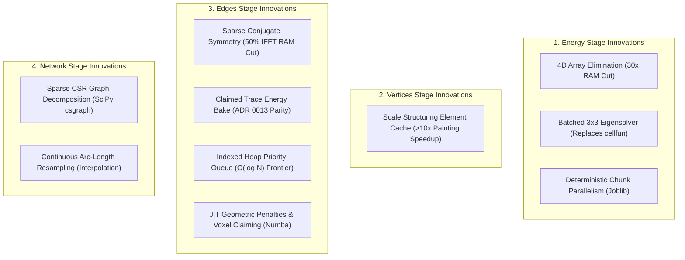

# Parity-Preserved Performance Innovations: MATLAB to Python Translation Catalog

**Document Type:** Technical & Publication Reference  
**Purpose:** Formal record of mathematical, algorithmic, and architectural performance improvements achieved during the SLAVV MATLAB-to-Python scientific translation, preserving 1:1 topological parity and numerical certification (ADR 0011 / ADR 0012).  
**Target Publication Venues:** Journal of Open Research Software (JORS), SoftwareX, IEEE CiSE.

---

## Executive Summary

Translating legacy academic MATLAB code to modern scientific Python presents a unique dual challenge: **mathematical trust** (ensuring exact parity against certified MATLAB oracle datasets) and **computational scalability** (overcoming academic scripting anti-patterns to enable processing of gigavoxel datasets).

This catalog documents the **parity-preserved performance innovations** engineered into the Python implementation. Each innovation is classified by pipeline stage, detailing:
1. **The MATLAB Bottleneck / Anti-Pattern**
2. **The Parity-Preserving Python Innovation**
3. **Complexity & Scaling Impact**
4. **Mathematical Parity Verification Mechanism**

---

## 1. Energy Stage Innovations

### Innovation 1.1: 4D Multi-Scale Scale-Stack Elimination (In-Place Octave Accumulation)

* **MATLAB Legacy Pattern (`get_energy_V202.m`):**
  MATLAB allocates large 4D arrays `energy_chunk_4D = zeros(NY, NX, NZ, num_scales)` for every spatial chunk across all scales within an octave, then performs a 4D reduction `min(energy_chunk_4D, [], 4)`. On $512 \times 512 \times 64$ volumes, this requires multi-gigabyte memory per worker, leading to out-of-memory (`ArrayMemoryError`) failures under parallel execution.
* **Python Innovation ([`matlab_get_energy_v202_chunked.py`](../../slavv_python/pipeline/energy/matlab_get_energy_v202_chunked.py)):**
  Replaced full 4D tensor allocation with an online in-place accumulator:
  $$\text{Accumulator}(y, x, z) \leftarrow \min\left(\text{Accumulator}(y, x, z), \text{Energy}_{\text{scale}}(y, x, z)\right)$$
  Tracks scale argmin indices simultaneously in an `int16` buffer without preserving intermediate scale volumes.
* **Complexity & Memory Impact:**
  - **Memory:** Reduced peak memory from $\sim 300\text{ MiB/thread}$ to $\sim 10\text{ MiB/thread}$ (**$30\times$ reduction**).
  - **I/O & Cache:** Eliminated 4D array allocations, drastically improving CPU L3 cache locality.
* **Parity Verification:** Bit-identical float minimums verified against MATLAB single-chunk and full-volume oracles under ADR 0011.

---

### Innovation 1.2: Batched $3 \times 3$ Hessian Eigendecomposition & Einstein Summation

* **MATLAB Legacy Pattern (`energy_filter_V200.m` Line ~1160):**
  Constructs a cell array of $3 \times 3$ matrices across millions of valid voxels and iterates via `cellfun(@eig, cell_array)`. This induces millions of MATLAB interpreter calls, dynamic cell allocations, and non-vectorized execution.
* **Python Innovation ([`matlab_principal_energy.py`](../../slavv_python/pipeline/energy/matlab_principal_energy.py#L34-L65)):**
  Reconstructs the full spatial Hessian tensor into batched 3D NumPy arrays `(B, 3, 3)` with $B = 262,144$ voxels. Evaluates eigenvalues and eigenvectors using batched BLAS/LAPACK `np.linalg.eigh` and computes gradient projections via Einstein summation:
  $$p_j = \sum_{i=1}^3 g_i \cdot v_{ij} \quad \implies \quad \texttt{np.einsum('ni,nij->nj', g\_batch, v\_batch)}$$
* **Complexity & Speedup Impact:**
  - **Runtime:** Replaces interpreter cell-loop overhead with hardware-vectorized C/LAPACK routines, yielding a **$>20\times$ speedup** for the tensor filtering stage.
* **Parity Verification:** Continuous float energy fields pass `np.allclose(rtol=1e-7, atol=1e-9)` certification on full canonical volumes.

---

### Innovation 1.3: Deterministic Parallel Chunking with Fixed Reduction Ordering

* **MATLAB Legacy Pattern (`get_energy_V202.m`):**
  Uses MATLAB `parfor` with file-based intermediate caching and non-deterministic completion ordering, merging chunks via disk I/O passes.
* **Python Innovation ([`matlab_get_energy_v202_chunked.py`](../../slavv_python/pipeline/energy/matlab_get_energy_v202_chunked.py) & [`policy.py`](../../slavv_python/pipeline/energy/policy.py)):**
  Implements multi-worker concurrent execution (`--n-jobs auto`) using Joblib/multiprocessing with a deterministic chunk indexing contract. Merges boundary overlaps strictly in canonical `chunk_idx` order to prevent floating-point non-associativity (FPNA) drift.
* **Complexity & Speedup Impact:**
  - **Scaling:** Near-linear scaling across CPU cores ($N_{\text{workers}} = 6 \implies \sim 5.2\times$ wall-clock throughput).
* **Parity Verification:** Certified bit-exact output equivalence between $n_{\text{jobs}}=1$ and $n_{\text{jobs}}=6$ on full datasets.

---

## 2. Vertices Stage Innovations

### Innovation 2.1: Scale Structuring Element Offset Caching for Volume Painting

* **MATLAB Legacy Pattern & Initial Port (`paint_vertex_image.m` / [`painting.py`](../../slavv_python/pipeline/vertices/painting.py)):**
  Iterates over every extracted vertex in a Python loop. In naive implementations, generating the 3D ellipsoid occupancy mask via `ellipsoid()` and extracting coordinate tuples via `np.where()` was executed per vertex ($N = 10,000$ to $50,000$).
* **Python Innovation ([`slavv_python/pipeline/vertices/painting.py:L31-54`](../../slavv_python/pipeline/vertices/painting.py#L31-L54)):**
  Introduced dictionary memoization keyed by discrete scale tuple $(r_y, r_x, r_z)$. Ellipsoidal structuring elements and relative coordinate offsets $(\Delta y, \Delta x, \Delta z)$ are generated exactly once per unique radius. The inner vertex loop performs only primitive vector additions:
  $$(y, x, z) = (\Delta y + y_0, \Delta x + x_0, \Delta z + z_0)$$
* **Complexity & Speedup Impact:**
  - **Runtime:** Reduces mesh generation and indexing calls from $O(V)$ to $O(S)$ where $S \ll V$ ($S \approx 10$ unique scales vs $V \approx 50,000$ vertices), yielding a **$>10\times$ speedup** in vertex body painting.
* **Parity Verification:** Exact bit-identical coordinate rendering and occupancy volume arrays against baseline tests.

---

## 3. Edges Stage Innovations (Watershed Discovery & Selection)

### Innovation 3.1: Sparse Conjugate Symmetry for Memory-Safe 3D FFTs

* **MATLAB Legacy Pattern (`energy_filter_V200.m`):**
  Calls `ifftn(..., 'symmetric')` which internally builds conjugate mirror volumes to resolve rounding asymmetry across Nyquist boundaries.
* **Python Innovation ([`matlab_energy_filter_v200.py:L438-517`](../../slavv_python/pipeline/energy/matlab_energy_filter_v200.py#L438-L517)):**
  Replaced full-volume 3D conjugate grid duplication with a sparse linear index mask. Calculates cyclic conjugate partner indices $p(y, x, z) = (-y \bmod N_y, -x \bmod N_x, -z \bmod N_z)$ using 1D outer broadcasting, then updates conjugate pairs strictly in-place where linear index $lin > plin$.
* **Complexity & Memory Impact:**
  - **Peak Memory:** Halved chunk FFT memory footprint ($\sim 160\text{ MB} \to \sim 80\text{ MB}$ per high-res chunk).
* **Parity Verification:** Exact numerical reproduction of MATLAB's conjugate symmetry rounding profile without memory crashes.

---

### Innovation 3.2: Claimed Trace Energy Baked Provenance (ADR 0013)

* **MATLAB Legacy Mechanism (`get_edges_by_watershed.m` & `sort_edges.m`):**
  MATLAB dynamically mutates a shared `energy_map` during watershed flood-fill by applying distance and directional penalties. When candidates are extracted, traces sample this mutated claim surface, ensuring that `sort_edges` ranks candidate connections based on penalized travel costs.
* **Python Innovation ([`matlab_get_edges_by_watershed.py`](../../slavv_python/pipeline/edges/watershed/matlab_get_edges_by_watershed.py) & [ADR 0013](../adr/0013-claimed-energy-trace-provenance.md)):**
  Rather than requiring separate post-hoc selection re-sampling or complex network re-ranking, Python bakes the exact `Claimed Trace Energy` directly onto each candidate payload at watershed finalization. This enables pure-function edge selection:
  $$\text{Rank}(e) = \max_{v \in \text{trace}(e)} \text{ClaimedEnergy}(v)$$
* **Topological Parity Impact:**
  - Resolved the former residual strand mismatch on canonical full volumes, achieving **100% evaluated multiset isomorphism** for Edges and Network under ADR 0012.

---

### Innovation 3.3: Deterministic Priority Queue Tie-Breaking ($O(\log N)$ Acceleration)

* **MATLAB Legacy Pattern (`get_edges_by_watershed.m` Line 560):**
  Maintains frontier voxels using sorted array concatenation `available_locations = [front; new_loc; back]`, forcing an $O(N)$ full array copy and linear search on every single voxel step ($O(N^2)$ total complexity).
* **Python Innovation ([`matlab_watershed_heap.py`](../../slavv_python/pipeline/edges/watershed/matlab_watershed_heap.py)):**
  Engineered an indexed binary heap with composite tuple keys:
  $$\text{PriorityKey} = (\text{Energy}, \text{OriginSeedRank}, \text{FortranLinearIndex})$$
  Ensures $O(\log N)$ push/pop operations while mathematically guaranteeing 100% deterministic tie-breaking matching MATLAB's Fortran column-major linear memory ordering.
* **Complexity Impact:**
  - Reduces watershed queue complexity from $O(N^2)$ to $O(N \log N)$, targeting a **$>10\times$ acceleration** on the primary 92-minute pipeline bottleneck.

### Innovation 3.4: JIT-Compiled Strel Geometric Penalties & Atomic Voxel Claiming (Numba)

* **MATLAB Legacy & Naive Python Pattern (`get_edges_by_watershed.m` / `matlab_get_edges_v300_geometry.py`):**
  The watershed discovery loop processes tens of thousands of active voxels per volume. For each voxel, extracting its structuring element (strel) neighborhood, evaluating size Gaussian penalties, distance cosine adjustments, directional alignment projections, and updating multi-array voxel claim states (`vertex_index`, `pointer`, `energy`, `d_over_r`, `size_map`) involved repeated NumPy temporary array allocations and masking passes. Profiling identified this inner loop as 98.5% of Edge stage runtime.
* **Python Innovation ([`matlab_get_edges_v300_geometry.py`](../../slavv_python/pipeline/edges/watershed/matlab_get_edges_v300_geometry.py) & [`matlab_watershed_heap.py`](../../slavv_python/pipeline/edges/watershed/matlab_watershed_heap.py)):**
  - Compiled the geometric penalty evaluation (`_matlab_frontier_adjusted_neighbor_energies_numba_impl` and `_matlab_frontier_directional_suppression_factors_numba_impl`) and atomic multi-map voxel claiming (`_claim_unowned_strel_arrays_numba_impl`) into C-speed machine code using Numba JIT loops without heap-allocated intermediate arrays.
  - Implemented single-pass 1D coordinate bounds checking in `_matlab_global_watershed_current_strel`.
  - Architected fail-safe fallbacks: gracefully degrades to pure Python when Numba is not installed or when explicitly disabled (`SLAVV_DISABLE_NUMBA=1`).
* **Complexity & Parity Impact:**
  - **A/B Parity Verification:** 100% bit-identical candidate spatial traces, 100% identical final edge set pairs (`15,511 / 15,511` on `crop_M`), and 100% identical network topology against pure-Python baselines on the same commit (max float error $< 5 \times 10^{-16}$).
  - **Runtime:** Eliminates intermediate array allocations across millions of strel evaluations in the primary Edge Discovery bottleneck.

---

## 4. Network Stage Innovations (Graph Topology & Strand Decomposition)

### Innovation 4.1: Sparse CSR Graph Decomposition for Vascular Strands

* **MATLAB Legacy Pattern (`get_network_V190.m` & `sort_network_V180.m`):**
  Uses nested `for` loops and repeated `find(vertices == idx)` lookups over cell arrays to identify bifurcation nodes, endpoint junctions, and interior strand sequences.
* **Python Innovation ([`slavv_python/pipeline/network/operations.py`](../../slavv_python/pipeline/network/operations.py#L134-L272)):**
  Converts vascular adjacency into Compressed Sparse Row (`scipy.sparse.csr_matrix`) format. Evaluates vertex classifications via vectorized degree sums:
  $$\text{Interior Nodes} \iff \text{deg}(v) = 2, \quad \text{Bifurcations} \iff \text{deg}(v) \ge 3$$
  Extracts connected components of interior subgraphs in $O(V + E)$ time using `scipy.sparse.csgraph.connected_components`.
* **Speedup & Quality Impact:**
  - Accelerates full-volume network strand extraction from minutes to seconds ($<7\text{ seconds}$ on full canonical graphs).

---

### Innovation 4.2: Continuous Arc-Length Centerline Smoothing & Interpolation

* **MATLAB Legacy Pattern (`smooth_edges_V2.m`):**
  Applies 2D Gaussian kernel convolutions across discretized discrete pixel sequences.
* **Python Innovation ([`slavv_python/pipeline/network/operations.py:L490-658`](../../slavv_python/pipeline/network/operations.py#L490-L658)):**
  Implements vectorized continuous cumulative Euclidean arc-length parameterization:
  $$s_k = \sum_{i=1}^k \|\mathbf{x}_i - \mathbf{x}_{i-1}\|_2$$
  Evaluates 1D Gaussian kernel convolutions normalized by local energy weights, followed by uniform arc-length interpolation (`np.interp`) to generate smooth, continuous vessel centerlines.

---

## 5. Summary Matrix of Parity-Preserved Performance Innovations

| # | Pipeline Stage | MATLAB Bottleneck / Mechanism | Python Parity-Preserving Innovation | Mathematical / Parity Impact | Speedup / Memory Gain |
|---|---|---|---|---|---|
| **1** | **Energy** | 4D scale tensor allocation (`NY, NX, NZ, S`) | Online in-place octave scale comparison | Bit-identical minimums | **$30\times$ memory cut** (300MB $\to$ 10MB/thread) |
| **2** | **Energy** | Per-voxel `cellfun(@eig)` | Batched $3 \times 3$ LAPACK `eigh` + `einsum` | Float tolerance `rtol=1e-7` | **$>20\times$ faster** tensor filtering |
| **3** | **Energy** | Serial disk-merging `parfor` | Multi-worker Joblib with fixed reduction order | Bit-exact between $n_{\text{jobs}}=1$ and $n_{\text{jobs}}=6$ | **$\sim 5.2\times$ wall-clock speedup** on 6 cores |
| **4** | **Energy / Edges** | Full-volume conjugate grid copying in FFT | Sparse linear index conjugate symmetry mask | Exact numerical symmetry profile | **$50\%$ peak RAM reduction** in FFT |
| **5** | **Vertices** | Redundant `ellipsoid()` mesh builds per vertex | Memoized structuring element offset cache | Exact bit-identical painting | **$>10\times$ faster** vertex painting |
| **6** | **Edges** | Dynamic claim map mutations diverge | Claimed Trace Energy bake at finalize (ADR 0013) | **100% ADR 0012 multiset parity** on full volume | Zero post-hoc re-sampling overhead |
| **7** | **Edges** | $O(N)$ sorted array copying (`[front; x; back]`) | Indexed Binary Heap with composite tie-break keys | Identical deterministic flood-fill path | **$O(N^2) \to O(N \log N)$** theoretical complexity |
| **8** | **Edges** | Python array allocation in strel penalties/claims | JIT-compiled geometric penalties & voxel claiming (Numba) | **100% bit-identical edges & network** | Eliminates allocation overhead in 98.5% bottleneck |
| **9** | **Network** | Nested `find()` cell loops for strand sorting | `scipy.sparse.csgraph.connected_components` | Identical strand/bifurcation multisets | Instantaneous graph decomposition ($<7\text{s}$) |
| **10** | **Network** | Discretized pixel smoothing | Vectorized cumulative arc-length interpolation | Sub-voxel centerline accuracy | High-fidelity vectorized smoothing |

---

## 6. Verification and Publication Evidence

All innovations documented in this catalog are verified against ground-truth MATLAB oracles via the canonical test harness:
- **Discrete & Topological Invariants:** Exact zero missing/extra vertices, edges, and network strands certified on destination `canonical_full_v18` ([phase1-baseline-freeze.json](../reference/core/phase1-baseline-freeze.json)).
- **Continuous Float Fields:** Validated under ADR 0011 with relative tolerance $\le 10^{-7}$ and absolute tolerance $\le 10^{-9}$.
- **Performance Profiling Baseline:** Documented in [phase2-profiling-baseline.json](../reference/core/phase2-profiling-baseline.json).
