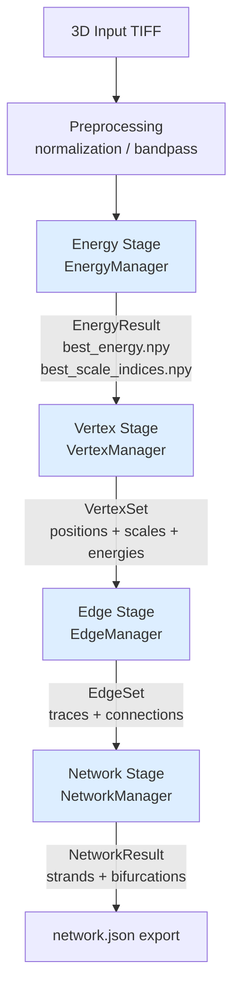
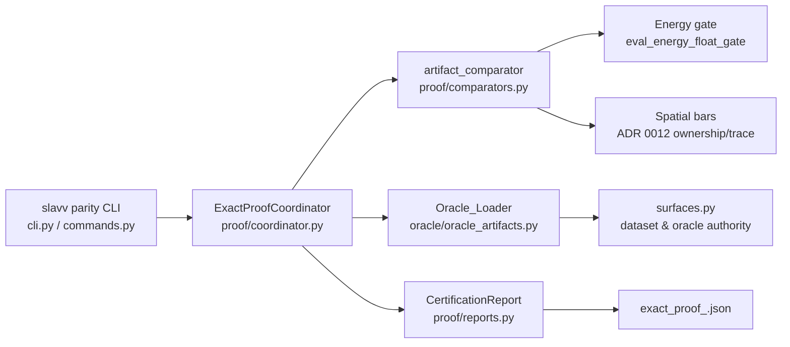

# Design Document: MATLAB-Python Parity

> ⛔ **DEPRECATED archive — do not treat as live design.**  
> Bars → [ADR 0011](../../adr/0011-energy-float-certification-policy.md) / [ADR 0012](../../adr/0012-edge-watershed-parity-bar.md) · status → [ONE TRUTH](../../reference/core/EXACT_PROOF_FINDINGS.md#one-truth--phase-1-parity-validated-from-disk) · index → [README](README.md).

## Overview

*(Historical text.)* This document describes the technical architecture for certifying 100% MATLAB-to-Python
parity for the SLAVV vascular vectorization pipeline. The goal is a full Python port whose
outputs are proven equivalent to preserved MATLAB truth vectors across all four pipeline
stages: Energy → Vertices → Edges → Network.

"Parity" here does not mean bit-identical floating-point outputs — that is unachievable
across MATLAB (MKL/FFT) and NumPy (FFTW/OpenBLAS) math libraries due to floating-point
non-associativity and ISA-level non-determinism. Instead, parity is defined operationally
as **Certification**: sequential exact-parity gates report zero missing and zero extra on
discrete/topological fields, `np.allclose(rtol=1e-7, atol=1e-9)` on continuous float
fields (ADR 0011), and ADR 0012 spatial/topological bars for the order-sensitive
watershed stages.

The released MATLAB source under `external/Vectorization-Public/source/` is the
executable specification. The Python port must reproduce the same mathematical methods
and algorithm structures, not merely similar output counts.

## Architecture

### Four-Stage Pipeline Execution Flow

The pipeline executes exactly four stages in a fixed order, mirroring MATLAB's
`vectorize_V200.m` orchestration. Each stage reads from the prior stage's typed result
object and writes its own typed result, persisted via `RunContext` checkpoints.



The `SlavvPipeline` orchestrator in `slavv_python/engine/orchestrator.py` delegates each
stage to its facade manager. It is stateless with respect to large data; all large
artifacts flow through `RunContext` + `StageController` checkpoints.

### Exact Route vs Paper Route

The Exact Route (`comparison_exact_network=True`) is the parity-certified path. It
differs from the production Paper Route in three key dimensions:

| Dimension | Paper Route | Exact Route |
|:----------|:------------|:------------|
| Precision | float32 (energy persisted as float32) | float64 throughout computation |
| Memory layout | C-order (row-major) | [Y,X,Z] Fortran-order (column-major) |
| Energy engine | Chunked multi-scale Hessian | Incremental octave-chunked engine (no 4D stack) |
| Vertex injection | Allowed (curated from oracle) | Native Python discovery only |
| Conflict painting | Enabled | Disabled (MATLAB watershed faithfulness) |
| Intensity normalization | Applied | Skipped (raw TIFF/HDF5 values preserved) |

Activating `comparison_exact_network=True` in run parameters gates the pipeline into the
Exact Route. The parameter whitelist in `validation.py` must include this key so it is
not stripped during `RunContext.prepare()`.

### Parity Harness Architecture

The parity harness lives under `slavv_python/analytics/parity/` and is accessed via the
`slavv parity` CLI. Its design separates concerns into themed subpackages:



The two CLI entry points that drive certification are:

- `slavv parity prove-exact --stage <stage>` — proves a single stage against an oracle
- `slavv parity prove-exact-sequence` — proves all four stages in dependency order,
  blocking downstream stages on upstream failure

## Components and Interfaces

### Pipeline Stage Managers

Each stage has a `manager.py` facade exposing `run()` (ephemeral) and `run_resumable()`
(persisted via `StageController`). The interface contract is:

```
EnergyManager.run(image, params) → EnergyResult
VertexManager.run(energy_result, params) → VertexSet
EdgeManager.run(vertex_set, energy_result, params) → EdgeSet
NetworkManager.run(edge_set, vertex_set, params) → NetworkResult
```

MATLAB-faithful ports live in `matlab_*.py` files beside each stage package:

| MATLAB source | Python port |
|:--------------|:------------|
| `get_energy_V202.m` | `pipeline/energy/matlab_get_energy_v202_chunked.py` |
| `energy_filter_V200.m` | `pipeline/energy/matlab_energy_filter_v200.py` + `matlab_principal_energy.py` |
| `get_vertices_V200.m` | `pipeline/vertices/detection.py` |
| `get_edges_by_watershed.m` | `pipeline/edges/matlab_get_edges_by_watershed.py` + `matlab_watershed_heap.py` |
| `get_edges_V300.m` | `pipeline/edges/matlab_get_edges_v300_frontier.py` + `matlab_get_edges_v300_geometry.py` |
| `get_network_V190.m` + `sort_network_V180.m` | `pipeline/network/manager.py` + `construction.py` |

### ExactProofCoordinator

`slavv_python/analytics/parity/proof/coordinator.py` is the central certification
controller. It exposes:

- `prove(stage, source_run_root, oracle_root, dest_run_root, strict_floats=False)`
  — loads oracle surface, normalizes Python checkpoints, delegates comparison, emits report
- `capture_candidates(vertex_set, energy_result, params)` — edge candidate generation
  for audit workflows

The comparator (`proof/comparators.py`) dispatches per-stage comparison logic:

- **Energy**: `evaluate_energy_float_gate` — strict scale_indices, `np.allclose` on
  energy/lumen_radius_microns; optional `--strict-floats` for bit-identical regression
- **Vertices**: strict positions + scales; `np.allclose` energies
- **Edges**: `_compare_edge_stage` — ownership-map overlap ≥ 60%, per-edge trace
  tolerance; no raw pair-overlap in verdict
- **Network**: `_compare_network_stage` — endpoint-pair multiset + bifurcation multiset
  exact; per-strand trace tolerance; no pair-overlap in verdict

### Oracle Loader

`slavv_python/analytics/parity/oracle/oracle_artifacts.py` reads MATLAB `.mat`/HDF5
artifacts into Python comparison surfaces. Critical conventions:

- **One-based shift**: MATLAB scale indices are 1-based globals; the loader applies
  exactly one `index - 1` shift. No double-shift is permitted.
- **Reversed-axis convention**: v7.3 HDF5 artifacts store arrays in reversed MATLAB
  order (C-contiguous HDF5 stores MATLAB column-major as transposed). The loader applies
  `np.flip` or equivalent axis reversal to recover `[Z,Y,X]` physical order, which then
  maps to internal `[Y,X,Z]` for watershed processing.
- **Curated vertex energy recovery**: MATLAB curation overwrites `curated_vertices.mat`
  energies with a rank ramp. The loader recovers true physical energies from the raw
  `vertices.mat` artifact; positions + scales still come from the curated artifact.

### Run Lifecycle (RunContext + StageController)

`slavv_python/engine/state/run_ledger.py` holds `RunContext` — fingerprints of input
images and parameters that determine whether a cached stage result can be reused.
`StageController` (`stage_handle.py`) provides checkpoint paths and manages
`begin` / `update` / `complete` transitions, writing `resume_state.json` for
interruption recovery.

Run directories follow the layout:
```
<run_root>/
  01_Params/           shared_params.json, python_derived_params.json, param_diff.json
  02_Output/python_results/checkpoints/   checkpoint_energy.pkl, checkpoint_vertices.pkl, ...
  03_Analysis/         exact_proof_<stage>.json, exact_proof.json
  99_Metadata/         experiment_provenance.json, parity_job.pid, resume_state.json
```

## Data Models

### Pipeline Stage Results (`slavv_python/schema/results.py`)

All inter-stage data is wrapped in validated dataclass models:

**`EnergyResult`**

| Field | dtype | Description |
|:------|:------|:------------|
| `energy` | float32 (persist) / float64 (compute) | Per-voxel best energy value |
| `scale_indices` | int16 | Per-voxel winning scale index (0-based after loader shift) |
| `lumen_radius_pixels` | float32/float64 | Per-scale radius in pixels |
| `lumen_radius_microns` | float32/float64 | Per-scale radius in microns |
| `image_shape` | tuple[int,...] | Physical `[Z,Y,X]` shape |

Note: computation uses float64 throughout; the persisted `best_energy.npy` artifact is
written as float32 to reduce disk I/O. The comparator reads the float64 computation
path, not the persisted float32 copy.

**`VertexSet`**

| Field | dtype | Description |
|:------|:------|:------------|
| `positions` | float32 | N×3 voxel coordinates (physical `[Z,Y,X]` order) |
| `scales` | int16 | Per-vertex winning scale index |
| `energies` | float32 | Per-vertex energy (sourced from raw vertices.mat) |
| `radii_pixels` | float32 | Per-vertex lumen radius in pixels |
| `radii_microns` | float32 | Per-vertex lumen radius in microns |

**`EdgeSet`**

| Field | dtype | Description |
|:------|:------|:------------|
| `traces` | list[float32 array] | Per-edge voxel coordinate sequences |
| `connections` | int32 | E×2 vertex index pairs |
| `energies` | float32 | Per-edge endpoint energies |

**`NetworkResult`**

| Field | dtype | Description |
|:------|:------|:------------|
| `strands` | list | Per-strand vertex chain + geometry arrays |
| `bifurcations` | int32 | Bifurcation vertex indices |
| `vertex_degrees` | int32 | Per-vertex degree in the network graph |

### Oracle Artifact Models (`analytics/parity/oracle/models.py`)

Each oracle stage artifact is a structured surface used by the comparator:

- **Energy surface**: `scale_indices` (int, 0-based), `energy` (float64),
  `lumen_radius_microns` (float64). Shape matches internal `[Y,X,Z]` grid.
- **Vertex surface**: `positions` (float64, `[Z,Y,X]`), `scales` (int, 0-based),
  `energies` (float64 from raw vertices.mat).
- **Edge surface**: `vertex_index_map` (int, ownership map), per-edge trace arrays.
- **Network surface**: endpoint-pair multiset, bifurcation multiset, per-strand traces.

### CertificationReport (`analytics/parity/proof/reports.py`)

Emitted as `exact_proof_<stage>.json` per stage and aggregated into `exact_proof.json`:

```json
{
  "stage": "energy",
  "verdict": "PASS",
  "missing_count": 0,
  "extra_count": 0,
  "float_agreement": {
    "energy": {"max_delta": 1.99e-11, "pass_rate": 1.0},
    "lumen_radius_microns": {"max_delta": 7.1e-15, "pass_rate": 1.0}
  },
  "discrete_agreement": {
    "scale_indices": {"mismatch_count": 0}
  },
  "diagnostics": {
    "ulp_figures": {"median_ulp": 4, "p90_ulp": 13, "max_ulp": 72343}
  },
  "first_failing_field": null
}
```

The `verdict` field is determined solely by the parity bars (ADR 0011/0012). ULP figures
appear in `diagnostics` only and do not affect `verdict`.

## Algorithms

### Incremental Octave-Chunked Energy Engine

The Exact Route energy engine (`matlab_get_energy_v202_chunked.py`) avoids a large 4D
energy stack by updating `best_energy` and `best_scale_index` volumes incrementally
within the multi-scale loop:

```
for each octave:
    for each chunk in lattice:
        compute padded FFT grid (MATLAB-aligned padded shape)
        apply energy_filter_V200 (Hessian matched filter, float64)
        apply principal_energy (eigh in returned-component role, float64)
        upsample via MATLAB-equivalent interp3 mesh
        update best_energy[chunk] where new_energy < current_best
        update best_scale_index[chunk] accordingly
        del large intermediates; gc.collect()
```

Peak memory per thread: ~10 MiB (vs ~300 MiB for 4D stack approach). Enables stable
processing of 512×512×64 canonical volume on 16 GB RAM with `n_jobs ≥ 1`.

**Critical: MATLAB linspace mesh**

The coarse-to-fine interpolation mesh must reproduce MATLAB's `linspace` exactly, using
the mod-based `d1` formula, multiply-then-divide, forced endpoints, and integer phase
term. Standard arithmetic meshes drift by ~1 ULP at coarse-cell boundaries, which flips
the per-voxel scale argmin — this was the root cause of 39,494 scale mismatches on the
canonical volume before the fix (commit `ca709a8d`).

### Grid Alignment and Fortran-Order Tie-Breaking

The Exact Route uses `[Y, X, Z]` internal grid orientation with Fortran (column-major)
memory order throughout the watershed. This matches MATLAB's column-major memory scan
order for tie-breaking. When two voxels share equal energy, MATLAB selects the one with
the lower Fortran-order linear index; Python must do the same via explicit `np.ravel`
with `order='F'`.

Grid orientation transitions:

```
Physical TIFF [Z, Y, X]
    → transpose to internal [Y, X, Z] + np.asfortranarray()   (on entry to watershed)
    → all watershed operations in [Y, X, Z] F-order
    → transpose back to [Z, Y, X]                              (on artifact persistence)
```

The double-transpose bug (applying the pre-transpose inside `generate_watershed_candidates`
when the engine already reorients internally) is permanently fixed in commit `e9dcc141`.

### Round-Half-Away-from-Zero

Vertex painting and candidate filtering round coordinates at `.5` boundaries using
`floor(x + 0.5)` rather than Python's built-in `round()` (which applies banker's
rounding, round-to-even). This matches MATLAB's `round()` behavior. Implemented in
`slavv_python/pipeline/vertices/painting.py` and propagated through the vertex scan.

### Structuring Element Voxel Membership

The NMS structuring element (`ellipsoid_offsets`) uses MATLAB float-radius membership:
a voxel at offset `(dy, dx, dz)` in scaled micron coordinates is included when
`sqrt(dy² + dx² + dz²) <= r` using float comparison (not integer-rounded radii). This
matches `construct_structuring_element.m`. The fix resolved 0 missing/extra on 13,706
vertices (crop harness).

### Edge Watershed Faithfulness

The Exact Route watershed must keep all discrete inputs bit-faithful to MATLAB:

- `edge_number_tolerance = 4` (not 2 — corrected from v29 discovery)
- `step_size_per_origin_radius = 1.0`
- `distance_tolerance_per_origin_radius = 3.0`
- `max_edge_energy = 0.0`
- Strel offsets from `matlab_calculate_linear_strel_range.py` (port of
  `calculate_linear_strel_range.m`)
- Conflict painting **disabled** on Exact Route (`selection.py`)

The emergent residual (watershed pair-set order-sensitivity) is certified under ADR 0012
ownership-map bar (~63.5%), not chased as a fixable local bug.

## Correctness Properties

*A property is a characteristic or behavior that should hold true across all valid executions of a system — essentially, a formal statement about what the system should do. Properties serve as the bridge between human-readable specifications and machine-verifiable correctness guarantees.*

---

**Property reflection before writing:**

The prework identified the following PROPERTY-class criteria:

- 2.1–2.4: float64 dtype invariants (all four stages)
- 3.1–3.4: grid orientation + tie-breaking + rounding invariants
- 4.4: MATLAB linspace mesh property
- 5.4: structuring-element float-radius membership
- 8.1: sequential stage evaluation order
- 8.2: downstream blocking on failure
- 8.4: first-failing-field reporting
- 9.2: certification verdict on all-pass
- 10.2: one loadable artifact per oracle stage
- 10.3: exactly-one index shift
- 10.4: reversed-axis round-trip
- 11.2: error message identifies artifact and field
- 11.4: network graph serialization round-trip
- 12.1: report contains required fields

**Redundancy review:**

- 2.1–2.4 (float64 dtype for each stage) can be combined into one property: "for any pipeline stage computation, continuous arrays shall be float64".
- 3.3 (orientation persist) and 10.4 (HDF5 axis reversal) are both axis-convention round-trips; they are different enough in scope to keep separate (one is the pipeline writer, the other is the oracle loader).
- 8.1 (stage order) and 8.2 (blocking on failure) are complementary — both are about sequential gating; keep separate as they test different aspects.
- 10.2 (artifact per stage) and 12.1 (report fields per stage) both test "for any stage"; keep separate as they test the oracle vs the report.
- After reflection: 14 properties reduce to 12 after combining 2.1–2.4.

---

### Property 1: Float64 Computation Invariant

*For any* 3D input volume and any pipeline stage (Energy, Vertices, Edges, Network) on the Exact Route, all continuous quantity arrays (energies, coordinates, radii, distance penalties, suppression factors, strand geometry) shall have dtype `float64` during computation, before any persistence coercion.

**Validates: Requirements 2.1, 2.2, 2.3, 2.4**

---

### Property 2: Fortran-Order Grid Invariant

*For any* 3D volume processed through the Exact Route watershed, the internal `vertex_index_map` and `energy_map` arrays shall be F-contiguous (i.e., `np.isfortran(arr) == True`) and have shape `[Y, X, Z]`.

**Validates: Requirements 3.1**

---

### Property 3: Fortran-Order Tie-Breaking

*For any* pair of voxels with equal energy values in the watershed flood-fill, the voxel with the lower Fortran-order linear index (computed via `np.ravel_multi_index` with `order='F'`) shall be selected as the catchment winner.

**Validates: Requirements 3.2**

---

### Property 4: Orientation Persistence Round-Trip

*For any* internal `[Y, X, Z]` array produced by the Exact Route, persisting it with the orientation mapping and then transposing back to `[Y, X, Z]` shall produce an array equal to the original within floating-point identity.

**Validates: Requirements 3.3**

---

### Property 5: Round-Half-Away-from-Zero

*For any* coordinate value `x` at a `.5` boundary (i.e., `x - floor(x) == 0.5`), the SLAVV rounding function shall return `floor(x) + 1` (round half away from zero), matching MATLAB's `round()` for both positive and negative values.

**Validates: Requirements 3.4**

---

### Property 6: MATLAB Linspace Mesh Correctness

*For any* valid `(start, stop, N)` linspace parameters used for the coarse-to-fine interpolation mesh, the MATLAB-equivalent linspace implementation shall agree with MATLAB's `linspace` output to within `1e-14` absolute error at every grid point, including at coarse-cell boundaries where octave-level scale argmin is sensitive to sub-ULP drift.

**Validates: Requirements 4.4**

---

### Property 7: Structuring Element Float-Radius Membership

*For any* valid radius `r` (in scaled micron coordinates), the `ellipsoid_offsets` function shall include exactly the set of voxel offsets `(dy, dx, dz)` for which `sqrt(dy² + dx² + dz²) <= r` using float comparison, and shall exclude all offsets for which the distance strictly exceeds `r`.

**Validates: Requirements 5.4**

---

### Property 8: Sequential Stage Evaluation Order

*For any* `prove-exact-sequence` invocation, the stages shall be evaluated in the order `[energy, vertices, edges, network]` — a later stage shall not be evaluated before an earlier stage has completed its proof.

**Validates: Requirements 8.1**

---

### Property 9: Downstream Blocking on Stage Failure

*For any* stage `X` in `[energy, vertices, edges, network]` that fails its parity bar, all downstream stages `X+1` through `network` shall be marked as blocked and shall not be evaluated in that `prove-exact-sequence` run.

**Validates: Requirements 8.2**

---

### Property 10: First-Failing-Field Identification

*For any* stage proof that produces a FAIL verdict, the emitted `CertificationReport` shall contain a non-null `first_failing_field` identifying the first discrete or continuous field whose comparison failed.

**Validates: Requirements 8.4**

---

### Property 11: All-Pass Certification Verdict

*For any* `prove-exact-sequence` result in which all four stages (energy, vertices, edges, network) pass their respective parity bars, the harness shall emit an overall verdict of `CERTIFIED` for the run.

**Validates: Requirements 9.2**

---

### Property 12: Oracle Exactly-One Index Shift

*For any* raw MATLAB HDF5 scale-index array with known 1-based values, the `Oracle_Loader` shall return values exactly 1 less than the raw HDF5 values — no more, no less. If the raw value is `k`, the loaded value shall be `k - 1`.

**Validates: Requirements 10.3**

---

### Property 13: Oracle HDF5 Axis Reversal Round-Trip

*For any* v7.3 HDF5 artifact array, loading the artifact and then reversing its axes shall recover the original on-disk array shape and contents, confirming exactly one axis-reversal is applied and is invertible.

**Validates: Requirements 10.4**

---

### Property 14: Oracle Loader Error Identification

*For any* oracle artifact that is malformed or missing a required field, the `Oracle_Loader` shall raise an error whose message contains both the artifact file path and the name of the missing or malformed field.

**Validates: Requirements 11.2**

---

### Property 15: Network Graph Serialization Round-Trip

*For any* valid `NetworkResult`, serializing it to `network.json` and then deserializing back shall produce a `NetworkResult` with an equal strand-endpoint-pair multiset, equal bifurcation multiset, and equal vertex-degree array.

**Validates: Requirements 11.4**

---

### Property 16: Oracle Artifact Completeness

*For any* valid oracle root directory, `ensure-oracle-artifacts` shall successfully load exactly one artifact surface for each of the four gated stages (energy, vertices, edges, network), and no stage surface shall be None.

**Validates: Requirements 10.2**

---

### Property 17: Certification Report Required Fields

*For any* completed stage proof (pass or fail), the emitted `CertificationReport` shall contain the fields `missing_count`, `extra_count`, and `float_agreement`, and shall contain a `diagnostics` section that includes ULP figures without those figures influencing the `verdict` field.

**Validates: Requirements 12.1, 12.2**

## Error Handling

### Oracle Loading Failures

The `Oracle_Loader` must surface clear errors at load time, not at comparison time.
Failure modes and required behaviors:

- **Missing oracle root**: raise `OracleNotFoundError` with the expected path
- **Missing stage artifact**: raise `OracleMissingArtifactError` naming the stage and
  expected file path
- **Malformed HDF5 field**: raise `OracleMalformedArtifactError` naming both the
  artifact file path and the missing/invalid field key (Property 14)
- **Wrong axis shape**: raise `OracleShapeError` showing expected vs actual shape after
  axis reversal

All oracle errors must propagate through `prove-exact` and appear in the
`CertificationReport` as a `BLOCKED` verdict with the error message in `diagnostics`.

### Parity Proof Failures

When a proof fails, `ExactProofCoordinator.prove()` must:
1. Record the first failing field name in `first_failing_field` (Property 10)
2. Set `verdict = "FAIL"`
3. Set `missing_count` and `extra_count` for discrete fields
4. Set `float_agreement` per-field with `max_delta` and `pass_rate`
5. Never raise an exception — failures are data, not exceptions

When `prove-exact-sequence` encounters a stage failure (FAIL or BLOCKED), it must:
1. Record the blocking stage
2. Set all downstream stages to `verdict = "BLOCKED"` (Property 9)
3. Return exit code 1 from the CLI

### Interrupted Runs

`RunContext` + `StageController` handle interrupted runs via `resume_state.json`. If a
run is resumed with a dead PID in `parity_job.pid`, the harness reconciles automatically
(no duplicate writer guard triggers). The `slavv parity status-exact-run` command
surfaces run health; a status of `interrupted` (dead PID) allows immediate resume.

### Memory Pressure

The incremental octave-chunked engine defends against OOM via:
- Explicit `del` of large DFT products after each scale step
- `gc.collect()` between octave chunks
- Per-chunk memory budget gated by `max_voxels_per_node_energy` (must match MATLAB's
  oracle batch lattice size — typically 6000 — to preserve chunk-boundary numerics)

If `max_voxels_per_node_energy` differs from the MATLAB oracle batch, scale argmin at
chunk boundaries may diverge (root cause of the 2026-06-21 1M-chunk failure).

### Parameter Whitelist Enforcement

`RunContext.prepare()` must not strip `comparison_exact_network` or other orchestration
keys from the parameter set. The whitelist in `validation.py` is the enforcement point.
Stripping this key silently falls back to the Paper Route, producing a run that cannot
be certified as exact-route output (this was the 2026-06-17 validation whitelist bug).

## Testing Strategy

### Overview

The testing strategy uses three tiers matching the Parity Pre-Gate (ADR 0009), with a
dual approach of unit/property-based tests for pure logic and integration tests for
oracle-bound certification claims.

Property-based testing (PBT) IS applicable to this feature: the SLAVV pipeline has many
pure functions (linspace mesh construction, rounding, orientation mapping, structuring
element membership, oracle loading, serialization) where universal properties hold across
a wide input space and 100 iterations with varied inputs will reveal edge cases that
2–3 examples would miss. PBT is used for these pure-function properties.

PBT is NOT used for oracle-bound certification steps (Requirements 4, 5, 6, 7, 9):
those depend on specific preserved MATLAB artifacts and a single run is the authoritative
proof — varying the input synthetically does not replicate the oracle relationship.

**PBT library**: [`hypothesis`](https://hypothesis.readthedocs.io/) (Python) — the
standard choice for the Python ecosystem. Each property test runs minimum 100 iterations.

---

### Tier 1 — Synthetic Fixture (CI, ~seconds)

Runs in CI on every commit. No MATLAB oracle required.

**Unit / property tests** (`tests/unit/`):

- `test_matlab_linspace_table.py` — Property 6: MATLAB linspace mesh against checked-in
  reference table. Hypothesis: `@given(st.integers(2, 200), st.floats(...))` varying N
  and endpoint ranges. Tag: `Feature: matlab-python-parity, Property 6: MATLAB linspace mesh correctness`
- `test_float64_dtype_invariant.py` — Property 1: for any synthetic volume, verify
  float64 throughout each stage's computation path (use `unittest.mock` to intercept
  intermediate arrays). Tag: `Property 1`
- `test_fortran_order_grid.py` — Property 2: for any random `[Y,X,Z]` shaped array,
  `np.asfortranarray` produces F-contiguous layout. Tag: `Property 2`
- `test_fortran_tie_breaking.py` — Property 3: for any pair of equal-energy voxels,
  verify lower Fortran linear index wins. Tag: `Property 3`
- `test_orientation_round_trip.py` — Property 4: for any random array shape, the
  `[Y,X,Z]→[Z,Y,X]→[Y,X,Z]` round-trip recovers the original. Tag: `Property 4`
- `test_round_half_away_from_zero.py` — Property 5: Hypothesis generates floats
  at `.5` boundaries (positive, negative, large, small). Tag: `Property 5`
- `test_structuring_element_membership.py` — Property 7: for any radius `r`, verify
  float-membership criterion matches MATLAB reference at boundary cases. Tag: `Property 7`
- `test_oracle_loader_index_shift.py` — Property 12: for any int array with known
  1-based values, loader returns values exactly 1 less. Tag: `Property 12`
- `test_oracle_loader_axis_reversal.py` — Property 13: for any array shape, axis
  reversal is exactly invertible. Tag: `Property 13`
- `test_oracle_loader_error_messages.py` — Property 14: for any malformed artifact,
  error names both path and field. Tag: `Property 14`
- `test_network_serialization_roundtrip.py` — Property 15: for any valid
  `NetworkResult`, `network.json` round-trip preserves topology. Hypothesis generates
  random strand/bifurcation structures. Tag: `Property 15`
- `test_prove_exact_sequence_order.py` — Property 8: mock four stage evaluators, verify
  call order is always [energy, vertices, edges, network]. Tag: `Property 8`
- `test_downstream_blocking.py` — Property 9: for any stage X that returns FAIL, verify
  X+1 through network are BLOCKED without being evaluated. Tag: `Property 9`
- `test_first_failing_field.py` — Property 10: for any crafted FAIL comparator result,
  verify `first_failing_field` is non-null. Tag: `Property 10`
- `test_all_pass_certification.py` — Property 11: for any mocked all-pass stage results,
  verify CERTIFIED verdict. Tag: `Property 11`
- `test_oracle_artifact_completeness.py` — Property 16: for any valid oracle root (using
  a minimal fixture oracle), all four stage surfaces load. Tag: `Property 16`
- `test_certification_report_fields.py` — Property 17: for any completed proof outcome,
  report contains required fields; ULP in diagnostics does not affect verdict.
  Tag: `Property 17`

**Integration smoke** (`tests/integration/`):

- `test_paper_profile_ci.py` — all four stages complete on synthetic volume (paper route)
- `test_parity_pre_gate_tier1.py` — `matlab_compat` edges smoke + watershed LUT seam

---

### Tier 2 — Crop Harness (`180709_E_crop_M`, ~minutes, local only)

Requires `workspace/oracles/180709_E_crop_M_v2`. Not in CI; run manually before
canonical certification:

```powershell
slavv parity prove-exact-sequence `
  --source-run-root workspace/runs/oracle_180709_E/crop_M_exact `
  --dest-run-root workspace/runs/oracle_180709_E/crop_M_exact `
  --oracle-root workspace/oracles/180709_E_crop_M_v2
```

Success bar (same as Tier 3):
- Energy: `scale_indices` 0 mismatches; `energy` + `lumen_radius_microns` within
  `np.allclose(rtol=1e-7, atol=1e-9)`
- Vertices: positions + scales 0 mismatches; energies within `np.allclose`
- Edges: ownership-map ≥ 60%; per-edge trace tolerance pass
- Network: endpoint-pair + bifurcation multisets 0 missing/extra; per-strand traces pass

---

### Tier 3 — Canonical Certification (`180709_E`, ~hours, local only)

Phase 1 certification milestone. Requires `workspace/oracles/180709_E_full_v2`:

```powershell
slavv parity prove-exact-sequence `
  --source-run-root workspace/runs/oracle_180709_E/canonical_full_v4 `
  --dest-run-root workspace/runs/oracle_180709_E/canonical_full_v4 `
  --oracle-root workspace/oracles/180709_E_full_v2
```

All four stages must pass under the same bars as Tier 2. A CERTIFIED verdict on this run
is the Phase 1 completion criterion (Requirement 9).

---

### Property Test Configuration

Each property test must:
- Use `@settings(max_examples=100)` minimum (Hypothesis default is 100)
- Include a comment tag: `# Feature: matlab-python-parity, Property N: <property_text>`
- Use `hypothesis` strategies (`st.integers`, `st.floats`, `st.arrays`) for input
  generation, not hand-written loops
- Be placed under `tests/unit/` mirroring the module under test

### Unit Test Balance

Unit tests focus on:
- Specific examples for MATLAB mathematical constants (`edge_number_tolerance=4`,
  `step_size_per_origin_radius=1.0`, etc.)
- Integration points between stage managers and oracle loader
- CLI routing checks (exact route flag, conflict painting disabled, provenance checks)
- Error condition examples (malformed oracle, wrong shape, missing field)

Property tests handle comprehensive input coverage through randomization, so unit tests
for the same surface should be kept minimal — 2–3 concrete examples only.

### Regression Gate

Before committing any parity-sensitive change (energy, vertices, edges, network stages
or the parity harness):

```powershell
python -m pytest tests/unit/pipeline/ tests/unit/parity/ tests/unit/analytics/ -m "unit"
python -m ruff format --check slavv_python tests
python -m ruff check slavv_python tests
python -m mypy
```

Then run Tier 2 crop proof before pushing to confirm no parity regression.
