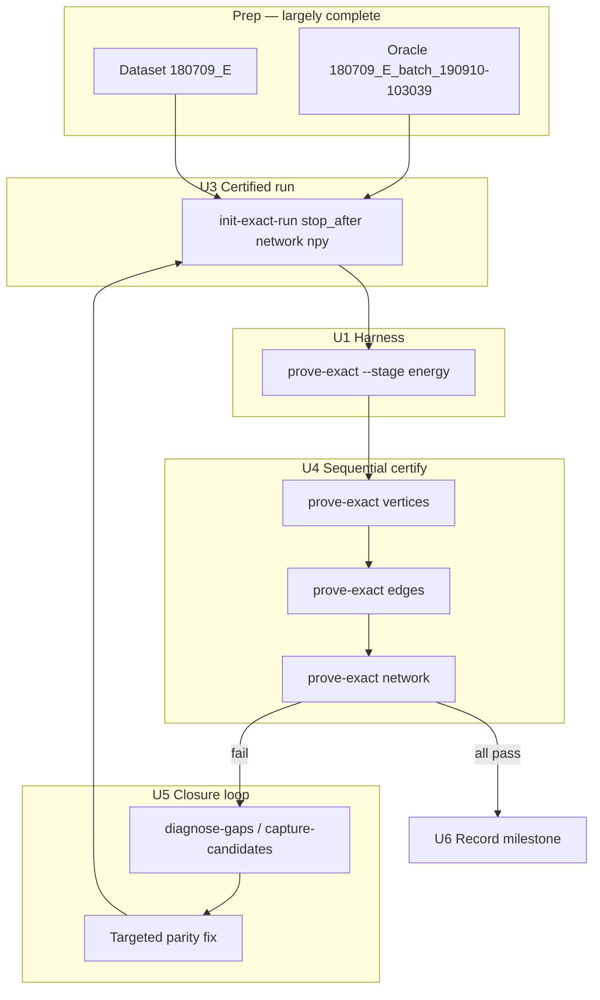

# Phase 1 exact-route certification on 180709_E

## Summary

Close the Phase 1 milestone by extending the parity harness so `prove-exact` can gate **energy**, completing a native exact-route run through **network** on full `180709_E`, then iterating parity fixes until sequential stage proofs report **zero missing/extra** at every gate. Documentation and reports are updated to match the strict bar already defined in the origin requirements.

---

## Problem Frame

The exact parity track on edges remains near **88.7%** pair match (v29: 135 missing, 371 extra), which blocks a credible MATLAB-equivalence claim. Phase 1 requires a reproducible certification on the canonical volume using native discovery and strict `prove-exact` gates—not informal match rates. (see origin: `docs/brainstorms/180709-native-parity-ship-confidence-requirements.md`)

---

## Requirements

- R1. `prove-exact` reports **zero missing and zero extra** per certified stage (strict set equality).
- R2. Certified runs use **native** vertex discovery (no oracle vertex checkpoint injection).
- R3. **Sequential gating:** energy → vertices → edges → network; downstream certification is blocked when an upstream stage fails on **that** run.
- R4. Canonical volume is **full `180709_E`** for the exact route.
- R5. Certified pipeline includes **energy, vertices, edges, and network**.
- R6. Phase 1 delivers **exact-route certification** only; program ship confidence waits for phase 2 (paper profile).
- R9. Oracle truth at `workspace/oracles/180709_E_batch_190910-103039` (one artifact per stage).
- R10. Trial runs under `workspace/runs/`; promoted summaries under `workspace/reports/` when warranted.
- R11. Experiments such as `strel_tiebreak_v30` are edges-stage trials under the gate, not milestones alone.
- R12. Shortest honest path: fixes tied to failing `prove-exact` stage; shims only with documented downgrade (do not satisfy R2).

**Origin actors:** A1 (maintainer/developer), A2 (public SLAVV user — phase 2), A3 (MATLAB oracle)

**Origin flows:** F1 (sequential exact-route certification), F2 (paper profile — phase 2, deferred)

**Origin acceptance examples:** AE1 (energy blocks downstream), AE2 (vertex mismatch propagates to edges), AE3 (phase 1 complete when all four stages pass)

---

## Scope Boundaries

### Deferred for later

- Parity across **all** neurovasc-db vectorized volumes.
- **CI merge-blocking** parity on every PR.
- **Publishable third-party reproduction** as the primary deliverable.
- Network exact proof on volumes other than `180709_E` until edges are closed on `180709_E`.
- Open-ended architecture consolidation not tied to a P0 `prove-exact` failure.

### Outside this product's identity

- Replacing the public paper workflow with exact-route-only parameters for all users.
- Claiming MATLAB equivalence without a passing `prove-exact` report for the workflow being claimed.

### Deferred to Follow-Up Work

- **Parity Pre-Gate tiers** (synthetic smoke, `180709_E_crop_M` harness, then canonical cert): documented in `docs/reference/workflow/PARITY_PRE_GATE.md` and `docs/adr/0009-parity-pre-gate-tiers.md`. Crop harness may run **in parallel** with canonical `phase1_cert_network`; passing crop does not satisfy Phase 1 certification.
- **Phase 2 paper profile certification** (R7–R8, F2): blocked on origin OQ1 (paper volume/oracle) and OQ2 (parameter alignment); separate plan after phase 1 passes.
- **Integration E2E parity test** replacing `tests/integration/parity/test_parity_placeholder.py` skip.
- **`preflight-exact` hardening** beyond current stub behavior in `slavv_python/analytics/parity/proofs.py`.
- **Zarr energy on Windows** reliability work if `npy` remains the certification default.

**In-scope non-goals for this plan**

- Oracle re-promotion (already done for `180709_E_batch_190910-103039`).
- New neurovasc-db volumes beyond `180709_E`.
- Changing public `slavv run` paper defaults (phase 2).

---

## Context & Research

### Relevant Code and Patterns

- Parity CLI: `scripts/cli/parity_experiment.py`, handlers in `slavv_python/analytics/parity/cli.py`
- Proof core: `slavv_python/analytics/parity/matlab_exact_proof.py` (`EXACT_STAGE_ORDER`, `compare_exact_artifacts`, energy normalization already implemented)
- Coordinator: `slavv_python/analytics/parity/coordinator.py` (`ExactProofCoordinator.prove`)
- Pair diagnostics: `slavv_python/analytics/parity/matlab_fail_fast.py`
- Pipeline: `slavv_python/engine/orchestrator.py` (`stop_after`), `slavv_python/processing/stages/edges/global_watershed.py`, `slavv_python/processing/stages/edges/manager.py`
- Operator docs: `docs/reference/workflow/PARITY_CERTIFICATION_GUIDE.md`, `docs/reference/workflow/PARITY_PRE_GATE.md`, `docs/reference/core/EXACT_PROOF_FINDINGS.md`
- ADR: `docs/adr/0008-exact-proof-coordinator.md`

### Institutional Learnings

- No `docs/solutions/` corpus; active spec is the origin brainstorm plus `EXACT_PROOF_FINDINGS.md` and `docs/investigations/phase_3_edge_closure.md`.
- v29 baseline: **1062/1197** pairs, **135 missing**, **371 extra**; frontier/static-map and strel tie-break are primary investigation threads.
- Windows certification runs should use **`--energy-storage-format npy`** when zarr rename fails.
- `PARITY_CERTIFICATION_GUIDE.md` still mentions **>95%** match rate—conflicts with strict zero bar; reconcile in this plan.

### External References

- None required; local parity patterns are established (energy normalization tests already exist).

---

## Key Technical Decisions

- **Add `energy` to `EXACT_STAGE_ORDER` before `vertices`** (resolves origin OQ4): `prove-exact --stage energy` and `--stage all` include energy; `all` runs stages in certification order. Rationale: normalization and tests already exist; product R3 requires an explicit energy gate on the certified run.
- **Certified run uses `--stop-after network`** with `--energy-storage-format npy` on Windows hosts. Rationale: phase 1 needs full stage artifacts; partial `stop_after=edges` runs (e.g. `strel_tiebreak_v30`) are experiments, not certification candidates until extended or superseded.
- **Sequential certification is procedural first:** maintainer runs `prove-exact` per stage in order and records pass/fail; optional follow-up to encode fail-fast in coordinator/report only if repeated operator error warrants it. Rationale: avoids over-engineering harness orchestration before first full pass.
- **Parity closure is stage-targeted:** after each failing stage, use `diagnose-gaps` / `capture-candidates` / `fail-fast` on edges, then code fixes in the failing layer (vertices before edges when AE2 applies). Rationale: R12 shortest honest path.
- **Do not use candidate-boundary fallback** (`coordinator.py` edges-only mock compare) for certification claims. Rationale: violates R1 strict equality on edges.
- **Resume vs fresh run:** prefer resuming `init-exact-run` when manifest matches (`execution.py` resume rules); if energy progress is stale or process died mid-tile, start a fresh dest run with a new name. Rationale: avoid mixing partial checkpoints from abandoned experiments.

---

## Open Questions

### Resolved During Planning

- **OQ4 (energy in `prove-exact`):** Extend `EXACT_STAGE_ORDER` and CLI `--stage` choices to include `energy`; order `all` as energy → vertices → edges → network.
- **OQ1 / OQ2 (paper profile):** Deferred to phase 2 follow-up plan; not blocking phase 1 units.

### Deferred to Implementation

- Whether `strel_tiebreak_v30` can resume to `network` or needs a fresh `init-exact-run` after harness work lands.
- Exact code changes required to close remaining **135/371** edge pair gap after vertices pass (depends on failing `prove-exact` artifacts).
- Whether `preflight-exact` should block certification runs on memory estimates.

---

## High-Level Technical Design

> *This illustrates the intended approach and is directional guidance for review, not implementation specification. The implementing agent should treat it as context, not code to reproduce.*

---

## Implementation Units

- U1. **Extend prove-exact energy stage**

**Goal:** Make energy a first-class `prove-exact` stage so R3 and AE1 are enforceable in the harness.

**Requirements:** R3, R5, R6; Covers AE1

**Dependencies:** None

**Files:**
- Modify: `slavv_python/analytics/parity/matlab_exact_proof.py`
- Modify: `scripts/cli/parity_experiment.py`
- Modify: `slavv_python/analytics/parity/coordinator.py` (only if `_selected_exact_stages` logic is centralized there)
- Test: `tests/unit/analysis/parity/test_matlab_exact_proof.py`
- Test: `tests/unit/scripts/parity_experiment/test_parity_experiment_comprehensive.py`

**Approach:**
- Prepend `"energy"` to `EXACT_STAGE_ORDER`.
- Ensure `_selected_exact_stages("all")` returns `(energy, vertices, edges, network)`.
- Add `energy` to CLI `--stage` choices.
- Confirm `find_matlab_vector_paths` and `load_normalized_python_checkpoints` work for energy (checkpoint `checkpoint_energy.pkl`).
- Update any report text that lists supported stages.

**Patterns to follow:**
- Existing `test_energy_stage_normalization_supports_dense_native_proof_surface` in `test_matlab_exact_proof.py`

**Test scenarios:**
- Happy path: `prove-exact --stage energy` with fixture MATLAB + Python energy payloads → `compare_exact_artifacts` reports `passed: true`.
- Happy path: `--stage all` selects four stages in certification order (assert stage list ordering in unit test).
- Error path: missing `checkpoint_energy.pkl` → clear failure (no silent skip of energy when stage is `all`).
- Edge case: CLI rejects unknown stage name.

**Verification:**
- Unit tests pass; CLI help lists `energy`; energy appears in written `03_Analysis/exact_proof.json` when proven.

---

- U2. **Align certification documentation with strict zero bar**

**Goal:** Remove contradictory >95% guidance and document sequential energy-first certification.

**Requirements:** R1, R3, R6

**Dependencies:** U1

**Files:**
- Modify: `docs/reference/workflow/PARITY_CERTIFICATION_GUIDE.md`
- Modify: `docs/reference/core/EXACT_PROOF_FINDINGS.md` (status section for harness + phase 1 target)
- Modify: `GEMINI.md` (only if parity workflow section still references old stage list)

**Approach:**
- Replace match-rate success language with zero missing/extra and sequential stage order.
- Document `prove-exact --stage energy` and full-run `init-exact-run --stop-after network`.
- Note `npy` recommendation for Windows certification runs (pointer to `docs/reference/backends/ZARR_ENERGY_STORAGE.md`).

**Test scenarios:**
- Test expectation: none — documentation-only unit.

**Verification:**
- Guide describes energy → vertices → edges → network; no conflicting percentage threshold for phase 1.

---

- U3. **Produce certification candidate run through network**

**Goal:** One native exact-route run on full `180709_E` with all checkpoints required for stage proofs.

**Requirements:** R2, R4, R5, R9, R10, R11

**Dependencies:** U1 (energy provable), oracle and dataset already promoted

**Files:**
- Runtime: `workspace/runs/oracle_180709_E/<cert_run_id>/` (new or resumed; e.g. extend or supersede `strel_tiebreak_v30`)
- Reference: `slavv_python/analytics/parity/execution.py`, `slavv_python/analytics/parity/cli.py` (`handle_init_exact_run`)

**Approach:**
- Use dataset root for `180709_E` and oracle `workspace/oracles/180709_E_batch_190910-103039`.
- Run `init-exact-run` with `--stop-after network`, `--energy-storage-format npy`.
- Do not call `sync_exact_vertex_checkpoint_from_matlab` on this run.
- If resuming an in-progress run, verify manifest: matching `dataset_hash`, `oracle_id`, `stop_after`; otherwise start fresh dest root.
- Allow long runtime; energy is ~6336 units on 512×512×64.

**Execution note:** Operational unit—validate resume state before relying on partial energy from abandoned processes.

**Test scenarios:**
- Integration: after completion, `02_Output/python_results/checkpoints/` contains `checkpoint_energy.pkl`, `checkpoint_vertices.pkl`, `checkpoint_edges.pkl`, `checkpoint_network.pkl`.
- Edge case: run manifest `status` reaches completed (not stuck `running` without process).

**Verification:**
- All four checkpoints exist; run manifest shows network stage completed.

---

- U4. **Execute sequential prove-exact certification**

**Goal:** Record passing strict proofs for energy, vertices, edges, and network on the certification run (AE3).

**Requirements:** R1, R3, R5, R6; Covers AE3

**Dependencies:** U3

**Files:**
- Output: `workspace/runs/.../03_Analysis/exact_proof.json`, `exact_proof.txt`
- Optional: `workspace/reports/` via `promote-report`
- Modify: none required if U1 complete

**Approach:**
- Run `prove-exact` separately in order: `energy` → `vertices` → `edges` → `network` (or `all` once U1 orders correctly).
- Stop certification if any stage reports missing/extra or `passed: false`.
- Promote report when a stage passes worth keeping; always retain final all-stage pass artifact.
- Capture pair counts from edges proof / `fail-fast` for comparison to v29 baseline.

**Test scenarios:**
- Happy path: each stage JSON shows `passed: true` and zero missing/extra fields for that stage's compared artifacts.
- Covers AE1: if energy fails, do not claim vertices/edges/network certified (document blocked state).
- Covers AE2: if vertices fail, expect edges failure with pair mismatch; do not certify edges.

**Verification:**
- All four sequential proofs pass on the same `dest-run-root`; maintainer can state phase 1 milestone per origin Definitions (not program ship confidence).

---

- U5. **Close parity gaps on failing stage**

**Goal:** Iteratively reduce missing/extra until U4 passes.

**Requirements:** R1, R3, R12, R11; Covers AE2

**Dependencies:** U4 (failure signals), prior strel tie-break and manager work on `main`

**Files:**
- Modify: as diagnostics dictate—likely `slavv_python/processing/stages/edges/global_watershed.py`, `slavv_python/processing/stages/edges/common.py`, possibly vertex discovery modules if vertices gate fails first
- Test: `tests/unit/core/test_global_watershed_comprehensive.py`, `tests/unit/core/test_resumable_edges.py`, `tests/unit/analysis/parity/test_matlab_fail_fast.py`
- Diagnostics: `slavv_python/analytics/parity/gaps.py`, CLI `diagnose-gaps`, `capture-candidates`, `fail-fast`

**Approach:**
- If **vertices** fail: fix discovery/normalization before edge work (AE2).
- If **edges** fail: use `diagnose-gaps` and `capture-candidates` on certification run; compare to `docs/investigations/phase_3_edge_closure.md` hypotheses (static frontier map, LIFO/FIFO seed semantics, strel tie-break, `edge_number_tolerance=4`).
- Land minimal fixes per failure; re-run from U3 or resume from failing stage as appropriate.
- Treat `strel_tiebreak_v30` as experiment lineage; certification run may use a new run id after fixes.

**Execution note:** Add or extend characterization tests before changing legacy watershed behavior.

**Test scenarios:**
- Happy path: unit tests for tie-break / frontier ordering stay green after each fix.
- Integration: `fail-fast` missing/extra pair counts decrease toward zero on certification run.
- Error path: do not certify using edges candidate fallback mock compare in coordinator.

**Verification:**
- U4 sequential proofs all pass; edges missing/extra counts are zero (not merely improved vs 135/371).

---

- U6. **Record phase 1 milestone metrics**

**Goal:** Persist certification outcome and baseline comparison for future phase 2 planning.

**Requirements:** R6, R10

**Dependencies:** U4, U5

**Files:**
- Modify: `docs/reference/core/EXACT_PROOF_FINDINGS.md`
- Optional: promoted under `workspace/reports/`

**Approach:**
- Document certification run id, commit hash, oracle id, per-stage pass timestamps, and edges pair metrics vs v29.
- State explicitly: phase 1 exact-route only; program ship confidence requires phase 2.

**Test scenarios:**
- Test expectation: none — documentation and report promotion.

**Verification:**
- `EXACT_PROOF_FINDINGS.md` reflects phase 1 complete with reproducible paths and zero missing/extra at all stages.

---

## System-Wide Impact

- **Interaction graph:** `init-exact-run` → `SlavvPipeline` → stage checkpoints → `ExactProofCoordinator.prove` → `03_Analysis/exact_proof.json`; edges proof may attach `candidate_surface` when using diagnostics commands (not for certification pass).
- **Error propagation:** Stage proof failures must not be masked by candidate fallback or percentage thresholds in docs.
- **State lifecycle risks:** Partial energy resume, Windows storage format, and abandoned `running` manifests can invalidate certification; verify manifest and checkpoints before U4.
- **API surface parity:** CLI `--stage` choices and `EXACT_STAGE_ORDER` are public harness contracts; keep `slavv` user CLI unchanged in phase 1.
- **Integration coverage:** Full `180709_E` certification is manual/CLI until integration placeholder is replaced (deferred).
- **Unchanged invariants:** Public paper profile behavior, non-exact workflows, and oracle promotion layout remain unchanged.

---

## Risks & Dependencies

| Risk | Mitigation |
|------|------------|
| Long energy runtime or stalled resume | Use `npy`; verify process alive; fresh run if resume unreliable |
| Vertices fail → edges always fail (AE2) | Gate order; fix vertices first |
| Harness `all` omits energy before U1 | Complete U1 before claiming energy certified |
| Doc/operators use >95% threshold | U2 reconciliation |
| Shim temptation under schedule pressure | R12: document downgrade; shims do not satisfy R2 native milestone |
| Edge gap larger than strel fix alone | U5 diagnostic loop; investigation journal as guide |

---

## Documentation / Operational Notes

- Phase 1 messaging: **MATLAB-equivalent exact parity route on full `180709_E`**—not program ship confidence (phase 2).
- Promote final `exact_proof.json` to `workspace/reports/` when sharing with reviewers.
- Regression gate: `python -m pytest tests/unit/analysis/parity/ tests/unit/core/ -k "parity or watershed"` after harness and code changes.

---

## Sources & References

- **Origin document:** [docs/brainstorms/180709-native-parity-ship-confidence-requirements.md](../brainstorms/180709-native-parity-ship-confidence-requirements.md)
- Related code: `slavv_python/analytics/parity/`, `slavv_python/processing/stages/edges/`
- Findings log: `docs/reference/core/EXACT_PROOF_FINDINGS.md`
- Investigation: `docs/investigations/phase_3_edge_closure.md`
- Pre-gate workflow: `docs/reference/workflow/PARITY_PRE_GATE.md`
- ADR: `docs/adr/0008-exact-proof-coordinator.md`, `docs/adr/0009-parity-pre-gate-tiers.md`
