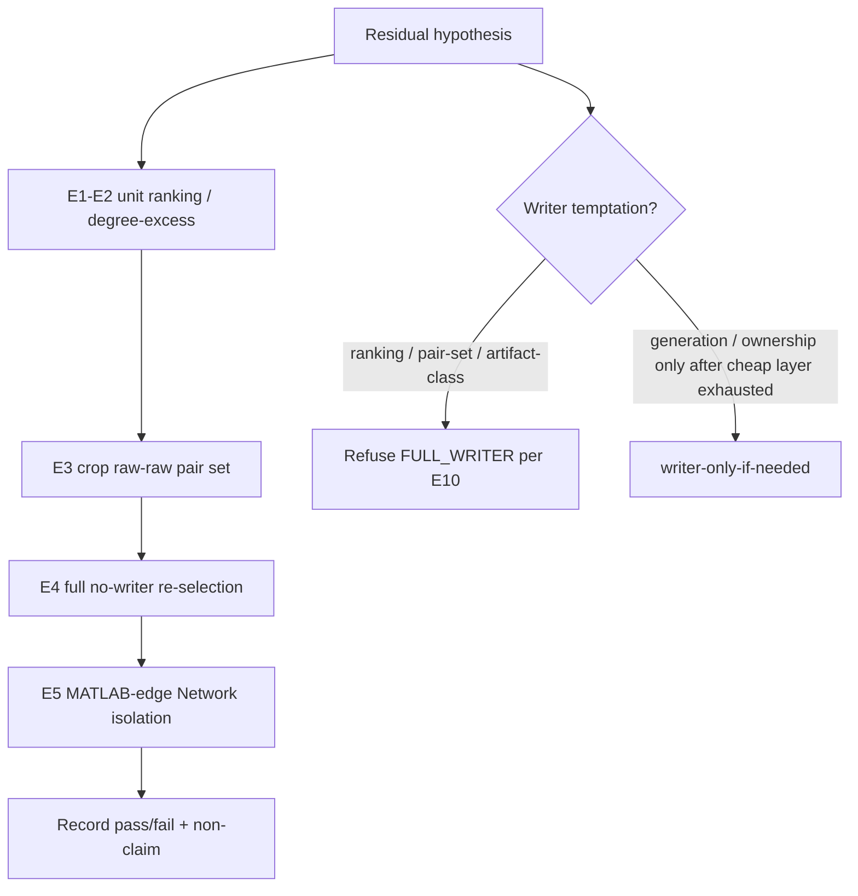

# Testable Parity Experiments Portfolio - Plan

## Goal Capsule

- **Objective:** Deliver a ranked portfolio of exactly **10** testable experiments on a balanced falsification ladder — roughly half residual/measurement (unit → crop → full no-writer), half audit-loop honesty / cheap-first discipline — so operators can falsify hypotheses without treating the matlab2python audit as Certification.
- **Product authority:** This plan owns the experiment portfolio definition (hypotheses, cost tiers, pass/fail, non-claims). Phase 1 closure execution, Network-stage rewrites, and new matlab2python coverage-as-Certification work are **not** active scope.
- **Open blockers:** None.

---

## Product Contract

### Summary

A durable, ranked set of ten falsifiable experiments grounded in `AUDIT_REPORT.md` (0 genuine behavioral divergences under honest `production_probe`; 13 static flags with full probe coverage) and ONE TRUTH residual (Network ADR 0012 / claimed `energy_map` + `sort_edges`; raw Candidate Sets already match). Each experiment carries a hypothesis, falsifier, cost tier, success/fail signal, and an explicit non-Certification claim unless an evaluated ADR 0012 proof is the named surface.

**Plan enrichment scope (2026-08-14):** Full brainstorm coverage via a documented pytest + probe/script ladder (no portfolio CLI). ProductionProbe honesty remediates living report banners **and** syncs `PROJECT.md` / `ORIGINAL_REQUEST.md` dual-run wording with honest production-only probes.

### Problem Frame

The matlab2python audit swarm (M1–M4) closed with strong negative evidence under synthetic production probes and with architecture picks C1 (shared ParityModuleMap) and C2 (honest ProductionProbe). Phase 1 remains OPEN on Network ADR 0012 for oracle/measurement reasons, not missing transpiler coverage. Without a ranked experiment portfolio, operators risk restarting expensive writers for ranking questions, promoting static AST flags to production bugs, or treating audit inventory as Certification.

### Key Decisions

- KD1. **Balanced falsification ladder.** (session-settled: user-directed — chosen over residual-first or audit-hardening-first: keep both residual measurement and audit-loop honesty active after the swarm.) Governs R1, R5–R14.
- KD2. **AUDIT_REPORT is not Certification.** (session-settled: user-directed — chosen over treating audit inventory as Phase 1 ship evidence: Certification stays Oracle + Exact Proof Coordinator / ADR 0011–0012.) Governs R2, R5–R14.
- KD3. **Residual class is measurement, not missing matlab2python.** (session-settled: user-directed — chosen over expanding transpiler coverage as the primary next move: ONE TRUTH names claimed `energy_map` + `sort_edges` with matching raw pairs.) Governs R5–R9.
- KD4. **C1 ParityModuleMap + C2 honest ProductionProbe.** (session-settled: user-directed — chosen over fake dual-run of `cleaned_transpiled` as the audit behavioral surface.) Governs R10–R13.
- KD5. **Experiments are falsifiers, not an implementation-task dump.** Portfolio entries define what to learn and what would refute a claim; how-to wiring is planning's job. Governs R1, R3.

<!-- ce-section: work-relationships -->
### How This Work Fits Together

This plan owns the **10 testable experiments** portfolio only. Surrounding areas below are the current understanding, not a committed roadmap.

- Phase 1 exact-route closure (evaluated Edges + Network ADR 0012 on a fresh claim root)
  - **May be informed by** residual falsifiers in this portfolio (hypothesis refinement only); closure execution remains outside this plan’s DoD
  - **Can proceed independently of** audit-honesty experiments once residual class is settled
- matlab2python audit tooling maintenance (manifest / matrix / report refresh)
  - **Shares** ParityModuleMap and ProductionProbe honesty constraints with R10–R13
  - **Can proceed independently of** full-volume writer work
- Network-stage rewrite or join-emission / tie-scan reopen
  - **Outside** this plan's identity (see Scope Boundaries)

### Actors

- A1. Parity operator / Phase 1 engineer — runs cheap-first experiments and cites proofs.
- A2. Audit maintainer — keeps probe honesty, discrepancy coverage, and module-map seam truthful.
- A3. Planning / implementation agent — turns this Product Contract into runnable harness steps without inventing scope.

### Requirements

**Portfolio rules**

- R1. The portfolio contains exactly **10** experiments with a balanced mix: five residual/measurement (R5–R9) and five audit-loop honesty / cheap-first discipline (R10–R14).
- R2. Every experiment states an explicit **non-claim**: results are not Phase 1 Certification unless the experiment's named surface is an evaluated ADR 0012 proof (`adr0012_evaluated: true`) cited via `slavv parity inspect-proof`.
- R3. Every experiment names a **cost tier** from the cheap ladder: `synthetic/unit` | `crop` | `full no-writer` | `writer-only-if-needed`. Ranking, artifact-class, and pair-set hypotheses must not request a full Edges writer when a cheaper tier can falsify (align with existing `require_cheap_loop` policy).
- R4. Every experiment records: hypothesis, what falsifies it, cost tier, success/fail signal, and the R2 non-claim.

**Residual / measurement experiments**

- R5. **E1 — Claimed energy_map max ranking vs original-field traces**
  - **Hypothesis:** MATLAB `sort_edges` ranks by `max` of the claimed/penalized `energy_map`, not the original energy field; sampling the original field inverts residual hub ranking.
  - **Falsified when:** Under a unit fixture, claimed-map ranking does not prefer the oracle partner over the extra pair (or original-field sampling does not invert that preference).
  - **Cost tier:** `synthetic/unit`
  - **Success/fail:** Pass if unit experiment reproduces claimed-map vs original-field rank inversion for the residual hub pattern; fail if ranks match under both samplers.
  - **Non-claim:** Not Certification; does not close Network ADR 0012.
- R6. **E2 — Degree-excess keeps earlier row under resampled-max tie**
  - **Hypothesis:** After a later resampled-max tie, degree-excess keeps the earlier row, so a wrongly ranked extra pair can survive into the Edge Set.
  - **Falsified when:** Toy hub / unit fixture shows degree-excess dropping the earlier row or selecting the oracle partner despite inverted pre-resample ranking.
  - **Cost tier:** `synthetic/unit`
  - **Success/fail:** Pass if earlier-row retention under tie is demonstrated; fail if selection is independent of emission order under the tie.
  - **Non-claim:** Not Certification; ablation that drops one candidate without fixing ranking is not proof MATLAB never emitted the pair.
- R7. **E3 — Crop raw Candidate Set undirected pairs match**
  - **Hypothesis:** On the crop harness, MATLAB and Python raw Candidate Sets share the same undirected pair multiset (discovery is not the residual class).
  - **Falsified when:** Same-class raw↔raw compare shows nonzero `only_py` or `only_mat` pairs on crop.
  - **Cost tier:** `crop`
  - **Success/fail:** Pass if raw undirected pair sets match; fail on any exclusive pairs. Compare raw↔raw only (never MATLAB finals vs Python raw).
  - **Non-claim:** Not Certification; crop pair-set match is a regression guard, not a full-volume ship gate. Unevaluated crop `prove-exact` JSON is not a spatial-bar verdict.
- R8. **E4 — Full no-writer re-selection: residual hub pair ranking**
  - **Hypothesis:** On existing full-volume candidates, no-writer re-selection with claimed-map/`sort_edges` ranking drops the residual extra pair and retains the oracle partner without a new watershed writer.
  - **Falsified when:** No-writer re-selection still keeps the extra pair (or drops the oracle) under claimed-map ranking.
  - **Blocked when:** Required candidate artifacts are missing (KTD4 — not fail-as-falsified).
  - **Cost tier:** `full no-writer`
  - **Success/fail:** Pass if re-selected Edge Set undirected multiset excludes the residual extra and includes the oracle hub partner; fail otherwise; blocked if artifacts absent.
  - **Non-claim:** Not Certification until a fresh claim root's evaluated Network ADR 0012 proof passes.
- R9. **E5 — MATLAB-edge isolation: Network multiset when Edge Set matches**
  - **Hypothesis:** Network ADR 0012 multiset failure is a function of Edge Set residual, not an independent Network bug; feeding MATLAB edges into Python Network yields exact topology.
  - **Falsified when:** With MATLAB Edge Set as input, Python Network still fails strand endpoint-pair multiset equality on the isolation surface used.
  - **Blocked when:** Isolation artifacts (normalized MATLAB edges/vertices) are missing (KTD4).
  - **Cost tier:** `crop` preferred; escalate to `full no-writer` only if crop isolation cannot speak to the claim. Do not launch a writer solely because isolation artifacts are absent.
  - **Success/fail:** Pass if Network multiset matches under MATLAB edges; fail if Network diverges with matched Edge Set; blocked if artifacts absent.
  - **Non-claim:** Isolation pass is not Phase 1 closure. Closure still requires evaluated Network ADR 0012 on a fresh full claim root.

**Audit-loop honesty / cheap-first experiments**

- R10. **E6 — ProductionProbe mode honesty**
  - **Hypothesis:** Audit behavioral validation runs in `production_probe` mode: it exercises `slavv_python` helpers only and does not dual-run `cleaned_transpiled` modules; report/mode banners **and** `PROJECT.md` / `ORIGINAL_REQUEST.md` state that honestly.
  - **Falsified when:** Probe execution, report, or those docs claim dual-run of cleaned transpiled modules, or mode banner contradicts actual execution.
  - **Cost tier:** `synthetic/unit`
  - **Success/fail:** Pass if mode, engine banner, living report, and PROJECT/ORIGINAL_REQUEST agree on production-only probes; fail on silent dual-run or contradictory wording.
  - **Non-claim:** Probe green is not Certification (per R2).
- R11. **E7 — All 13 static DISCREPANCY flags have probe coverage**
  - **Hypothesis:** Every `DISCREPANCY_DETECTED` matrix flag is covered by at least one production probe classification (13/13 coverage).
  - **Falsified when:** Any discrepancy flag lacks a covering probe result.
  - **Cost tier:** `synthetic/unit`
  - **Success/fail:** Pass at 13/13 coverage with zero uncovered flags; fail if uncovered > 0.
  - **Non-claim:** Coverage completeness is not behavioral Certification.
- R12. **E8 — Static AST branch-count alone never yields GENUINE divergence**
  - **Hypothesis:** A static AST branch/constant count mismatch alone does not classify `GENUINE_BEHAVIORAL_DIVERGENCE` without a failing synthetic or oracle differential.
  - **Falsified when:** Classifier emits `GENUINE_BEHAVIORAL_DIVERGENCE` from static-only evidence with no failing probe/oracle differential.
  - **Cost tier:** `synthetic/unit`
  - **Success/fail:** Pass if current audit classification shows 0 genuine divergences with static flags resolved to parity / benign / filtered; fail if any genuine label lacks behavioral evidence.
  - **Non-claim:** Zero genuine under synthetic fixtures does not equal Phase 1 closed.
- R13. **E9 — ParityModuleMap single-seam inventory**
  - **Hypothesis:** Manifest, AST matrix, and audit inventory resolve MATLAB↔Python counterparts through one shared ParityModuleMap seam and do not invent phantom `slavv_python` paths.
  - **Falsified when:** Inventory or matrix cites a counterpart path absent from the shared map, or parallel hard-coded maps disagree.
  - **Cost tier:** `synthetic/unit`
  - **Success/fail:** Pass if sampled inventory/matrix entries resolve via the shared map without phantoms; fail on phantom or divergent dual maps.
  - **Non-claim:** Map completeness is an audit aid only; Certification still uses Oracle + Exact Proof Coordinator.
- R14. **E10 — Cheap-loop gate refuses full writer for ranking/pair-set**
  - **Hypothesis:** The Parity Experiment cheap-loop gate refuses `FULL_WRITER` cost for ranking, artifact-class, and pair-set hypotheses.
  - **Falsified when:** Those hypothesis kinds accept a full Edges writer request without error.
  - **Cost tier:** `synthetic/unit`
  - **Success/fail:** Pass if forbidden combinations raise the cheap-loop error; fail if writer is allowed for those kinds.
  - **Non-claim:** Enforcing cheap-loop policy is process integrity, not Certification.

### Key Flows

- F1. Run one portfolio experiment cheap-first
  - **Trigger:** Operator picks an experiment E1–E10 (defined in R5–R14).
  - **Actors:** A1, A3
  - **Steps:** Confirm hypothesis kind and cost tier per R3; run at the named tier; record pass/fail and R2 non-claim; escalate cost only if the cheaper tier cannot falsify.
  - **Outcome:** A cited experiment result that does not silently upgrade to Certification.
  - **Covered by:** R2, R3, R4, R14
- F2. Residual ladder before writer
  - **Trigger:** Operator investigates Network red / Edge Set residual.
  - **Actors:** A1
  - **Steps:** Run E1–E2 (unit) → E3 (crop raw↔raw) → E4 (full no-writer) → E5 (isolation); request writer only if generation/ownership genuinely requires it.
  - **Outcome:** Residual class confirmed or falsified without a premature full Edges writer.
  - **Covered by:** R5–R9, R3
- F3. Audit honesty check after report refresh
  - **Trigger:** Audit tools or `AUDIT_REPORT` regenerate.
  - **Actors:** A2
  - **Steps:** Run E6–E10; fix honesty/coverage/map/cheap-loop failures before claiming audit progress.
  - **Outcome:** Audit surface stays truthful relative to C1/C2.
  - **Covered by:** R10–R14

### Acceptance Examples

- AE1. Ranking question stays cheap
  - **Covers:** R3, R14, F1
  - **Given:** An operator wants to know whether claimed-map ranking beats original-field ranking for the residual hub.
  - **When:** They follow F1 for E1.
  - **Then:** The run stays at `synthetic/unit`; a full Edges writer is refused if requested for that ranking hypothesis.
- AE2. Raw vs final not crossed
  - **Covers:** R7, R2
  - **Given:** Crop MATLAB finals and Python `candidates.pkl` differ in pair count.
  - **When:** E3 is interpreted.
  - **Then:** The experiment compares raw↔raw only; the operator does not treat finals-vs-raw mismatch as discovery failure or Certification.
- AE3. Probe green is not ship
  - **Covers:** R2, R10, R12
  - **Given:** Production probes are 22/22 with 0 genuine divergences.
  - **When:** Someone cites the audit as Phase 1 closed.
  - **Then:** R2 non-claim applies; ONE TRUTH / evaluated Network ADR 0012 remains the ship gate.
- AE4. Isolation vs closure
  - **Covers:** R9, R2
  - **Given:** E5 passes (MATLAB edges → Python Network multiset exact).
  - **When:** Closure messaging is drafted.
  - **Then:** Messaging states isolation confirmed Edge-Set residual class; Phase 1 still open until evaluated Network proof on a fresh claim root.

### Success Criteria

- SC1. All ten experiments (R5–R14) are runnable at their named cost tier with recorded pass/fail and R2 non-claim.
- SC2. Residual track (E1–E5) can be executed in order without opening a full writer for ranking or pair-set questions.
- SC3. Audit track (E6–E10) can detect regression of probe honesty, discrepancy coverage, genuine-label discipline, module-map seam, or cheap-loop gate.
- SC4. A cold reader of this plan cannot mistake audit green or unit residual falsifiers for Phase 1 Certification.

### Scope Boundaries

**In scope**

- Defining and ranking the ten experiments above.
- Binding each to cheap-first cost tiers and non-Certification claims.
- Relating residual experiments to ONE TRUTH residual class and audit experiments to AUDIT_REPORT / C1 / C2.
- Packaging each experiment as a runnable pytest and/or probe/script entrypoint on the documented ladder (no new portfolio CLI).
- Syncing `PROJECT.md` / `ORIGINAL_REQUEST.md` dual-run wording with honest ProductionProbe (E6).

**Deferred for later**

- Optional full-volume ownership-map refresh so ADR 0012 proofs evaluate (`writer-only-if-needed` surface). This is Phase 1 closure follow-up, **outside** portfolio DoD and not ranked among E1–E10.
- A unified `slavv parity experiment run E{n}` portfolio CLI (explicitly out of this plan's packaging choice).

**Deferred to Follow-Up Work**

- Wiring `require_cheap_loop` into writer-launch CLI surfaces (E10 remains unit-enforced in v1).
- Promoting unlabeled scratch probes into the portfolio beyond the named E1–E10 surfaces.

**Outside this product's identity**

- Claiming Phase 1 closed from this portfolio alone.
- Network-stage rewrite; reopening join-emission / tie-scan / cleanup secondary keys as the ship-gate change.
- Expanding matlab2python coverage as Certification evidence.
- Promoting static AST branch-count mismatches to production bugs without failing synthetic or oracle differentials.

### Dependencies / Assumptions

- D1. Live residual and claim-root status remain authoritative in `docs/reference/core/EXACT_PROOF_FINDINGS.md` ONE TRUTH (do not freeze KPIs in this plan).
- D2. Cheap residual unit fixtures continue to live beside `tests/unit/pipeline/test_watershed_energy_map_sort_experiments.py` patterns (planning may extend, not replace the concept).
- D3. Parity Experiment cost policy (`HypothesisKind` / `ExperimentCost` / `require_cheap_loop`) remains the cost-tier authority for R3 and R14.
- AS1. Claim-verifier confirmed (2026-08-14): AUDIT_REPORT production_probe numbers, 13/13 coverage, ParityModuleMap audit-aid disclaimer, cheap-loop enums, ONE TRUTH residual wording, residual unit tests, and ORIGINAL_REQUEST/PROJECT dual-run wording conflict with honest probe — treated as facts, not assumptions.

### Outstanding Questions

**Resolve Before Planning**

- (none)

**Deferred to Planning** — resolved in Planning Contract

- Q1. Exact harness entrypoints and artifact paths for E4/E5 → resolved by KTD3 (discover from HANDOFF + hygiene; no invented run roots).
- Q2. Whether E6 remediation is report-banner only, PROJECT/ORIGINAL_REQUEST doc sync, or both → resolved by KTD2 (both).
- Q3. Ordering and packaging of the ten experiments as one CLI/suite vs documented manual ladder → resolved by KTD1 (documented pytest + probe/script ladder; no portfolio CLI).

### Sources / Research

- `AUDIT_REPORT.md` — 0 genuine divergences; 22/22 production probes; 13/13 discrepancy coverage; remediation non-Certification stance.
- `docs/reference/core/EXACT_PROOF_FINDINGS.md` — ONE TRUTH; Network ADR 0012 open; claimed `energy_map` + `sort_edges` residual; raw pairs match.
- `.claude/HANDOFF.md` — operator sequence; crop regression guard; no Network rewrite.
- `AGENTS.md` — Exact MATLAB Parity Rule; Parity Experiment cheap-first; no static transpilers for Certification verification.
- `slavv_python/analytics/parity/experiments/cost.py` — cost ladder and `require_cheap_loop`.
- `workspace/experiments/matlab2python_audit/tools/parity_module_map.py` — C1 shared map; audit aid only.
- `docs/solutions/parity/raw-vs-final-candidate-compare.md` — same-class compare discipline.
- `docs/solutions/best-practices/parity-experiment-hygiene.md` — cheap ladder, artifact classes, run-root pairing.
- `tests/unit/pipeline/test_watershed_energy_map_sort_experiments.py` — cheap residual falsifier pattern.
- Grounding dossier (scratch): claim-verifier all-confirmed on the above repo facts.

---

## Planning Contract

**Product Contract preservation:** restructured, no scope change: R8/R9 gained explicit **Blocked when** (KTD4 alignment); R10 extended to cover PROJECT/ORIGINAL_REQUEST per settled KTD2; F1 trigger wording clarified. Deferred Q1–Q3 closed as KTDs; Scope Boundaries gained packaging/doc-sync in-scope lines and deferred portfolio CLI.

### Key Technical Decisions

- KTD1. **Packaging = documented pytest + probe/script ladder (no portfolio CLI).** (session-settled: user-approved — chosen over a new `slavv parity experiment` subcommand in this plan: v1 reuses existing unit tests and scripts; a unified CLI is follow-up.) Instantiates KD5 / R1 / Q3.
- KTD2. **E6 honesty remediates report/banner and PROJECT / ORIGINAL_REQUEST wording.** (session-settled: user-approved — chosen over report-only: living docs must not contradict C2 production-only probes.) Instantiates KD4 / R10 / Q2.
- KTD3. **Discover E4/E5 artifact roots from HANDOFF + parity-experiment-hygiene; do not invent new run roots.** Claim candidates prefer live claim surface named in hygiene/ONE TRUTH (historically `canonical_full_v16`); crop guard is `crop_M_exact_v3`. Instantiates R8–R9 / Q1.
- KTD4. **Missing workspace artifacts block the experiment, they do not falsify the hypothesis.** Unit/crop tests use `skipif` / explicit blocked outcome when raw dumps or candidates are absent. Instantiates R7–R9 / SC1.
- KTD5. **Extend existing harness seams; do not invent a second experiment framework.** Residual stays on pipeline unit tests + `select_and_finalize_edge_set` scripts; audit stays on `synthetic_validator` / `compile_audit_report` / `parity_module_map` tests; cost policy stays on `require_cheap_loop`. Instantiates D2–D3 / R3 / R14.
- KTD6. **Same-class compare only for pair-set experiments.** E3/E4 use `compare_same_class_pair_sets` / `load_edge_artifact`; never MATLAB finals vs Python raw. Instantiates R7 / AE2.
- KTD7. **E4 requires a script-side claimed-map ranking adapter.** A bare fork of crop persist-selection that re-ranks stored original-field traces does not satisfy R8; if the adapter cannot run on the current candidate lineage, E4 is blocked (KTD4), not falsified. Instantiates R8 / U2.

### Assumptions

- AS2. Live claim-root directory names may advance after this plan is written; implementers re-read ONE TRUTH / hygiene tables rather than hard-coding a frozen root into operator messaging.
- AS3. Crop MATLAB-edge isolation (E5) is sufficient for the portfolio's residual-class claim; full-volume isolation is optional escalation, not a second ship gate.
- AS4. E10 unit coverage of `require_cheap_loop` is sufficient for portfolio v1; CLI enforcement of the gate is follow-up.

### High-Level Technical Design

Cheap-first residual ladder (F2) before any Edges writer:

Audit honesty track (F3) after report refresh:

### Execution Order

1. U1 (E1–E3 residual unit/crop) — no dependency on audit packaging.
2. U2 (E4 full no-writer) after U1 crop raw↔raw discipline is in place.
3. U3 (E5 isolation) after residual class narrative is runnable; crop-first.
4. U4 (E6–E9 audit honesty + doc sync) may run in parallel with U1–U3.
5. U5 (E10 + operator ladder doc) after U1–U4 entrypoints exist so the ladder cites real paths.

### Risks and Mitigations

| Risk | Mitigation |
|------|------------|
| Wrong artifact class (finals vs raw) reopens false “MATLAB never emitted” story | KTD6; AE2; use `ArtifactClass` helpers |
| Missing scratch dumps treated as discovery failure | KTD4 skip/block |
| Operator cites audit green as Phase 1 closed | R2 non-claim in every unit’s result surface; AE3 |
| Full writer launched for ranking | E10 + F2 order; KTD1 documents ladder without writer steps for E1–E4 |
| Stale / contaminated claim roots (`canonical_full_v17`, mispaired proof JSON) | KTD3; `load_proof_record` / `inspect-proof` for any ship-adjacent citation |
| Doc drift reintroduces dual-run wording after E6 | KTD2 + unit/assert on report banner strings |

---

## Implementation Units

### U1. Residual unit + crop raw↔raw (E1–E3)

- **Goal:** Make E1–E3 runnable as unit/crop falsifiers with explicit non-claims and correct same-class compare.
- **Requirements:** R1, R2, R3, R4, R5, R6, R7, F2, AE1, AE2, SC1, SC2
- **Dependencies:** None
- **Files:**
  - Modify: `tests/unit/pipeline/test_watershed_energy_map_sort_experiments.py`
  - Optionally thin wrap: `scripts/edge_emission_order_probe.py` (raw↔raw already) or a small crop raw↔raw helper that only calls `load_edge_artifact` + `compare_same_class_pair_sets`
  - Test: same pipeline unit file (feature-bearing)
- **Approach:**
  1. Prefer a rename/tag/doc pass on existing residual unit tests (E1/E2/E3 identifiers + R2 non-claim markers) before adding new harness code — core falsifiers already live in this file.
  2. Ensure E3 compares crop Python `candidates.pkl` to crop MATLAB raw dump via same-class helpers only; `skipif` when artifacts missing (KTD4).
  3. Optional thin wrap of `scripts/edge_emission_order_probe.py` only if operator discoverability needs a named E3 script; avoid duplicate crop helpers.
- **Execution note:** Characterization-first on the existing residual fixture file; do not rebuild E1–E3 from scratch.
- **Patterns to follow:** Existing tests in `tests/unit/pipeline/test_watershed_energy_map_sort_experiments.py`; `slavv_python.analytics.parity.experiments` public API; `docs/solutions/parity/raw-vs-final-candidate-compare.md`.
- **Test scenarios:**
  - Happy path: claimed-map ranking prefers oracle hub partner over extra pair; original-field ranking inverts that preference (E1).
  - Happy path: under resampled-max tie, degree-excess keeps the earlier row (E2).
  - Happy path: when crop raw artifacts exist, undirected pair multisets match (E3).
  - Edge: missing crop raw dump or candidates → skip/blocked, not fail-as-falsified (KTD4).
  - Error: mixed-class compare (finals vs raw) raises / is refused (KTD6 / AE2).
  - Covers AE1: ranking hypothesis stays at unit cost; no writer request in this unit.
- **Verification:** E1–E3 have named tests or documented script entrypoints; cold reader sees R2 non-claim; no full writer invoked.

### U2. Full no-writer re-selection (E4)

- **Goal:** Package E4 so operators can re-select on existing full-volume candidates and assert residual hub pair outcome without a watershed writer.
- **Requirements:** R8, R2, R3, F2, SC2
- **Dependencies:** U1
- **Files:**
  - Create: `scripts/persist_full_edges_selection.py` (fork of crop pattern)
  - Test: `tests/unit/pipeline/test_full_no_writer_reselection_experiment.py` (or extend residual experiments file) with `skipif` when claim candidates absent
  - Do **not** modify `slavv_python/pipeline/edges/selection_workflow.py` in this unit (KTD5)
- **Approach:**
  1. Clone `scripts/persist_crop_edges_selection.py` pattern: load candidates + E/V/params from run surface, call existing `select_and_finalize_edge_set`, assert hub-pair membership per R8.
  2. Because stored traces may still sample the original energy field, supply a **script-side claimed-map ranking adapter** for the residual hub (override hub-pair energies / sort inputs from ONE TRUTH residual narrative, or an equivalent no-writer-safe claimed-map input). A bare persist_crop fork without that adapter does **not** satisfy R8.
  3. Default roots from HANDOFF / hygiene (KTD3); CLI flags for override; refuse to start a writer. If claimed-map ranking cannot be supplied without production watershed changes, mark E4 **blocked** (not falsified) until post-fix candidates exist.
  4. Success signal: re-selected Edge Set undirected multiset excludes residual extra and retains oracle hub partner per ONE TRUTH residual narrative.
- **Execution note:** Prove the script against existing candidates first; do not launch `resume-exact-run --force-rerun-from edges` for this unit.
- **Patterns to follow:** `scripts/persist_crop_edges_selection.py`; `compare_same_class_pair_sets`; HANDOFF “prefer no-writer probes first.”
- **Test scenarios:**
  - Happy path (artifacts + claimed-map adapter present): re-selection drops residual extra and keeps oracle partner under claimed-map / `sort_edges` ranking.
  - Edge: missing candidates → blocked/skip, not silent fail-as-falsified.
  - Edge: claimed-map adapter unavailable on current candidate lineage → blocked (document why), not treated as hypothesis fail.
  - Error: script does not invoke watershed discovery / full writer.
  - Integration: output Edge Set loadable for downstream E5 messaging without claiming Certification.
- **Verification:** Operator can run E4 on the documented claim candidates path with the claimed-map adapter; result block states non-claim.

### U3. MATLAB-edge Network isolation (E5)

- **Goal:** Package crop-first MATLAB Edge Set → Python Network isolation so residual class can be confirmed without a Network rewrite.
- **Requirements:** R9, R2, F2, AE4, SC2
- **Dependencies:** U1
- **Files:**
  - Create: `scripts/network_matlab_edge_isolation.py` (or equivalent pytest under `tests/unit/parity/` with skipif)
  - Read-only use of: `slavv_python/analytics/parity/oracle/matlab_vector_loader.py`, `slavv_python/pipeline/network/construction.py`
  - Test: `tests/unit/parity/test_network_matlab_edge_isolation_experiment.py`
- **Approach:**
  1. Follow prove-parity skill isolation recipe: load normalized MATLAB edges/vertices, construct Network, compare strand endpoint-pair multiset on the isolation surface.
  2. Default to crop oracle + crop run; escalate to full only if crop cannot speak to the claim (R9).
  3. Result messaging must match AE4: isolation ≠ Phase 1 closure.
- **Patterns to follow:** `.claude/skills/prove-parity/SKILL.md` isolation steps; `tests/unit/analytics/parity/test_matlab_exact_proof.py` loader usage.
- **Test scenarios:**
  - Happy path: with MATLAB edges, Network multiset matches on crop isolation surface.
  - Edge: missing oracle/normalized stages → blocked/skip.
  - Covers AE4: pass result text forbids claiming Phase 1 closed.
  - Fail path: if Network still diverges with matched Edge Set, fail the hypothesis (independent Network bug signal) without proposing a rewrite in-scope.
- **Verification:** Named entrypoint exists; AE4 non-claim language present; no Network-stage rewrite changes.

### U4. Audit honesty E6–E9 + dual-run doc sync

- **Goal:** Lock ProductionProbe honesty, 13/13 coverage, no static-only GENUINE, ParityModuleMap single seam, and sync PROJECT/ORIGINAL_REQUEST with C2.
- **Requirements:** R10, R11, R12, R13, F3, AE3, SC3, SC4
- **Dependencies:** None (parallel with U1–U3)
- **Files:**
  - Modify: `workspace/experiments/matlab2python_audit/tools/synthetic_validator.py` (mode/banner assertions if needed)
  - Modify: `workspace/experiments/matlab2python_audit/tools/compile_audit_report.py`
  - Modify: `AUDIT_REPORT.md` and/or report renderer so living banner stays honest
  - Modify: `PROJECT.md`, `ORIGINAL_REQUEST.md` (KTD2 — remove/replace dual-run claims)
  - Modify/extend tests: `tests/unit/test_synthetic_validator.py`, `tests/unit/test_compile_audit_report.py`, `tests/unit/test_parity_module_map.py`
- **Approach:**
  1. E6: assert `VALIDATION_MODE` / engine banner / report section agree on production-only probes; sync PROJECT + ORIGINAL_REQUEST to the same story.
  2. E7: assert `SyntheticValidatorEngine` matrix_coverage (existing summary field) reports 13/13 with zero uncovered discrepancy flags — do not invent a new `compute_matrix_coverage` symbol.
  3. E8: assert classifier refuses GENUINE from static-only evidence; living classification remains 0 genuine without behavioral failure.
  4. E9: assert inventory/matrix counterparts resolve through shared ParityModuleMap without phantoms or dual hard-coded maps.
- **Execution note:** Prefer characterization tests on current honest behavior before editing docs; then fix wording drift.
- **Patterns to follow:** Existing audit unit tests; C1/C2 shipped tools under `workspace/experiments/matlab2python_audit/tools/`.
- **Test scenarios:**
  - Happy path: mode banner and execution path are production-only (E6).
  - Happy path: 13/13 discrepancy coverage (E7).
  - Happy path: static-only mismatch does not yield GENUINE (E8).
  - Happy path: sampled map resolutions have no phantoms (E9).
  - Covers AE3: audit green messaging path still carries non-Certification disclaimer.
  - Regression: PROJECT/ORIGINAL_REQUEST no longer instruct dual-run of cleaned transpiled modules as the behavioral surface.
- **Verification:** Audit unit tests green; docs agree with C2; SC4 satisfied for audit track.

### U5. Cheap-loop gate (E10) + operator ladder documentation

- **Goal:** Keep E10 enforceable in unit tests and publish a single operator ladder that maps E1–E10 to entrypoints without a portfolio CLI.
- **Requirements:** R14, R1, R3, F1, F2, F3, AE1, SC1–SC4
- **Dependencies:** U1, U2, U3, U4
- **Files:**
  - Modify/extend: `tests/unit/parity/test_parity_experiment_module.py` only (not `test_parity_experiment_comprehensive.py`)
  - Create or update: short operator section in `docs/solutions/best-practices/parity-experiment-hygiene.md` — prefer extending hygiene (existing operator-facing surface)
  - Do **not** add `slavv parity experiment` CLI in this unit (KTD1)
- **Approach:**
  1. Parametrize cheap-loop tests so RANKING, ARTIFACT_CLASS, and PAIR_SET each raise `CheapLoopError` on FULL_WRITER; keep GENERATION/OWNERSHIP allow-path coverage.
  2. Document F1–F3 ladders with Ei → pytest node or script path, cost tier, and R2 non-claim one-liner.
  3. Explicitly forbid `resume-exact-run` / full Edges writer for E1–E4 ranking and pair-set questions; warn that writer CLI does not yet call `require_cheap_loop` (follow-up).
- **Patterns to follow:** `slavv_python/analytics/parity/experiments/cost.py`; existing cheap-loop unit tests; hygiene doc tone.
- **Test scenarios:**
  - Happy path: RANKING, ARTIFACT_CLASS, and PAIR_SET each reject FULL_WRITER (E10).
  - Covers AE1: documented ranking path points at unit surface, not writer.
  - Edge: GENERATION / OWNERSHIP kinds remain allowed at FULL_WRITER (policy completeness).
- **Verification:** E10 tests green; operator can run all ten experiments from the ladder doc without inventing entrypoints; no portfolio CLI landed.

---

## Verification Contract

- Unit gate: residual + audit + cheap-loop tests covering E1–E10 behaviors named above.
- Targeted pytest on files touched by U1–U5; workspace-dependent cases may skip when artifacts absent.
- No `prove-exact` or full Edges writer required to mark this plan’s DoD complete.
- Ship-adjacent citations (if any) must use `slavv parity inspect-proof` with evaluated ADR 0012 — never audit green alone.
- Quality: `ruff` / existing unit markers per `tests/README.md`; respect 1000-line file limit.

---

## Definition of Done

**Global**

- All ten experiments (E1–E10) have a named runnable entrypoint at their cost tier with pass/fail and R2 non-claim.
- Residual ladder E1→E5 can be followed without opening a full Edges writer for ranking or pair-set questions.
- Audit track E6–E10 detects honesty/coverage/map/cheap-loop regressions; PROJECT/ORIGINAL_REQUEST agree with production-only probes.
- Cold reader cannot mistake portfolio green for Phase 1 Certification.
- No Network rewrite; no portfolio CLI; no invented claim run roots.

**Per unit**

- U1: E1–E3 tests/scripts green or correctly skipped when artifacts missing.
- U2: E4 no-writer script + test exist; writer not invoked.
- U3: E5 isolation entrypoint exists; AE4 non-claim language present.
- U4: E6–E9 tests green; dual-run doc wording removed/aligned.
- U5: E10 cheap-loop tests green; operator ladder documents all ten entrypoints.

---

## Appendix

### Experiment → harness map (planning reference)

| Ei | Cost | Primary harness |
|----|------|-----------------|
| E1 | unit | `tests/unit/pipeline/test_watershed_energy_map_sort_experiments.py` |
| E2 | unit | same |
| E3 | crop | same + raw↔raw via `compare_same_class_pair_sets` / emission probe |
| E4 | full no-writer | `scripts/persist_full_edges_selection.py` (new; crop analogue exists) |
| E5 | crop → escalate | `scripts/network_matlab_edge_isolation.py` or parity unit isolation test |
| E6 | unit | `tests/unit/test_synthetic_validator.py` + `test_compile_audit_report.py` + PROJECT/ORIGINAL_REQUEST |
| E7 | unit | coverage helper tests + report |
| E8 | unit | classification tests (static ≠ GENUINE alone) |
| E9 | unit | `tests/unit/test_parity_module_map.py` |
| E10 | unit | `tests/unit/parity/test_parity_experiment_module.py` |

### Must-read before implementation

- `docs/solutions/best-practices/parity-experiment-hygiene.md`
- `docs/solutions/parity/raw-vs-final-candidate-compare.md`
- `docs/solutions/parity/edge-watershed-matlab-faithfulness.md`
- `.claude/HANDOFF.md`
- `docs/reference/core/EXACT_PROOF_FINDINGS.md` (ONE TRUTH only for live status)
