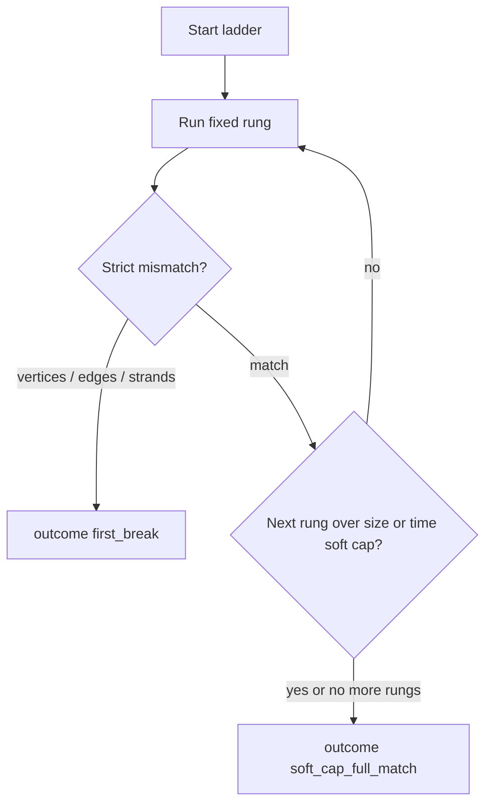

# Synthetic Complexity Ladder Until First Divergence - Plan

## In short

Grow fake photos step by step until Python and MATLAB first disagree (or they
still agree at the last step). This is a cheap probe series. It does **not**
reopen Phase 1 and it does **not** unlock crop Energy identical-bits.

## Goal Capsule

- **Objective:** Deliver a short, fixed four-step fake-volume ladder that runs MATLAB and Python the same way as the tiny Y-junction experiment, escalating complexity until the first real mismatch on vertices, edges, or strands — or until a soft size/time cap or the last fixed rung (end-of-ladder full match) if they still agree.
- **Product authority:** This plan owns the synthetic escalate-until-first-divergence ladder only. Phase 1 Certification closure and the claimed-energy production fix are **not** active scope.
- **Open blockers:** None.

---

## Product Contract

### Summary

Extend the existing tiny Y-junction MATLAB↔Python dual-run into a hand-defined four-rung synthetic TIFF ladder. Each rung is a fixed volume (not an open-ended generator). Stop at the first real disagreement on vertices, edges, or strands, or stop at a soft size/time cap or after the last fixed rung if everything still matches. Results are informative only — never Phase 1 Certification.

Implementation covers the full brainstorm: named generators in-package, one operator script for the dual-run ladder, unit-tested strict stop/compare helpers, and a durable ladder report. No package refactor of the existing tiny experiment beyond optional shared-helper reuse.

### Problem Frame

A single 32³ Y-junction already matched after index alignment, which can make “toys always match” feel true and weaken trust in the full-volume residual story. Without a bounded way to escalate fake-volume difficulty under the same dual-run compare, operators cannot cheaply pressure-test that intuition.

### Key Decisions

- KD1. **Any first real mismatch is a win.** (session-settled: user-directed — chosen over ranking-shaped-only or harness-even-if-always-match: falsify “toys always match” quickly.) Governs R2, R6, R7.
- KD2. **Short fixed ladder + soft cap; no endless generator.** (session-settled: user-approved — chosen over open-ended escalation: lightest form still worth doing.) Governs R1, R3, R4, R8.
- KD3. **Reuse the tiny dual-run compare pattern.** (session-settled: user-directed — chosen over a new CI-fixture tour or a free-form preset generator: build on the harness that already proved the Y-junction match.) Governs R5, R9.
- KD4. **Synthetic results are not Certification.** (session-settled: user-directed — chosen over treating ladder outcomes as Phase 1 ship evidence.) Governs R10.

<!-- ce-section: work-relationships -->
### How This Work Fits Together

This plan owns the **synthetic complexity ladder until first divergence** only. Surrounding areas below are the current understanding, not a committed roadmap.

- Phase 1 exact-route closure (evaluated Edges + Network ADR 0012 on a fresh claim root)
  - **May be informed by** a found synthetic mismatch (hypothesis refinement only)
  - **Can proceed independently of** this ladder
- Claimed Trace Energy bake-at-finalize (production ranking residual fix)
  - **Outside** this plan’s identity; adjacent only
  - **Can proceed independently of** this ladder
- Testable parity experiments portfolio (`docs/plans/2026-08-14-001-feat-testable-parity-experiments-plan.md`)
  - **Shares** cheap-first / non-Certification discipline
  - **Can proceed independently of** this ladder’s rungs

### Actors

- A1. Parity operator — runs the ladder, reads the first-break / soft-cap verdict, does not promote results to ONE TRUTH.
- A2. Planning / implementation agent — turns this Product Contract into fixed volumes and dual-run wiring without inventing Certification claims.

### Requirements

**Ladder shape**

- R1. The ladder has a short fixed set of about **four** hand-defined synthetic TIFF rungs, starting from the existing matching tiny Y-junction as the baseline rung.
- R2. Escalation stops at the **first real mismatch** among curated vertices, final edges (spatial pair sense used by the tiny experiment), or strand count — whichever fails first in that compare order.
- R3. If all rungs still match, the ladder stops at a **soft cap**: about **64³** volume size and about a **few minutes** of runtime per side (MATLAB or Python), whichever the operator hits first while staying within the fixed rung set.
- R4. There is **no** open-ended or auto-searching volume generator; rungs are fixed artifacts or fixed named definitions only.

**Compare behavior**

- R5. Each rung reuses the tiny experiment’s dual-run pattern: generate/load the TIFF, run MATLAB Vectorization-Public and Python exact-route comparison, then compare vertices / edges / strands honestly.
- R6. The durable output of a ladder run names either the **first-break rung and surface** (vertices, edges, or strands) or a **soft-cap full-match** outcome.
- R7. A first-break outcome is a successful falsification of “always match on these toys” for this ladder; it is not a Certification pass or fail.

**Non-claims and boundaries**

- R8. Soft-cap full match is a finished, informative negative result for the ladder hypothesis; it does not prove the full-volume residual is ranking-only.
- R9. Implementation may live beside or extend `workspace/experiments/tiny_synthetic_matlab_python_diff/`; planning owns exact file layout.
- R10. Ladder reports must state they are **not** Certification / not Phase 1 and must not update ONE TRUTH or claim-run roots.

### Key Flows

- F1. Escalate until first break
  - **Trigger:** Operator starts the synthetic complexity ladder from the matching baseline.
  - **Actors:** A1
  - **Steps:** Run rung 1 (baseline) → if mismatch, stop with first-break; else run next fixed rung → repeat until first mismatch or soft cap / last rung.
  - **Outcome:** Report names first-break rung + surface, or soft-cap / end-of-ladder full match.
  - **Covered by:** R1–R7, R10

- F2. Soft-cap stop without mismatch
  - **Trigger:** All completed rungs match and the next step would exceed ~64³ or a few minutes per side, or the fixed rung list is exhausted.
  - **Actors:** A1
  - **Steps:** Do not invent further volumes; emit soft-cap / full-match verdict with non-Certification banner.
  - **Outcome:** Informative negative result per R8; ladder considered complete.
  - **Covered by:** R3, R4, R6, R8, R10

### Acceptance Examples

- AE1. First mismatch on edges
  - **Covers:** R2, R6, R7
  - **Given:** Baseline Y-junction matches; rung 2 mismatches on spatial edge pairs while vertices still match
  - **When:** The ladder runs
  - **Then:** It stops at rung 2, reports edges as the first-break surface, and does not run later rungs

- AE2. Soft-cap full match
  - **Covers:** R3, R8, R10
  - **Given:** All fixed rungs within ~64³ and the time budget still match
  - **When:** The ladder completes
  - **Then:** Verdict is soft-cap / full-match, banner says not Certification, and ONE TRUTH is untouched

- AE3. No endless generation
  - **Covers:** R4
  - **Given:** Soft cap or last fixed rung is reached without mismatch
  - **When:** Someone asks for “one more harder volume”
  - **Then:** That request is out of this plan’s product behavior; no auto-generator continues the search

### Success Criteria

- SC1. An operator can run the fixed ladder once and get either a first-break (rung + surface) or a soft-cap full-match verdict without improvising volumes.
- SC2. A cold reader of the report cannot mistake the outcome for Phase 1 Certification.
- SC3. Planning can implement without inventing win criteria, stop rules, or Certification claims.

### Scope Boundaries

**In scope**

- Fixed four-rung synthetic TIFF ladder and dual-run compare until first divergence, soft size/time cap, or end-of-ladder full match
- Reuse of the tiny Y-junction dual-run pattern and non-Certification reporting

**Deferred for later**

- Ranking-shaped-only hunting after a first any-mismatch win
- Larger or longer ladders beyond the soft cap
- Promoting a synthetic oracle into Certification pre-gate tiers

**Outside this product's identity**

- Phase 1 / ONE TRUTH Certification claims from ladder results
- Claimed Trace Energy bake-at-finalize production fix
- Crop or canonical full-volume writers used as the ladder itself
- Endless or search-based volume generation

### Dependencies / Assumptions

- D1. MATLAB Vectorization-Public and a working Python exact-route compare path remain available as in the tiny experiment.
- AS1. The existing tiny Y-junction remains a valid matching baseline until a ladder run shows otherwise.
- AS2. “Few minutes per side” is an operator soft budget, not a hard CI timeout contract; planning may refine measurement without changing the soft-cap intent.

### Outstanding Questions

**Resolve Before Planning**

- None.

**Deferred to Planning** (resolved below in Planning Contract)

- Q1. Exact vessel geometry / topology themes for rungs 2–4 — resolved as KTD1.
- Q2. Whether the ladder is one orchestration entrypoint or a small set of scripts — resolved as KTD2.
- Q3. Precise on-disk report fields beyond first-break / soft-cap + non-Certification banner — resolved as KTD3.

### Sources / Research

- Existing dual-run: `workspace/experiments/tiny_synthetic_matlab_python_diff/` (`run_tiny_synthetic_diff.py`, `report.json` with `first_big_break` / non-Certification note).
- Adjacent portfolio (separate plan): `docs/plans/2026-08-14-001-feat-testable-parity-experiments-plan.md`.
- Synthetic generators (CI smoke, not this ladder): `slavv_python/utils/synthetic.py`, Parity Pre-Gate tier 1 in `docs/reference/workflow/PARITY_PRE_GATE.md`.
- Hygiene: `docs/solutions/best-practices/parity-experiment-hygiene.md`, `docs/solutions/parity/raw-vs-final-candidate-compare.md`.

---

## Planning Contract

### Key Technical Decisions

- KTD1. **Four named hand-defined geometries (no search).** (session-settled: user-approved defaults — chosen over open themes deferred to implementer improvisation.) Rung 1 = existing matching 32³ Y-junction baseline. Rung 2 = second junction / extra branch on ~32³ (topology step). Rung 3 = asymmetric radii or offset junction on ~48³ (geometry asymmetry). Rung 4 = size step to ~64³ in the same Y-family (soft-cap size rung). Exact voxel paint formulas may refine at implementation time if a named theme stays within R1/R3/R4. Resolves Q1. Governs R1, R3, R4.
- KTD2. **One operator script + in-package generators + unit-tested pure compare.** Durable generators live in `slavv_python/utils/synthetic.py`; strict compare/stop helpers live in a small package module so pytest can import them; the ladder runner is a single `scripts/` entrypoint writing artifacts under `workspace/experiments/synthetic_complexity_ladder/`. Do not put the only harness under gitignored `workspace/` alone, and do not make full MATLAB dual-run part of default CI. Resolves Q2. Governs R5, R9.
- KTD3. **Ladder report uses a strict first-break surface; graded `first_big_break` stays advisory.** Ladder stop / R6 outcome fields: `outcome` (`first_break` | `soft_cap_full_match` | `inconclusive` | `failed`), `first_break_rung`, `first_break_surface` (`vertices` | `edges` | `strands`), `ladder_rungs[]` (per-rung meta + timings + compare summary), `soft_cap_reason` (`size` | `time` | `end_of_ladder` when applicable), plus the existing non-Certification `note`. `soft_cap_full_match` is the umbrella no-first-break completion; `soft_cap_reason` disambiguates size vs time vs end_of_ladder (R3’s size/time limits remain the soft-cap policy; exhausting the fixed rung list is still this outcome with reason `end_of_ladder`). Use `inconclusive` / `failed` when MATLAB/Python is unavailable, non-zero, or artifacts are non-comparable — never first_break or soft_cap_full_match. Strict mismatch = unequal curated vertex spatial key sets, or unequal spatial undirected edge-pair sets, or unequal strand counts — in that order (R2). Do not use the tiny script’s graded residual bands (`tiny_edge_or_strand_residual`, etc.) as the ladder stop predicate; they may still appear inside per-rung diagnostics. Soft time budget default: ~3 minutes wall per side (AS2); budget is per side, not a single combined dual-run timer. Prefer `MATLAB_EXE` / `shutil.which` over a hard-coded MATLAB path. Resolves Q3. Governs R2, R3, R6, R10.
- KTD4. **Reuse tiny dual-run semantics, not Certification APIs.** Mirror `SHARED_PARAMS` / `comparison_exact_network` / curated vertices + curated edges + spatial pair compare from the tiny experiment. Do not route the ladder through `prove-exact`, Claim Run Roots, or `compare_same_class_pair_sets` as the primary stop surface (that API is same-class index/artifact compare for crop/oracle work). Governs R5, R10.

### Assumptions

Un-validated agent bets from scoping (confirmation skipped per operator preference):

- A-plan1. Soft time cap is implemented as ~180s wall-clock per side unless the operator override flag says otherwise; size cap refuses starting a rung whose max dimension exceeds 64. Soft-time enforcement is **pre-start of the next rung** (if either side of the prior rung exceeded ~180s, do not start the next); mid-rung kill/timeout is not required for v1.
- A-plan2. Rung TIFF definitions are regenerated from named code each run (deterministic seed), not checked-in multi-megabyte TIFF binaries in git.
- A-plan3. Optional later refactor of `run_tiny_synthetic_diff.py` to call the shared compare module is follow-up, not required for ladder ship.
- A-plan4. Each rung uses isolated input / matlab_batches / python_run subdirs so skip-matlab / reuse-python cannot accidentally compare the wrong geometry; when wall_sec is null under reuse, soft-time gating skips that side’s budget check (or requires an explicit override).

### High-Level Technical Design

Ladder control flow (directional):

### Scope Boundaries (implementation)

**Deferred to Follow-Up Work**

- Refactor tiny experiment script onto the shared compare module
- Ranking-shaped post-win probes after first any-mismatch
- CI nightly optional MATLAB ladder job

---

## Implementation Units

### U1. Named rung geometries in synthetic utils

**Goal:** Provide four hand-defined, deterministic synthetic volume builders (or a named rung table calling builders) covering baseline Y-junction through topology / asymmetry / ~64³ size steps.

**Requirements:** R1, R4; KTD1

**Dependencies:** None

**Files:**
- Modify: `slavv_python/utils/synthetic.py`
- Modify: `slavv_python/utils/__init__.py` (only if new public exports are required by convention)
- Test: `tests/unit/utils/test_synthetic.py`

**Approach:**
1. Keep existing `generate_synthetic_y_junction_volume` as the rung-1 building block.
2. Add named builders or a fixed rung registry for double-junction (~32³), asymmetric Y (~48³), and ~64³ Y-family volumes — parameters fixed in code, not searched.
3. Unit-test shape, vessel presence / topology discriminators, and determinism for each named rung.

**Patterns to follow:** Existing Y-junction tests in `tests/unit/utils/test_synthetic.py`; TIFF ZYX write conventions from the tiny experiment.

**Test scenarios:**
- Happy path: each named rung returns the expected ZYX shape and more vessel voxels than empty/background-only.
- Edge: rung-1 matches the tiny experiment’s 32³ Y-junction call signature / seedable paint so baseline stays comparable.
- Edge: rung-2 has a topology discriminator vs rung-1 (e.g. extra branch voxels or second junction site).
- Error: unknown rung name raises a clear error (if a registry API is used).

**Verification:** Unit tests green; no MATLAB required.

### U2. Strict dual-run compare and ladder stop predicate

**Goal:** Extract or implement pure helpers that compute spatial vertex keys, spatial undirected edge pairs, strand equality, and a strict first-break surface for ladder stop — without graded “tiny residual” softening.

**Requirements:** R2, R6, R7; KD1; KTD3, KTD4

**Dependencies:** None (can land parallel to U1)

**Files:**
- Create: `slavv_python/analytics/parity/probes/synthetic_dual_run_compare.py` (or similarly small package module under `slavv_python/analytics/parity/`)
- Test: `tests/unit/analytics/parity/test_synthetic_dual_run_compare.py`

**Approach:**
1. Mirror the tiny experiment’s quantization / 0- vs 1-based position handling and spatial pair construction.
2. Add `first_break_surface` (or equivalent) that returns `None` on full match, else the first failing surface among vertices → edges → strands.
3. Keep optional graded diagnostic labels separate from the stop predicate so KD1 is not softened.
4. Do not depend on MATLAB or pipeline I/O in unit tests — feed synthetic position/connection/strand fixtures.

**Execution note:** Implement compare/stop helpers test-first; they are the load-bearing contract for AE1.

**Patterns to follow:** Compare helpers inside `workspace/experiments/tiny_synthetic_matlab_python_diff/run_tiny_synthetic_diff.py`; package placement near other parity probes.

**Test scenarios:**
- Covers AE1. Vertices match, spatial edge pairs differ → surface is `edges`; strands not consulted.
- Happy path: identical vertex keys, pairs, and strand counts → no first-break surface.
- Edge: vertex sets differ → surface is `vertices` even if pairs would also differ.
- Edge: vertices and pairs match, strand counts differ → surface is `strands`.
- Edge: empty both sides / zero edges still classified deterministically (match vs mismatch).
- Error: incomplete artifact dicts yield non-comparable / explicit failure rather than a false match.

**Verification:** Unit tests alone prove stop ordering and strictness.

### U3. Ladder orchestrator script and durable report

**Goal:** One operator entrypoint that walks the fixed rung list, runs MATLAB + Python dual-run per rung (reusing tiny experiment params and artifact loading patterns), applies soft size/time caps, stops at first strict mismatch, and writes a non-Certification ladder report.

**Requirements:** R1–R10; F1, F2; AE1–AE3; SC1–SC2; KTD2, KTD3, KTD4

**Dependencies:** U1, U2

**Files:**
- Create: `scripts/ladder/run.py`
- Create: `workspace/experiments/synthetic_complexity_ladder/vectorize_ladder_rung.m` (required parameterized MATLAB driver: TIFF path + output batch dir; the tiny `.m` hardcodes one TIFF)
- Create (runtime artifacts, not git-required): `workspace/experiments/synthetic_complexity_ladder/` with **per-rung** input / matlab_batches / python_run subdirs plus top-level `ladder_report.json`
- Test: `tests/unit/analytics/parity/test_synthetic_ladder_report.py` (report assembly / stop orchestration on mocked per-rung results — no MATLAB in default CI)

**Approach:**
1. Fixed ordered rung table from U1; regenerate TIFF per rung under that rung’s input dir.
2. Per rung: parameterized MATLAB driver + Python `SlavvPipeline` exact-route stop-after network, loading curated MATLAB vectors and Python checkpoints as in the tiny harness, with isolated artifact dirs (A-plan4).
3. Apply U2 strict stop; on mismatch write `outcome=first_break` and halt without later rungs (AE1).
4. Before starting a rung, enforce soft size/time policy (KTD3 / A-plan1); on exhaustion emit `soft_cap_full_match` with banner (AE2/AE3). On MATLAB/Python failure or non-comparable artifacts, emit `inconclusive` or `failed` (KTD3) — never a match claim.
5. Report always includes non-Certification note; never writes ONE TRUTH or claim roots.
6. CLI flags for skip-matlab / reuse-python / optional time-budget override target the active rung’s dirs; resolve MATLAB via env/`which` when possible.

**Execution note:** Prefer smoke-first verification of the script on rung 1 (reuses known match) before full ladder overnight; keep full dual-run out of default `unit or integration` CI.

**Patterns to follow:** `workspace/experiments/tiny_synthetic_matlab_python_diff/run_tiny_synthetic_diff.py` and its `report.json`; MATLAB discovery pattern in `tests/support/random_component_parity.py`; hygiene non-claim banners in `docs/solutions/best-practices/parity-experiment-hygiene.md`.

**Test scenarios:**
- Covers AE1. Mocked rung results: rung1 match, rung2 edges mismatch → report outcome first_break, surface edges, rung id 2, no rung3+ entries executed.
- Covers AE2. All mocked rungs match within caps → outcome soft_cap_full_match; note asserts not Certification / not Phase 1.
- Covers AE3. After soft-cap / last rung, orchestration does not invent an extra rung.
- Edge: next rung shape would exceed 64³ → soft_cap_reason size without running it.
- Edge: prior rung MATLAB or Python side wall-clock exceeds ~180s → soft_cap_reason time without starting the next rung.
- Error: MATLAB unavailable → outcome `inconclusive` or `failed` without claiming Certification match or soft_cap_full_match.
- Integration (operator, not default CI): rung-1 dual-run still matches after wiring (AS1 sanity).

**Verification:** Unit tests cover report/stop orchestration; operator smoke on rung 1 confirms dual-run wiring; full ladder run is optional proof of the product flows.

---

## Verification Contract

- Unit: `tests/unit/utils/test_synthetic.py` and new compare/ladder unit modules above — part of normal `unit` CI.
- Do **not** add full MATLAB dual-run to default CI gates; mark any live dual-run tests `slow` + skip-if-no-MATLAB.
- Operator smoke: run the ladder script for rung 1 (or full ladder when MATLAB is available) and confirm `ladder_report.json` banner + outcome fields.
- Regression guard: ladder must not modify `docs/reference/core/EXACT_PROOF_FINDINGS.md` or claim-run roots.
- Quality: keep new modules under the repo 1000-line file limit; extract helpers rather than growing the tiny script past the limit.

---

## Definition of Done

- Product Contract R1–R10 satisfied by U1–U3 without inventing Certification claims.
- Operator can obtain either first-break (rung + surface) or soft-cap full-match from one script entrypoint (SC1).
- Report cold-reads as non-Certification (SC2); AE1–AE3 covered by unit scenarios and/or operator smoke.
- Unit tests for generators, strict stop ordering, and report assembly are green in CI without MATLAB.
- Deferred follow-ups (tiny-script refactor, ranking-only hunt, CI MATLAB job) remain out of the merge unless explicitly pulled in later.
