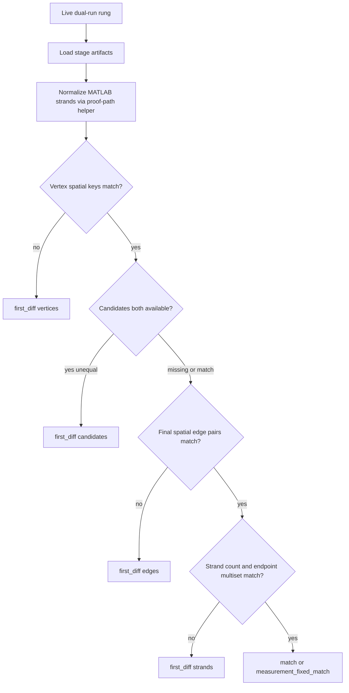

# Double-Junction Strand Divergence Investigation Harness - Plan

## Goal Capsule

- **Objective:** Turn the reported `double_junction_32` strands break (MATLAB 1 vs Python 3) into a cheap, stage-aware investigation harness that localizes MATLAB↔Python mismatch (or measurement error) with live dual-run — without treating results as Phase 1 Certification or folding into ADR 0013.
- **Product authority:** This plan owns toy-rung divergence localization only. Claim Run Roots, ONE TRUTH, and claimed-energy production fixes are out of scope.
- **Open blockers:** None.

---

## Product Contract

### Summary

Build an investigation layer on top of the existing synthetic complexity ladder so an operator can re-run `double_junction_32` (and the current first-break rung after recount) under live MATLAB↔Python dual-run, compare stage surfaces in order, and get a durable localization report. The first cheap falsifier is correcting MATLAB strand counting in the ladder loader: on-disk mats already show three MATLAB strands, so the published 1-vs-3 figure is a measurement bug until proven otherwise after recount.

### Problem Frame

The ladder stopped at rung `double_junction_32` with `first_break_surface=strands` and counts MATLAB 1 / Python 3 while vertices and spatial edge pairs matched. That invites a Network-assembly story. Live artifacts contradict the MATLAB count: `strands2vertices` is a numeric `(3, 2)` endpoint matrix, and Python has three strands whose endpoints align after 0-based normalization. The ladder’s `load_matlab_artifacts` treats non-object arrays as `n_strands = 1`, so the stop predicate can fire on a harness bug. Operators need a stage-by-stage localization path that (1) fixes that measurement, (2) re-runs live dual-run, and (3) only then attributes any remaining mismatch to candidates, final edges, or network — without promoting toys to Certification.

### Key Decisions

- KD1. **Not Certification / not ONE TRUTH.** (session-settled: user-directed — chosen over treating ladder or localization outcomes as Phase 1 ship evidence.) Governs R8.
- KD2. **Separate from ADR 0013 claimed-energy bake-at-finalize.** (session-settled: user-directed — chosen over folding this toy into the full-volume ranking residual work.) Governs R9.
- KD3. **Investigation harness first; production algorithm fix deferred.** (session-settled: user-directed — chosen over find-and-fix Network/Selection in one plan.) Governs R1–R7.
- KD4. **Localization requires live MATLAB dual-run.** (session-settled: user-directed — chosen over frozen MATLAB stage dumps for CI.) Governs R5, R7.

### How This Work Fits Together

<!-- ce-section: work-relationships -->

This plan owns **toy-rung divergence localization** only. Surrounding areas below are the current understanding, not a committed roadmap.

- Synthetic complexity ladder (`docs/plans/2026-08-14-002-feat-synthetic-complexity-ladder-plan.md`)
  - **Provides** the dual-run runner, rung geometries, and strict verts→edges→strands stop
  - **Is extended** by correct strand counting and optional localization report mode
- Phase 1 / ONE TRUTH / Claim Run Roots
  - **Outside** this plan’s identity
- Claimed Trace Energy bake-at-finalize (ADR 0013)
  - **Outside** this plan’s identity; full-volume residual remains a separate track
- ADR 0012 Network endpoint-pair multisets / E5 MATLAB-edge Network isolation
  - **May inform** localization compare surfaces after recount; not a Certification claim here

### Actors

- A1. Parity operator — runs live dual-run localization, reads stage verdicts, does not update ONE TRUTH.
- A2. Implementer — lands counting fix, compare helpers, localization report, and MATLAB-gated tests.

### Requirements

**Localization behavior**

- R1. The harness can target the known break rung `double_junction_32` (and, after recount, whatever rung is the current ladder first-break) under the same dual-run pattern as the complexity ladder.
- R2. Localization compares stages in order: Vertex Set → Candidate Set (when both sides expose it) → final Edge Set → Network strands — same-class only (raw↔raw, final↔final).
- R3. Strand compare must count MATLAB `strands2vertices` correctly for numeric `(N, 2)` endpoint matrices, object cells, and single-row forms — never treat a multi-row numeric matrix as one strand.
- R4. After correct counting, strand localization also reports undirected endpoint-pair multisets (ADR 0012-style), not count alone.
- R5. A localization run requires a live MATLAB dual-run for that rung (reuse/skip-matlab is allowed only as an explicit operator override for iterate-on-compare, not as the primary localization claim).
- R6. Durable output names the first differing stage (or `measurement_fixed_match` / full match), counts per side, and the non-Certification banner.
- R7. Cheap falsifiers exist as unit tests for counting/compare helpers plus at least one live-MATLAB gated localization test path that is not part of the default unit CI gate.

**Non-claims and boundaries**

- R8. Localization outcomes must state they are not Certification / not Phase 1 and must not update ONE TRUTH or claim-run roots.
- R9. This work does not implement the ADR 0013 claimed-energy production fix or a Network-stage rewrite as the default response to a toy strand mismatch.

### Key Flows

- F1. Recount then re-localize
  - **Trigger:** Operator starts localization on `double_junction_32` after the counting fix.
  - **Actors:** A1
  - **Steps:** Live dual-run → correct strand load → verts / candidates / edges / strands compares → emit localization report.
  - **Outcome:** Either measurement-fixed match (ladder may advance), or a true first differing stage with evidence.
  - **Covered by:** R1–R6, R8

- F2. True post-recount strand mismatch
  - **Trigger:** After correct counts, verts and final spatial edge pairs still match but strand endpoint multisets differ.
  - **Actors:** A1
  - **Steps:** Report Network as the first differing surface; optionally note E5-style isolation (MATLAB Edge Set → Python Network) as the next cheap falsifier without implementing a production Network rewrite.
  - **Outcome:** Investigation points at network assembly / indexing, not selection — only if finals truly match.
  - **Covered by:** R2, R4, R6, R9

### Acceptance Examples

- AE1. Numeric `(3, 2)` MATLAB strands count as 3
  - **Covers:** R3
  - **Given:** A MATLAB-side fixture with `strands2vertices` shape `(3, 2)`
  - **When:** Strand count / normalize helpers run
  - **Then:** MATLAB strand count is 3, not 1

- AE2. Localization after recount on `double_junction_32`
  - **Covers:** R1, R4–R6, R8
  - **Given:** Live dual-run artifacts for that rung with correct strand loading
  - **When:** Localization runs
  - **Then:** Report either match / measurement-fixed match, or a named first differing stage; banner says not Certification

- AE3. Same-class only
  - **Covers:** R2
  - **Given:** Python candidates and MATLAB finals both present
  - **When:** Localization compares stages
  - **Then:** It does not treat Python `candidates.pkl` vs MATLAB `edges_*.mat` as a discovery mismatch

### Success Criteria

- SC1. The published 1-vs-3 strand stop cannot recur from the numeric-matrix counting bug alone.
- SC2. An operator can run live localization on `double_junction_32` and read a stage verdict without improvising probes.
- SC3. Cold readers cannot mistake the report for Phase 1 Certification or ADR 0013 completion.

### Scope Boundaries

**In scope**

- Correct MATLAB strand counting in the ladder (and shared helpers used by localization)
- Stage-ordered localization report / mode on the ladder dual-run surface
- Endpoint-pair multiset strand compare for toys
- Unit tests for helpers; live-MATLAB gated localization test path
- Working hypothesis and isolation guidance for post-recount residuals

**Deferred for later**

- Production Network rewrite or Selection ranking fix driven by this toy
- Emitting durable MATLAB raw Candidate Sets from the ladder `.m` driver if SpecialOutput does not already
- Extending localization to crop / canonical claim roots
- Nightly CI job that always has MATLAB

**Outside this product's identity**

- Phase 1 / ONE TRUTH / Claim Run Root updates
- ADR 0013 Claimed Trace Energy production bake-at-finalize
- Treating approximate strand-count % as Network Certification

### Dependencies / Assumptions

- D1. Synthetic complexity ladder dual-run (`scripts/run_synthetic_complexity_ladder.py`, compare/report modules, rung geometries) remains the base surface.
- D2. MATLAB Vectorization-Public and `MATLAB_EXE` / `resolve_matlab_exe` remain available for live localization.
- AS1. On current `double_junction_32` experiment artifacts, MATLAB `(3, 2)` strands and Python three strands with matching endpoint pairs imply the historical 1-vs-3 stop is primarily a loader bug until a fresh live dual-run after the fix says otherwise.
- AS2. Default CI continues to run unit/integration gates without requiring MATLAB; live localization tests are gated and optional for machines without MATLAB.

### Outstanding Questions

**Resolve Before Planning**

- None (scoping call-out resolved: live MATLAB).

**Deferred to implementation**

- Q1. Exact CLI shape (`--localize` on the ladder script vs a thin sibling script) — prefer extending the ladder entrypoint; implementer may choose the thinner path if coupling stays low.
- Q2. Whether tiny experiment’s MATLAB loader shares the same bug and should be patched in the same PR — yes if the same else-branch pattern exists; otherwise defer.

### Sources / Research

- Ladder: `scripts/run_synthetic_complexity_ladder.py` (`load_matlab_artifacts`), `slavv_python/analytics/parity/probes/synthetic_dual_run_compare.py`, `synthetic_ladder_report.py`, `slavv_python/utils/synthetic.py`
- Correct strand semantics: `slavv_python/analytics/parity/proof/array_normalization.py` (`_normalize_matlab_strands`), `artifact_comparator.py` (`_strand_endpoint_pairs`)
- Live artifact check (2026-08-14): `workspace/experiments/synthetic_complexity_ladder/double_junction_32/` — MATLAB `strands2vertices` `(3, 2)`; Python `checkpoint_network.pkl` length 3; endpoint pairs align after 0-based normalize
- Hygiene / same-class: `docs/solutions/best-practices/parity-experiment-hygiene.md`, `docs/solutions/parity/raw-vs-final-candidate-compare.md`
- Ladder product plan: `docs/plans/2026-08-14-002-feat-synthetic-complexity-ladder-plan.md`
- Network isolation pattern: `docs/plans/2026-08-14-001-feat-testable-parity-experiments-plan.md` (E5), ADR 0012
- External research: skipped — local dual-run and proof-path patterns are sufficient

---

## Planning Contract

### Key Technical Decisions

- KTD1. **Treat harness strand counting as the first localization target.** On-disk MATLAB `(3, 2)` vs loader `n_strands=1` is verified; do not open a Network rewrite from the published 1-vs-3 figure. Governs R3, R6; aligns KD3.
- KTD2. **Reuse proof-path strand normalization, do not invent a third counter.** Prefer calling existing `_normalize_matlab_strands` (or a thin public wrapper in the probes package) from ladder/localization loaders so toys and Certification loaders agree on MATLAB strand shape. Governs R3, R4.
- KTD3. **Live MATLAB for localization claims; pure unit tests for helpers.** (session-settled: user-directed — chosen over frozen CI MATLAB dumps.) Mark live tests `parity` + `slow` with skip-if-no-MATLAB; keep them out of the default unit CI gate. Operator may use `--skip-matlab` / `--reuse-python` only for compare iteration, not as the localization claim of record. Governs R5, R7; KD4.
- KTD4. **Stage order and same-class discipline.** Vertices → candidates (if both sides) → final edges → strands; never cross raw↔final. If candidates are missing on MATLAB under the current ladder `.m` export, mark that stage `unavailable` and continue — do not invent a discovery residual from Python candidates vs MATLAB finals. Governs R2, AE3.
- KTD5. **Working hypothesis (planning-time, revisable after recount).** Likely class for the *reported* break: measurement (strand count). If recount yields full match, ladder advances and any later break is a new localization target. If recount still fails strand endpoint multisets while final spatial edge pairs match, prefer Network assembly / indexing next, then E5 isolation — not ADR 0013 by default on this toy. Governs R9; KD2.

### Assumptions

- A-plan1. Extending `scripts/run_synthetic_complexity_ladder.py` with a localization mode (or shared helpers imported by a thin sibling) is preferred over a greenfield package.
- A-plan2. After the counting fix, a fresh live dual-run may show `double_junction_32` as a full match; that is a successful investigation outcome (`measurement_fixed_match`), not a failed harness.
- A-plan3. Endpoint-pair multiset compare for toys uses the same undirected pair sense as ADR 0012 helpers, with explicit 0- vs 1-based handling already present in the ladder compare.

### High-Level Technical Design

Localization control flow (directional):



Isolation guidance after a true strand multiset miss (directional):

```text
final Edge Set spatial pairs match?
  yes → try MATLAB edges → Python Network (E5-style) before blaming discovery/selection
  no  → selection/cleanup or edge-index issues first; do not start at Network rewrite
```

### Scope Boundaries (implementation)

**Deferred to Follow-Up Work**

- MATLAB ladder driver changes to always dump raw candidates
- Tiny experiment full refactor onto shared compare (beyond shared strand count fix if needed)
- Production Network / Selection patches

---

## Implementation Units

### U1. Correct MATLAB strand counting in dual-run loaders

**Goal:** Stop treating numeric `(N, 2)` `strands2vertices` as a single strand; align ladder (and tiny, if same pattern) with proof-path normalization.

**Requirements:** R3, AE1; KTD1, KTD2

**Dependencies:** None

**Files:**
- Modify: `scripts/run_synthetic_complexity_ladder.py` (`load_matlab_artifacts`)
- Modify: `slavv_python/analytics/parity/probes/synthetic_dual_run_compare.py` (or a small adjacent helper module) if counting should live in-package for tests
- Optional modify: tiny dual-run loader under `workspace/experiments/tiny_synthetic_matlab_python_diff/` if it shares the else-branch bug
- Test: `tests/unit/analytics/parity/test_synthetic_dual_run_compare.py` (or new focused unit file under the same package)

**Approach:**
1. Replace the object/list/else→1 counting branch with proof-path `_normalize_matlab_strands` (or equivalent row-count for `(N, 2)` plus cell handling).
2. Expose a pure helper that unit tests can call without MATLAB.
3. Keep ladder report non-Certification note unchanged.

**Patterns to follow:** `slavv_python/analytics/parity/proof/array_normalization.py`; existing dual-run compare tests.

**Execution note:** Characterization-first — add a failing unit case with a `(3, 2)` uint8 fixture mirroring the live mat before changing the loader.

**Test scenarios:**
- Covers AE1. Happy path: `(3, 2)` numeric matrix → count 3.
- Edge: object-dtype cell of three endpoint rows → count 3.
- Edge: single-row `(1, 2)` or squeezed length-2 vector → count 1.
- Error: missing `strands2vertices` → strand count null / non-comparable, not silent 1.

**Verification:** Unit tests green without MATLAB; loader no longer returns 1 for the known `(3, 2)` shape.

### U2. Strand endpoint multiset + stage localization helpers

**Goal:** Pure helpers that compare vertices, optional candidates, final edges, and strands (count + undirected endpoint pairs) and return the first differing stage.

**Requirements:** R2, R4, R6, AE3; KTD4, KTD5

**Dependencies:** U1

**Files:**
- Modify: `slavv_python/analytics/parity/probes/synthetic_dual_run_compare.py`
- Optional create: `slavv_python/analytics/parity/probes/synthetic_stage_localize.py` if compare module would exceed clarity/size limits
- Test: `tests/unit/analytics/parity/test_synthetic_dual_run_compare.py` and/or `tests/unit/analytics/parity/test_synthetic_stage_localize.py`

**Approach:**
1. Add endpoint-pair extraction for MATLAB Nx2 strands and Python vertex-chain strands (ends only), with index-base handling consistent with the ladder.
2. Add `first_diff_stage` (name may vary) ordered vertices → candidates → edges → strands; mark missing candidate side as skip, not fail.
3. Keep graded tiny residuals out of the stop predicate.

**Patterns to follow:** Existing `first_break_surface`; `_strand_endpoint_pairs` in the artifact comparator (reuse or mirror semantics, avoid Certification API as the operator stop surface).

**Test scenarios:**
- Happy path: verts+edges match, strand counts equal but endpoint multisets differ → first diff `strands`.
- Happy path: all stages match → no diff / match.
- Edge: candidates unavailable on one side → stage skipped; edges still compared.
- Covers AE3. Error/guard: comparing Python candidates to MATLAB finals is not offered as a discovery verdict.

**Verification:** Pure unit coverage of stage order and multiset equality without MATLAB.

### U3. Operator localization mode on the ladder dual-run

**Goal:** One operator path that live dual-runs a named rung (default `double_junction_32`), writes a localization report under the experiment tree, and never updates ONE TRUTH.

**Requirements:** R1, R5, R6, R8, AE2; KD1, KD4; KTD3, KTD5

**Dependencies:** U1, U2

**Files:**
- Modify: `scripts/run_synthetic_complexity_ladder.py` (preferred) or create a thin `scripts/localize_synthetic_rung_divergence.py` that reuses ladder run/load helpers
- Modify: `slavv_python/analytics/parity/probes/synthetic_ladder_report.py` only if shared report assembly helps
- Test: unit tests for report assembly fields; live path covered in U4

**Approach:**
1. Add a localization entry (flag or sibling script) that runs one rung with live MATLAB by default.
2. Emit JSON including `first_diff_stage`, per-stage comparable flags, strand counts, endpoint multiset overlap, and non-Certification `note`.
3. On post-fix match for a rung that previously “broke” on strands, allow outcome `measurement_fixed_match` (or equivalent) so operators do not treat “no residual” as harness failure.
4. Document that full ladder re-run after U1 may advance past rung 2.

**Patterns to follow:** Existing `run_one_rung` / `assemble_ladder_report`; solution note tone from the ladder tooling note / plan R10.

**Test scenarios:**
- Happy path (unit): given mocked side dicts with corrected strand counts matching, report outcome is match / measurement_fixed_match and note is non-Certification.
- Edge: MATLAB unavailable → inconclusive / skipped localization claim, not match.
- Integration intent: covered by U4 live test.

**Verification:** Operator can run localization on `double_junction_32` and get a durable report path under `workspace/experiments/synthetic_complexity_ladder/`.

### U4. Live-MATLAB gated localization test

**Goal:** A pytest path that requires live MATLAB dual-run to assert localization wiring on `double_junction_32` (or the documented smoke rung), without making default unit CI depend on MATLAB.

**Requirements:** R5, R7, AE2; KTD3

**Dependencies:** U1, U2, U3

**Files:**
- Create: `tests/parity/test_synthetic_rung_localization_live.py` (or under `tests/integration/` with `parity` + `slow` markers — prefer a path/markers combo excluded from default `unit` gate)
- Test expectation: live dual-run when MATLAB present; skip when absent

**Approach:**
1. Mark `parity` and `slow`; skip if `resolve_matlab_exe()` finds nothing.
2. Run localization for `double_junction_32` with live MATLAB (bounded soft time; fail or xfail clearly on timeout).
3. Assert report schema, non-Certification note, and that MATLAB strand count is not spuriously 1 when the loaded mat is `(N, 2)` with N>1.
4. Do not assert Phase 1 / ADR 0012 Certification bars.

**Patterns to follow:** Ladder’s `resolve_matlab_exe` / inconclusive semantics; avoid hard-fail-only patterns that break machines without MATLAB when the test is collected under optional markers.

**Execution note:** Smoke-first on machines with MATLAB; default CI remains unit helpers from U1/U2.

**Test scenarios:**
- Covers AE2. Integration: live dual-run produces comparable localization report with correct strand counting.
- Edge: no MATLAB → skipped (not failed).
- Guard: report note contains non-Certification language.

**Verification:** On a MATLAB-equipped machine, live test passes or clearly fails on real dual-run issues; on CI without MATLAB, test skips and unit suite stays green.

---

## Verification Contract

- Unit: counting + stage localization helpers (U1, U2) without MATLAB.
- Operator: live localization on `double_junction_32` after U1–U3; inspect report outcome.
- Optional: re-run full ladder once; if rung 2 matches, confirm later rungs run under existing soft-cap rules.
- Do not run `prove-exact` or update ONE TRUTH as part of this verification.
- Quality: targeted pytest for new/changed unit files; ruff on touched Python.

## Definition of Done

- [ ] U1–U4 complete with their test scenarios addressed
- [ ] Numeric `(N, 2)` MATLAB strands cannot report count 1 for N>1
- [ ] Localization report exists for a live `double_junction_32` run (or skip documented when MATLAB absent in CI)
- [ ] Plan outcomes explicitly non-Certification; no ONE TRUTH / ADR 0013 production claim
- [ ] Working hypothesis updated in the report or solution note after recount (measurement-fixed vs true stage)

## Appendix

### Research confidence notes

- Independent repo research + on-disk mat/checkpoint verification established the loader bug; learnings research reinforced same-class compare and “do not Network-rewrite from strand count alone.”
- Flow analysis (in-thread after researchers returned): critical gap closed by `measurement_fixed_match` and unavailable-candidate handling; live-MATLAB vs default CI tension closed by KTD3 markers/skip.
- External research was not load-bearing.
- Doc review: full multi-persona `ce-doc-review` was not dispatched as nested independent reviewers in this harness; coherence pass was in-thread only (not independent corroboration).
