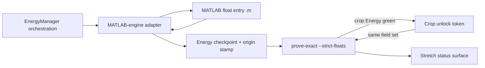
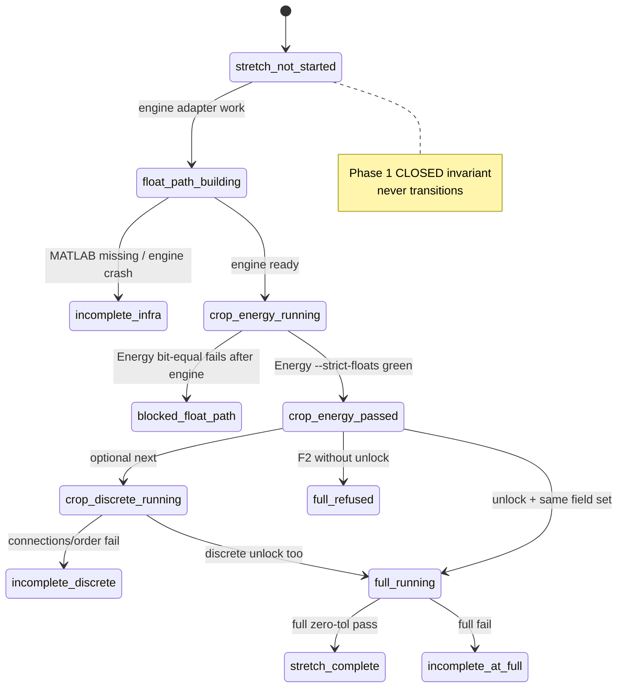

# True Zero-Tolerance Parity Stretch - Plan

## In short

Phase 1 already matches MATLAB closely enough to ship. This plan is the extra
goal: every compared number identical bits, including Energy. “Close enough”
(`allclose`) is not this bar and is not 100%.

Crop Energy is still not bit-equal (~90% exact, leftover last-digit diffs).
That leftover does **not** reopen Phase 1. Do not overwrite protected dests.
Live status: findings stretch subsection + dest `stretch_status.json`.
Readable diagnosis: [crop-energy-stretch-float-isolation.md](../solutions/parity/crop-energy-stretch-float-isolation.md).

## Goal Capsule

- **Objective:** Build a stretch program that makes every compared MATLAB↔Python field truly zero-tolerance (including Energy floats bit-equal to MATLAB), using a MATLAB-engine Energy float path as needed, proven on the crop harness first and only then on full `180709_E`.
- **Product authority:** This plan owns the post–Phase 1 true zero-tolerance stretch only. Phase 1 Certification on claim root `canonical_full_v18` stays CLOSED and is not redefined or reopened.
- **Open blockers:** None for planning. Delivery may stay incomplete if no float path yields bit-equal Energy; that outcome is “blocked,” not a silent return to `np.allclose`.
- **Execution profile:** code — implement behind exact-route Energy + existing `--strict-floats` proof surfaces; no Phase 1 ship-bar changes.
- **Stop when:** Crop then full zero-tolerance proofs pass for the **full** R1+R2 field set under the engine-backed path (`stretch_complete`), **or** the program is explicitly recorded as `blocked_float_path` / `incomplete_discrete` / `incomplete_infra` / `incomplete_at_full` without redefining success as ADR 0011 allclose.
- **Product Contract preservation:** Product Contract unchanged (R1–R10, A1–A3, F1–F2, AE1–AE4, KD1–KD5 preserved).

---

## Product Contract

### Summary

Pursue true zero-tolerance parity as a stretch beyond closed Phase 1. Prefer a MATLAB-engine path for Energy float-sensitive math so Python can match MATLAB bit-for-bit. Prove on the crop harness with a zero-tolerance compare gate, then on full `180709_E`. Discrete strict fields (exact connections / order-sensitive emission) sit under the same bar.

Plan coverage: full brainstorm scope. Energy-first crop unlock may authorize Energy-only full proof (ASSUME1); discrete strict-field expands the unlock field set under the same bar; full volume runs only for a matching unlocked field set. `stretch_complete` requires Energy **and** discrete (R2) at full — Energy-only full progress is intermediate, not program complete. Stretch status lives beside ONE TRUTH without mutating CLOSED Phase 1 language.

### Problem Frame

Phase 1 Certification already passes ADR 0011 / evaluated ADR 0012 on `canonical_full_v18`, but “100% parity” still sounds unfinished to operators who mean bit-identical fields. ADR 0011 documents real NumPy vs MATLAB MKL Energy float drift and chose `np.allclose` for the ship gate. Without an explicit stretch program, teams either reopen Phase 1 or quietly redefine “100%” as the bars already met.

### Key Decisions

- KD1. **True zero-tolerance everywhere, including Energy floats.** (session-settled: user-directed — chosen over Phase-1-bars-as-100%, strict-field-only, more-volumes-only, or softer float tolerance: “100%” means every compared field bit-equal to MATLAB.) Governs R1, R2, R3.
- KD2. **Build now; MATLAB-engine / MKL float path is in-scope.** (session-settled: user-directed — chosen over document-only aspirational or spike-only: commit to building toward the bar.) Governs R4, R5.
- KD3. **Approach A — MATLAB-engine Energy float path.** (session-settled: user-approved — chosen over MKL-only hope or MATLAB-writes-Energy hybrid: clearest path to bit-equal Energy from a Python-owned pipeline.) Governs R4, R6.
- KD4. **Crop first, then full `180709_E`.** (session-settled: user-directed — chosen over full-only or crop-only: cheap falsification before multi-day full runs.) Governs R7, R8.
- KD5. **Phase 1 Certification stays CLOSED.** (session-settled: user-directed — chosen over reopening the ship gate: stretch does not change ADR 0011/0012 certification standing.) Governs R9, R10.

<!-- ce-section: work-relationships -->
### How This Work Fits Together

This plan owns the **true zero-tolerance parity stretch** only. Surrounding areas below are the current understanding, not a committed roadmap.

- Phase 1 Certification (`canonical_full_v18`, ONE TRUTH CLOSED)
  - **Outside** this plan’s identity; must remain CLOSED
  - **Can proceed independently of** this stretch (already done)
- Documented Strict-Field Stretch Goal (exact connections / order on crop)
  - **Shares** discrete zero-tolerance outcomes with this plan’s bar
  - **Folded into** this program rather than a separate product outcome
- Paper-profile / Phase 2 certification, matlab2python audits, unrelated PR tracks
  - **Can proceed independently of** this stretch
  - **Outside** this plan’s identity unless a later brainstorm pulls them in

### Actors

- A1. Parity operator — runs crop then full zero-tolerance proofs; does not promote stretch results into Phase 1 ONE TRUTH closure language.
- A2. Planning / implementation agent — designs the MATLAB-engine Energy path and zero-tolerance proof wiring without inventing a softer success bar.
- A3. MATLAB runtime environment — must be available where the engine-backed Energy path runs.

### Requirements

**Zero-tolerance bar**

- R1. Every field compared in the stretch proof must match MATLAB with **zero remaining tolerance** (bit-equal / strict equality as appropriate to the field type), including continuous Energy floats.
- R2. Discrete Edges/Network strict fields (exact `connections` / order-sensitive emission) are **in** this same bar, not a separate optional product.
- R3. If Energy floats never become bit-equal under any in-scope float path, the program status is **incomplete / blocked** — not redefined as Phase 1 `np.allclose` success.

**Float path**

- R4. The primary delivery path uses a **MATLAB-engine Energy float path** so float-sensitive Energy math can match MATLAB while Python still owns pipeline orchestration.
- R5. An MKL-matched in-process library path may be used only as a short falsifying alternative if it demonstrably yields bit-equal Energy; it does not replace R4 as the default commitment without a later scope change.
- R6. A hybrid where MATLAB alone writes the Energy artifact and Python never produces Energy does **not** satisfy this stretch’s “Python zero-tolerance” intent.

**Proof ladder**

- R7. Zero-tolerance must first pass on the **crop harness** volume paired with its oracle.
- R8. Full `180709_E` zero-tolerance proof runs **only after** crop zero-tolerance passes for the fields under test.

**Phase 1 boundary**

- R9. Phase 1 Certification on `canonical_full_v18` remains CLOSED; stretch proofs must not reopen or rewrite the ADR 0011 / evaluated ADR 0012 ship bars.
- R10. Stretch progress must not be described as Phase 1 Certification closure or as replacing ONE TRUTH’s CLOSED answer.

### Key Flows

- F1. Crop zero-tolerance proof
  - **Trigger:** Operator (or automation) starts a stretch proof after an engine-backed Energy path is available.
  - **Actors:** A1, A2, A3
  - **Steps:** Produce crop Energy (and downstream stages as required) via the MATLAB-engine float path; compare all in-scope fields to the crop oracle under zero-tolerance; stop on first bit-level failure with a clear field surface.
  - **Outcome:** Crop pass emits an unlock for a **named field set** (Energy-only or Energy+discrete); that unlock alone authorizes F2 for the same set. Crop fail means stretch incomplete for that surface.
  - **Covered by:** R1, R3, R4, R7, R8

- F2. Full-volume zero-tolerance proof
  - **Trigger:** F1 passed for the fields under test.
  - **Actors:** A1, A2, A3
  - **Steps:** Run the same zero-tolerance compare on full `180709_E` against the full oracle lineage; do not claim Phase 1 reopen.
  - **Outcome:** Full pass = stretch success for this volume; fail = incomplete / blocked at full scale.
  - **Covered by:** R1, R8, R9, R10

### Acceptance Examples

- AE1. Crop Energy floats still differ by ULP under NumPy-only Energy
  - **Covers:** R1, R3, R4
  - **Given:** Crop harness and current NumPy Energy path
  - **When:** Zero-tolerance Energy compare runs without the MATLAB-engine path
  - **Then:** Proof fails on Energy floats; status is incomplete, not “allclose is good enough for this stretch”

- AE2. Crop passes only after engine-backed Energy
  - **Covers:** R4, R7
  - **Given:** MATLAB-engine Energy float path available and crop oracle present
  - **When:** Zero-tolerance crop proof runs end-to-end for compared fields
  - **Then:** Every compared field matches with zero tolerance, including Energy floats

- AE3. Full volume gated by crop
  - **Covers:** R7, R8
  - **Given:** Crop zero-tolerance has not passed
  - **When:** Operator attempts full `180709_E` stretch proof as the first gate
  - **Then:** Full run is refused or treated as out of process for this plan’s success definition

- AE4. Phase 1 language unchanged
  - **Covers:** R9, R10
  - **Given:** Stretch crop or full proof is green or red
  - **When:** Status is reported in operator docs
  - **Then:** ONE TRUTH still says Phase 1 CLOSED; stretch is labeled stretch / blocked / complete separately

### Success Criteria

- Crop harness shows zero-tolerance match on every compared field, including Energy floats, under the engine-backed path.
- Full `180709_E` shows the same only after crop success.
- Phase 1 Certification messaging remains CLOSED on `canonical_full_v18`.
- A durable failure mode exists: “blocked on float path” rather than silently accepting tolerance.

### Scope Boundaries

**In scope**

- MATLAB-engine Energy float path as the primary mechanism
- Zero-tolerance proof ladder: crop → full `180709_E`
- Discrete strict-field equality under the same bar

**Deferred for later**

- Additional volumes beyond `180709_E` / its crop harness
- Paper-profile certification and Phase 2 program work
- Broad packaging/distribution of a MATLAB-engine dependency for all users

**Deferred to Follow-Up Work**

- Zero-tolerance compare for Vertices/Edges continuous float fields (radii, non-Energy energies) after Energy-stage floats close — still under R1 in principle (ASSUME5), not in U1–U7 DoD

**Outside this product's identity**

- Reopening Phase 1 Certification or changing ADR 0011/0012 ship gates
- Claiming “100% parity” from Phase 1 spatial/tolerance bars alone
- matlab2python static-transpiler audits as the verification path
- Hybrid MATLAB-only Energy writer as the stretch success definition (R6)

### Dependencies / Assumptions

- MATLAB R2019a-compatible runtime (or the project’s documented MATLAB version) is available on machines that run the engine-backed Energy path.
- Crop and full oracles for `180709_E` remain the compare surfaces; this stretch does not invent a new certification volume.
- ADR 0011’s measured NumPy↔MKL drift remains the reason a MATLAB-linked float path is required for Energy bit equality.
- Existing zero-tolerance / strict-float compare capability in the proof harness may be reused; planning owns wiring details.

### Outstanding Questions

**Resolve Before Planning**

- None.

**Deferred to Implementation**

- Exact `.m` entry surface inside Vectorization-Public (per-scale filter vs whole octave body) once engine transfer cost is measured on crop.
- Whether stretch CLI gains a named alias vs documenting `prove-exact --strict-floats` as the stretch gate.
- Exact stretch run-directory naming food-codenames at launch time.

---

## Planning Contract

### Assumptions

Recorded because scoping confirmation was skipped (recommended defaults):

- ASSUME1. **Energy-first unlock (intermediate).** Crop Energy under `--strict-floats` may unlock Energy-only F2 before discrete is green. Energy-only full green is progress, **not** `stretch_complete`. Discrete failure is `incomplete_discrete`, not R3 `blocked_float_path`. Program complete (`stretch_complete`) requires R2 discrete at full as well.
- ASSUME2. **Stretch status home.** A dedicated stretch subsection (or sidecar note linked from findings) records stretch state; ONE TRUTH Phase 1 CLOSED text is never rewritten by stretch greens/reds.
- ASSUME3. **MKL spike is optional.** Not a required gate before engine work; may run only as a short falsifier. An MKL crop bit-equal result does **not** replace Approach A without a later scope change.
- ASSUME4. **CI does not require MATLAB.** Default unit/integration CI skips engine tests when MATLAB/engine is absent; stretch proofs run on operator hosts with MATLAB.
- ASSUME5. **First delivery units own Energy-stage floats.** Vertex/edge continuous energies remain under R1 in principle but are **Deferred to Follow-Up Work** for a later unit unless crop Energy work already surfaces them; do not claim first-unit DoD covers them.
- ASSUME6. **Stretch writers are serial-first** (`n_jobs=1`) until engine+merge bit-identity is proven; parallel chunk merge remains a follow-on verification, not a day-one requirement.

### Key Technical Decisions

- KTD1. **Reuse `--strict-floats` as the stretch compare gate; do not change ADR 0011 defaults.** Default `prove-exact` stays allclose for Certification. Stretch proofs always pass `--strict-floats` (and/or a thin stretch wrapper that forces it). Governs R1, R9.
- KTD2. **Greenfield MATLAB-engine adapter behind exact-route Energy; keep `EnergyManager` orchestration.** No `matlab.engine` exists today (only `-batch` in random-component parity). Add a small adapter + explicit energy origin distinct from `python_native_hessian`. Pattern discovery on `MATLAB_EXE` / prerequisites may be shared with `tests/support/random_component_parity.py`, but the float path uses in-process engine, not batch-as-success. Instantiates KD3 / R4, R6.
- KTD3. **Minimize Python↔MATLAB crossings for float math.** Prefer one long-lived engine per Energy job and a single MATLAB entry that owns FFT/filter (or octave float body) before returning one result — R2019a-era marshalling of large 3D arrays is expensive; avoid per-chunk `start_matlab` and `.tolist()` round-trips. Instantiates R4.
- KTD4. **Hard crop→full unlock token scoped by field set.** F2 entry requires a recorded crop unlock for the same field set (Energy-only vs full pipeline). Checklist-only AE3 is insufficient. Instantiates R7, R8 / AE3.
- KTD5. **Status taxonomy separates failure classes.** At least: `blocked_float_path` (R3), `incomplete_discrete` (R2 after Energy green), `incomplete_infra` (MATLAB/engine/version/license), `incomplete_at_full` (full fail after unlock), plus progress states such as `crop_energy_passed`. `stretch_complete` means full R1+R2 (Energy **and** discrete) at full volume — not Energy-only. Never map infra failure to R3. Instantiates R2, R3, AE4.
- KTD6. **New stretch dest run roots only.** Never overwrite `canonical_full_v18` or historical claim/audit roots. Prefer `crop_M_exact_v3` lineage for crop stretch; new canonical stretch root for full. Instantiates R9, R10.
- KTD7. **Provenance refuse mixed float paths.** Stretch proofs reject Energy checkpoints that mix NumPy FFT and engine-backed voxels, or that lack the stretch origin stamp. Instantiates R4, R6, AE2.
- KTD8. **MKL spike is optional falsifier only.** Does not unlock stretch complete or replace KTD2. Instantiates R5.

### High-Level Technical Design

#### Component topology

#### Proof ladder / state machine

#### Data-flow note (directional)

Python owns params, lattice/chunk scheduling, resume, and checkpoint packaging. MATLAB owns float-sensitive Energy transforms for the stretch origin. Return path must preserve Fortran-order `[Y, X, Z]` alignment with the exact-route grid. Oracle compare uses existing loaders + `evaluate_energy_float_gate` with `strict_floats=True`.

### Alternative Approaches Considered

| Approach | Why not primary |
|:---------|:----------------|
| MKL-matched NumPy as default | ADR 0010/0011 show ≥1 ULP IFFT floor; portable CNR hope is weak; allowed only as R5 falsifier (KTD8) |
| MATLAB-only Energy writer | Violates R6 — Python must produce Energy under orchestration |
| Change ADR 0011 ship default to bit-equal | Reopens Phase 1; violates KD5 / R9 |
| Full volume before crop | Violates KD4 / R7–R8; crop≠full history (high-octave divergence) |

### Risks & Dependencies

| Risk | Mitigation |
|:-----|:-----------|
| No engine bridge today | Build U2 adapter; fail as `incomplete_infra` if engine cannot start |
| R2019a large-array marshalling dominates wall time | Measure crop transfer once (KTD3); one engine + one `.m` return; budget full ETA separately; timeout → `incomplete_infra` |
| Partial MATLAB surface leaves residual ULP | Expand float ownership inside Energy until crop Energy `==`; never declare complete on allclose |
| Crop green ≠ full Energy / high-octave multi-chunk | F2 after unlock; re-verify octaves per `docs/solutions/parity/canonical-energy-high-octave-divergence.md` |
| Full-volume orientation `(512,64,512)` vs oracle | Follow `docs/solutions/parity/resume-energy-orientation.md`; assert shape before `--strict-floats`; refuse unlock on mismatch |
| Silent allclose / default `prove-exact` as stretch green | Unlock only on `--strict-floats` green; taxonomy forbids rewriting R3 as ADR 0011 success |
| Mixed provenance / wrong run root | KTD6–KTD7; refuse stretch proof on Phase 1 claim roots and mixed origins |
| Discrete residual after bit-equal Energy | Sequence U5; label `incomplete_discrete` |
| License seat contention / engine attach mid-job | Serial-first (ASSUME6); map license/engine errors to `incomplete_infra`, never `blocked_float_path` |
| Engine Python version pin ≠ repo/CI Python | Pin operator host Python in stretch docs; CI skips engine tests (ASSUME4) |

### System-Wide Impact

- **Operators (A1):** New stretch run roots, unlock discipline, status vocabulary; Phase 1 dashboards unchanged.
- **Writer lease:** Stretch Energy writers use `slavv_python/analytics/parity/runs/writer_lease.py` / `writer_session.py`. No second writer on the same dest root while a lease is live; reconcile stale leases before claim.
- **Resume / force-rerun:** Engine origin and unlock tokens must survive `resume-exact-run` / `launch-exact-run`. Changing float path or `n_jobs` requires `--force-rerun-from energy`; never force-rerun on `canonical_full_v18`.
- **Concurrent jobs:** Check `slavv jobs list` before stretch writers; food-codenames are aliases only — lease/job registry remains authority.
- **Streamlit vs CLI:** Stretch gates (`--strict-floats`, unlock, engine origin) are CLI-first (`slavv parity …`). Streamlit must not imply stretch success or bypass unlock.
- **Oracle loaders:** Keep `oracle/matlab_vector_loader.py` / `python_checkpoint_loader.py` / `surfaces.py` — no stretch-only loader that softens Energy floats.
- **Proof CLI:** Do not change default ADR 0011 allclose in `commands.py` / `coordinator.py`; only `--strict-floats` (or a thin wrapper) drives stretch unlock.
- **Provenance consumers:** Stretch engine stamps stay distinct from `python_native_hessian` so mixed checkpoints fail stretch proofs.
- **CI:** Optional/skipped engine tests; default Certification proofs unchanged.
- **Packaging:** Do not add MATLAB Engine to `pyproject.toml` `[app]` / `[workspace]`; operator install stays beside ASSUME4 (broad packaging remains Deferred).
- **Docs:** Stretch subsection + ADR cross-links; do not edit ONE TRUTH CLOSED claim language.

### Phased Delivery

1. **Phase A — Float path + crop Energy zero-tol** (U1–U4): status surface, engine adapter, Energy dispatch, crop Energy unlock.
2. **Phase B — Discrete crop** (U5): strict connections/order under same bar.
3. **Phase C — Full volume** (U6): gated F2 for unlocked field set. Energy-only full may follow Phase A unlock without Phase B complete; `stretch_complete` still requires Phase B discrete unlock + full discrete green.
4. **Optional — MKL spike** (U7): short falsifier only; may run anytime without replacing Phase A.

### Documentation Plan

- Stretch status subsection linked from `docs/reference/core/EXACT_PROOF_FINDINGS.md` without mutating ONE TRUTH CLOSED body.
- Operator notes in `.claude/HANDOFF.md` (stretch commands + unlock rule) labeled stretch.
- Pointer from ADR 0011 Option A/D history to this plan as the active stretch program (no ADR ship-bar rewrite).

---

## Implementation Units

### U1. Stretch status surface and unlock contract

- **Goal:** Give operators a durable stretch status home and a hard crop→full unlock token scoped by field set, without touching Phase 1 CLOSED language.
- **Requirements:** R3, R7, R8, R9, R10; AE3, AE4; KTD4, KTD5, KTD6
- **Dependencies:** None
- **Files:**
  - Modify: `docs/reference/core/EXACT_PROOF_FINDINGS.md` (stretch subsection / link only; do not rewrite ONE TRUTH CLOSED)
  - Modify: `.claude/HANDOFF.md` (stretch operator notes)
  - Create: helpers under `slavv_python/analytics/parity/proof/` for unlock token + status enum serialization (prefer thin helpers over a new `parity/stretch/` package unless a second consumer appears)
  - Create: `tests/unit/parity/test_stretch_unlock_gate.py`
- **Approach:**
  1. Define status values covering KTD5 failure classes plus progress states (`crop_energy_passed`, etc.); keep one authoritative enum shared with docs.
  2. Persist a crop unlock artifact naming field set (`energy` vs `energy+discrete`) and dest run pairing.
  3. Gate full stretch entry on unlock presence; refuse otherwise (AE3).
  4. Document that stretch greens never edit ONE TRUTH CLOSED (AE4); `stretch_complete` requires Energy+discrete at full.
- **Execution note:** Characterization-first on refuse paths; no Energy math in this unit.
- **Patterns to follow:** `load_proof_record` / dest pairing discipline; parity experiment hygiene (new roots only).
- **Test scenarios:**
  - Covers AE3. Full stretch entry without unlock → refuse / incomplete process.
  - Unlock for Energy-only does not authorize Network discrete full claim.
  - Covers AE4. Status writer does not mutate ONE TRUTH CLOSED strings.
  - Infra-labeled failure is not recorded as `blocked_float_path`.
- **Verification:** Unit tests green; docs show stretch separate from Phase 1 CLOSED.

### U2. MATLAB-engine Energy float adapter

- **Goal:** Provide an in-process MATLAB engine session adapter usable by exact-route Energy float math, with clear infra failure modes.
- **Requirements:** R4, R6; KTD2, KTD3; ASSUME4
- **Dependencies:** None (can parallel U1)
- **Files:**
  - Create: `slavv_python/pipeline/energy/matlab_engine_backend.py` (or similarly named thin module; keep under 1000 lines)
  - Create: MATLAB helper under `external/Vectorization-Public/` or `workspace/scratch/matlab/` only if needed for path-add during stretch (prefer vendored source path)
  - Create: `tests/unit/pipeline/energy/test_matlab_engine_backend.py`
  - Optionally extend: `tests/support/random_component_parity.py` for shared MATLAB discovery only
- **Approach:**
  1. Start one engine per Energy job; `addpath` once; quit at job end.
  2. Convert arrays with Fortran-order / `matlab.double` buffer path; forbid `.tolist()` for volume transfers.
  3. Expose a narrow call surface for float-sensitive Energy (filter/FFT/octave body) — expand only as crop evidence demands.
  4. Missing MATLAB / version / license → `incomplete_infra`, not R3.
  5. Do not treat MATLAB writing the full Energy artifact alone as success (R6).
- **Execution note:** Tests skip cleanly when MATLAB/engine unavailable.
- **Patterns to follow:** Random-component MATLAB prerequisite discovery; AGENTS.md float64 + `[Y,X,Z]` rules.
- **Test scenarios:**
  - Engine missing → infra error / skip, not silent NumPy fallback for stretch origin.
  - Happy path: small array round-trip preserves float64 values and axis order policy.
  - `nargout` / path-miss failures surface as infra, not bit-equal pass.
  - Covers R6. Adapter does not offer “load MATLAB-only energy checkpoint as stretch success.”
- **Verification:** Unit tests pass or skip; no change to default Energy origin.

### U3. Exact-route Energy dispatch to engine float path

- **Goal:** Wire exact-route Energy so stretch runs can produce engine-backed Energy while Python owns orchestration, resume lattice, and checkpoint packaging.
- **Requirements:** R1, R4, R6; KD3; KTD2, KTD3, KTD7; ASSUME5, ASSUME6
- **Dependencies:** U2
- **Files:**
  - Modify: `slavv_python/pipeline/energy/manager.py`
  - Modify: `slavv_python/pipeline/energy/resumable.py` (origin stamp on resume writers — required)
  - Modify: `slavv_python/pipeline/energy/chunking.py` if `_energy_result_payload` stamps origin
  - Modify: `slavv_python/pipeline/energy/matlab_get_energy_v202_chunked.py` and/or `matlab_energy_filter_v200.py` (thin dispatch only; avoid file bloat)
  - Modify: `slavv_python/pipeline/energy/provenance.py` (whitelist stretch origin for stretch mode only)
  - Modify: `slavv_python/pipeline/edges/discovery.py` — stretch-aware Exact-Route Watershed allow predicate without silently widening Phase 1 `EXACT_COMPATIBLE_ENERGY_ORIGINS`
  - Modify: `slavv_python/utils/validation.py` and/or `slavv_python/pipeline/energy/config.py` for a dedicated params flag (e.g. `energy_float_backend=matlab_engine`), not a bare new `energy_method` value
  - Create/Modify: tests under `tests/unit/pipeline/energy/` for origin stamp + dispatch
  - Create: `tests/unit/pipeline/energy/test_stretch_energy_origin.py`
- **Approach:**
  1. Add dedicated stretch float-backend flag selecting engine path without changing Phase 1 default `python_native_hessian` / `energy_method=hessian`.
  2. Stamp checkpoints with the new origin in manager **and** resumable writers; refuse mixed NumPy/engine Energy for stretch proofs.
  3. Keep Watershed Discovery on Exact Route under stretch by a stretch-mode allow path that does not blur Phase 1 provenance (document the chosen origin string).
  4. Keep chunk/resume ownership in Python; call MATLAB for float-sensitive body per KTD3.
  5. Default stretch writers: `n_jobs=1` until bit-identity with parallel merge is proven.
- **Execution note:** Prefer a failing crop `--strict-floats` Energy compare (NumPy path) as characterization before flipping origin.
- **Patterns to follow:** Exact-route float64 path in `EnergyManager`; provenance allowlist pattern.
- **Test scenarios:**
  - Default exact path origin unchanged (`python_native_hessian`).
  - Stretch origin selected → adapter invoked; checkpoint stamped.
  - Mixed-origin Energy rejected by stretch proof helper.
  - Covers AE1. NumPy-only Energy still fails `--strict-floats` on crop fixtures where ULP drift is expected.
- **Verification:** Unit/integration tests; Phase 1 default Energy path behavior unchanged.

### U4. Crop Energy zero-tolerance proof and unlock

- **Goal:** Prove crop Energy bit-equal under the engine path and emit the Energy field-set unlock for F2.
- **Requirements:** R1, R3, R4, R7; F1; AE1, AE2; KTD1, KTD4, KTD6
- **Dependencies:** U1, U3
- **Files:**
  - Modify: `slavv_python/analytics/parity/proof/coordinator.py`, `cli_handlers/cli_proofs.py` — emit Energy unlock on `--strict-floats` green; do not change ADR 0011 defaults
  - Modify: unlock helpers from U1
  - Create: `tests/unit/parity/test_stretch_crop_energy_strict_floats.py`
  - Docs: stretch run recipe pointing at `crop_M_exact_v3` / `180709_E_crop_M_v2` surfaces
- **Approach:**
  1. Run crop Energy via stretch origin; compare with `prove-exact --stage energy --strict-floats`.
  2. On green, write Energy unlock token for that dest/oracle pairing from the prove path.
  3. On red after engine path, record `blocked_float_path` (or continue deepening MATLAB surface) — never report ADR 0011 allclose as stretch success.
  4. New dest run root only.
- **Execution note:** Smoke/runtime on operator host with MATLAB; unit-test the gate wiring with fixtures.
- **Patterns to follow:** Existing `--strict-floats` / `EnergyFloatGateOptions`; PARITY_PRE_GATE crop surfaces.
- **Test scenarios:**
  - Covers AE1. Fixture with ULP drift fails strict Energy gate.
  - Covers AE2. Engine-stamped equal arrays pass strict Energy gate and emit unlock.
  - Allclose-green + strict-red must not emit unlock.
- **Verification:** Crop Energy `--strict-floats` green on harness host; unlock artifact present; ONE TRUTH CLOSED untouched.

### U5. Discrete strict-field stretch on crop

- **Goal:** Bring exact `connections` / order-sensitive emission into the same zero-tolerance bar on crop after Energy floats are unlocked.
- **Requirements:** R1, R2; F1; KTD5; ASSUME1
- **Dependencies:** U4
- **Files:**
  - Modify: `slavv_python/analytics/parity/proof/artifact_comparator.py` plus CLI (`commands.py` / `cli_proofs.py`) for an explicit stretch discrete mode (strict `connections` / order equality), separate from ADR 0012 ownership/multiset ship bars
  - Create: `tests/unit/parity/test_stretch_discrete_strict_field.py`
  - Docs: stretch status for `incomplete_discrete`
- **Approach:**
  1. After Energy unlock, run crop edges/network under the **stretch discrete** compare mode (not ADR 0012 green alone; `prove-exact-sequence` alone does not unlock discrete).
  2. Failure → `incomplete_discrete` (not R3).
  3. Success → expand unlock field set to include discrete (required before `stretch_complete`).
- **Execution note:** Do not reopen ADR 0012 ship bars; this is stretch-only strict-field.
- **Patterns to follow:** `prove-exact-sequence` / strict connections fallback diagnostics; ADR 0012 addenda for stretch vs ship.
- **Test scenarios:**
  - Energy unlock present + connections mismatch → `incomplete_discrete`, unlock not expanded.
  - Exact connections match → discrete field set added to unlock.
  - ADR 0012 ownership-map green alone does not mark discrete stretch complete.
- **Verification:** Crop discrete status correctly classified; Phase 1 ADR 0012 evaluated ship path unchanged.

### U6. Full `180709_E` zero-tolerance after unlock

- **Goal:** Run full-volume stretch proof only after crop unlock for the same field set; record complete or incomplete-at-full without Phase 1 reopen.
- **Requirements:** R1, R8, R9, R10; F2; AE3, AE4; KTD4, KTD6
- **Dependencies:** U4 (Energy-only full) or U5 (full discrete)
- **Files:**
  - Modify: `slavv_python/analytics/parity/cli_handlers/cli_runs.py` and/or stretch prove wrapper — refuse full stretch launch/prove without matching unlock (AE3)
  - Modify: unlock helpers from U1; status writer for `incomplete_at_full` / `stretch_complete`
  - Create: `tests/unit/parity/test_stretch_full_volume_gate.py`
  - Docs: full stretch run root recipe vs `canonical_full_v18`
- **Approach:**
  1. Refuse full stretch without matching unlock (AE3) at launch/prove entry — not checklist-only.
  2. New full stretch dest root; carry Energy/Vertices as policy allows; never overwrite claim root.
  3. Prove unlocked field set under `--strict-floats` (Energy-only progress allowed; `stretch_complete` only when discrete unlock + full discrete also green).
  4. Update stretch status only.
- **Execution note:** Operator-host long run; unit-test gate and status transitions with fixtures.
- **Patterns to follow:** Claim run root policy; orientation lessons from resume-energy-orientation; high-octave divergence note.
- **Test scenarios:**
  - Covers AE3. Full entry without unlock refused.
  - Energy-only unlock + attempt full discrete claim refused.
  - Covers AE4. Completing stretch status does not flip ONE TRUTH CLOSED.
- **Verification:** Gate tests green; on host, full proof only after unlock; status surface correct.

### U7. Optional MKL falsifying spike

- **Goal:** Provide a short optional spike that can falsify “in-process MKL alone yields bit-equal Energy,” without replacing Approach A.
- **Requirements:** R5; KTD8
- **Dependencies:** None (optional; must not block U2–U6)
- **Files:**
  - Create: spike notes under `workspace/scratch/` or a short script under `scripts/` if retained
  - Create: `tests/unit/parity/test_mkl_spike_does_not_replace_engine.py` (policy/status assertion)
- **Approach:**
  1. If run, document result as falsifier evidence only.
  2. Bit-equal MKL crop must not set Approach A complete or emit stretch-complete without scope change.
- **Test scenarios:**
  - Covers R5. Status/policy helper rejects “MKL pass ⇒ stretch complete.”
- **Verification:** Policy test green; spike artifacts clearly labeled non-canonical.

---

## Verification Contract

- **Unit / integration (default CI):** `python -m pytest` on new stretch unlock, origin, and gate tests; engine tests skip without MATLAB.
- **Quality:** `ruff` + `mypy` on touched packages; respect 1000-line file limit.
- **Stretch Energy gate (operator host):** crop `prove-exact --stage energy --strict-floats` against crop oracle after engine path; unlock must emit only on strict green.
- **Stretch discrete (after Energy):** crop strict-field / sequence surfaces; classify `incomplete_discrete` distinctly.
- **Full stretch:** refused without unlock; after unlock, same `--strict-floats` field set on new full dest root — never on `canonical_full_v18`.
- **Non-goals for verification:** ADR 0011 default allclose green is **not** stretch success; ADR 0012 ownership-map green alone is **not** discrete stretch complete; `prove-energy-ulp` remains advisory telemetry.

---

## Definition of Done

**Global**

- [ ] Crop Energy bit-equal under engine path with `--strict-floats`, or program explicitly `blocked_float_path` / `incomplete_infra` (not allclose success).
- [ ] Discrete crop + full under R2 green before `stretch_complete` (Energy-only full is intermediate progress only).
- [ ] Full stretch only after matching unlock; AE3 enforced in launch/prove code.
- [ ] Phase 1 ONE TRUTH remains CLOSED on `canonical_full_v18`; stretch status recorded separately (AE4).
- [ ] Abandoned spike/experiment code removed from production package; scratch left under `workspace/scratch/`.
- [ ] Unit tests for gates/status/origin land under `tests/` per `tests/README.md`.

**Per unit**

- U1: Unlock + status tests green; docs separated from Phase 1 CLOSED.
- U2: Adapter tests pass/skip; no silent NumPy fallback for stretch origin.
- U3: Provenance stamp + default path unchanged.
- U4: Crop Energy strict green ⇒ unlock; allclose≠unlock.
- U5: Discrete failures labeled `incomplete_discrete`.
- U6: Full gate refuses without unlock; status updates stretch only.
- U7: Optional; if present, cannot mark Approach A complete alone.

---

## Appendix

### Sources & Research

- Product contract origin: this file (ce-brainstorm requirements-only enrichment).
- `docs/adr/0011-energy-float-certification-policy.md` — allclose ship vs Option A/D bit-identical / MATLAB-linked path.
- `docs/adr/0010-random-component-parity-suite.md` — ≥1 ULP IFFT floor NumPy vs MATLAB MKL.
- `docs/adr/0012-edge-watershed-parity-bar.md` — ship vs strict-field stretch.
- `docs/adr/0009-parity-pre-gate-tiers.md` — crop → canonical ladder.
- `docs/reference/core/EXACT_PROOF_FINDINGS.md` — Phase 1 CLOSED on `canonical_full_v18`.
- `docs/solutions/parity/canonical-energy-high-octave-divergence.md` — crop≠full Energy lessons.
- `docs/solutions/parity/resume-energy-orientation.md` — full-volume orientation pitfall.
- `docs/solutions/parity/exact-energy-chunk-parallelism.md` — `n_jobs` bit-identity and ETA pitfalls.
- `docs/solutions/best-practices/parity-experiment-hygiene.md` — cheap loop + new run roots.
- Code anchors: `slavv_python/pipeline/energy/manager.py`, `matlab_energy_filter_v200.py`, `matlab_get_energy_v202_chunked.py`, `provenance.py`; `slavv_python/analytics/parity/proof/energy_ulp_proof.py`, `coordinator.py`, `commands.py` (`--strict-floats`); `tests/support/random_component_parity.py` (batch MATLAB only).
- External (load-bearing for KTD3): MathWorks MATLAB Engine for Python — start/reuse engine, `matlab.double` / column-major, large-array transfer cost pre-R2022a.

### Must-read before implementation

1. `docs/adr/0011-energy-float-certification-policy.md`
2. `docs/adr/0010-random-component-parity-suite.md`
3. `docs/solutions/parity/canonical-energy-high-octave-divergence.md`
4. `docs/solutions/best-practices/parity-experiment-hygiene.md`
