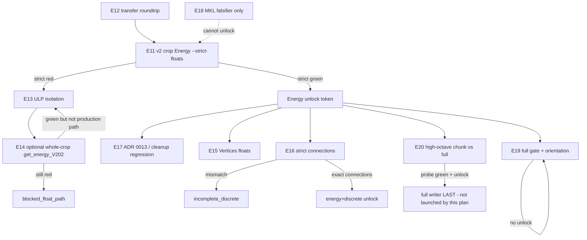

# Zero-Tolerance Stretch Experiments E11-E20 - Plan

## In short

These experiments chase the extra 100% bar (identical last digits), not Phase 1.
Crop Energy is about 90% exact; leftover diffs are tiny (`1e-10`). Tiny photos
that match when treated as their own volume do **not** close the crop leftover.
Do not start long writers from this plan. Readable diagnosis:
[crop-energy-stretch-float-isolation.md](../solutions/parity/crop-energy-stretch-float-isolation.md).

## Goal Capsule

- **Objective:** Deliver a second ranked portfolio of exactly **10** testable experiments (**E11–E20**) that falsify remaining true zero-tolerance gaps on the way to **100% parity** — bit-equal / strict-equality of every compared MATLAB↔Python field, including Energy floats, under `prove-exact --strict-floats`.
- **Product authority:** This plan owns the E11–E20 experiment portfolio only. It **extends** the E1–E10 portfolio and the stretch program; it does **not** rewrite them. Phase 1 Certification on claim root `canonical_full_v18` stays **CLOSED** and is not reopened.
- **Open blockers:** Crop Energy `--strict-floats` is **`blocked_float_path`** on `crop_M_stretch_engine_v2` (v1 remains the filter-only baseline). U5 discrete crop and U6 full volume remain gated on Energy unlock.
- **Execution profile:** code — cheap fixtures and operator procedures; **not** a writer sprint. Do not start long MATLAB writers from this plan. Do not overwrite `canonical_full_v18` or `crop_M_exact_v3`.
- **Stop when:** Crop then full `--strict-floats` pass for Energy **and** discrete (`stretch_complete`), **or** the program is recorded as `blocked_float_path` / `incomplete_discrete` / `incomplete_infra` / `incomplete_at_full` without redefining success as ADR 0011 allclose or ADR 0012 ownership-map green.

---

## Product Contract

### Summary

A durable second series of ten falsifiable experiments aimed at remaining **true zero-tolerance** gaps after Phase 1 CLOSED and after E1–E10 (ranking residual + audit honesty). Each experiment carries a hypothesis, cheap-first procedure, pass/fail criterion, artifacts, an explicit non-claim, and an estimated cost.

**100% parity** here is the stretch bar already settled in `docs/plans/2026-08-14-004-feat-true-zero-tolerance-parity-stretch-plan.md`: every compared field bit-equal / strict equality, **including Energy floats**. Default `prove-exact` allclose is **not** stretch success and is **not** 100%. Evaluated ADR 0012 ownership-map / multiset green is **not** discrete stretch complete.

Live stretch status lives in `stretch_status.json` beside stretch run roots, not in ONE TRUTH.

### Problem Frame

Phase 1 Certification is CLOSED on `canonical_full_v18`. E1–E10 closed the ranking-residual / audit-honesty loop (ADR 0013 claimed-trace bake; matlab2python audit = 0 genuine under production probes). The remaining “100%” gap is **stretch**: Energy floats are not bit-equal (v2 engine path ~90.3% voxels identical, leftover last-digit diffs, status `blocked_float_path`; v1 filter-only was ~62.5%), and discrete strict `connections` / emission order plus Vertices continuous floats are gated on Energy unlock. Without a second experiment series, operators will either reopen Phase 1, treat allclose or ADR 0012 ownership as 100%, or launch a full-volume writer before crop Energy unlocks.

### Key Decisions

- KD1. **100% means `--strict-floats` bit-equal / strict equality, including Energy floats.** (session-settled: user-directed — chosen over Phase-1 allclose-as-100% or ADR 0012 ownership-as-100%: default `prove-exact` allclose is not stretch success.) Governs R1, R2, R7.
- KD2. **Phase 1 stays CLOSED.** (session-settled: user-directed — chosen over reopening ONE TRUTH / ADR 0011–0012 ship bars.) Governs R3.
- KD3. **Extend E1–E10; do not duplicate or rewrite them.** (session-settled: user-directed — chosen over a replacement portfolio: new IDs are E11–E20.) Governs R4.
- KD4. **Crop first; full `180709_E` only after a matching unlock field set.** (session-settled: user-directed — chosen over full-first: never overwrite `canonical_full_v18` or `crop_M_exact_v3`.) Governs R5, R9.
- KD5. **If Energy never becomes bit-equal, status is `blocked_float_path` / incomplete — never allclose.** (session-settled: user-directed — chosen over softening the float bar.) Governs R2, R7.
- KD6. **Discrete strict `connections` / order are in the same 100% bar, gated on Energy unlock.** (session-settled: user-directed — chosen over treating ADR 0012 ownership as discrete stretch.) Governs R8, R16.
- KD7. **Cheap ladder + skip/block when artifacts missing; no writer sprint from this plan.** (session-settled: user-directed — chosen over launching crop/full writers to make the portfolio feel complete.) Governs R5, R6, R10.

<!-- ce-section: work-relationships -->
### How This Work Fits Together

This plan owns the **E11–E20 zero-tolerance stretch experiments** only. Surrounding areas below are the current understanding, not a committed roadmap.

- E1–E10 testable parity experiments (`docs/plans/2026-08-14-001-feat-testable-parity-experiments-plan.md`; shipped in `ca2e716d3`; not present on this `main` tip — **do not recreate**)
  - **Predecessor** residual/audit portfolio; E11–E20 must not repeat those hypotheses
  - **Can proceed independently of** this series (already defined)
- True zero-tolerance stretch program (`docs/plans/2026-08-14-004-feat-true-zero-tolerance-parity-stretch-plan.md`, U1–U7)
  - **Shares** `--strict-floats`, unlock tokens, status taxonomy
  - This portfolio **prepares and falsifies** remaining U4–U7 gaps; it does not replace U4–U7 delivery
- Phase 1 Certification (`canonical_full_v18`, ONE TRUTH CLOSED)
  - **Outside** this plan’s identity; must remain CLOSED
- Synthetic complexity ladder (PR #108) and double-junction harness (PR #109)
  - **Outside** this plan; measurement bugs already fixed; tiny synthetics matched MATLAB
- matlab2python `AUDIT_REPORT.md` (0 genuine under production probes)
  - **Not** Certification and **not** stretch success

### Actors

- A1. Parity operator — runs cheap-first stretch experiments; records `stretch_status.json`; never promotes results into ONE TRUTH CLOSED language.
- A2. Planning / implementation agent — adds only the tiny fixtures needed to make an experiment concrete; does not start long writers.
- A3. MATLAB runtime (R2019a + isolated Python 3.7 `workspace/scratch/conda_py37_stretch`) — required for engine-path experiments; missing engine is `incomplete_infra` / skip, not fail-as-falsified.

### Requirements

**Portfolio rules**

- R1. The portfolio contains exactly **10** new experiments **E11–E20**, each aimed at a remaining zero-tolerance gap (not E1–E10 duplicates).
- R2. Stretch success for any float field is **`prove-exact --strict-floats` bit-identity** (or `np.array_equal` on a named fixture). Default allclose / ADR 0011 ship green is **not** 100% and **must not** emit a crop Energy unlock.
- R3. No experiment may rewrite ONE TRUTH CLOSED language, ADR 0011/0012 ship bars, or claim-run roots.
- R4. Every experiment records: hypothesis, cheap-first procedure, pass/fail, artifacts, what it does **not** prove, estimated cost, and a skip/block rule when artifacts are missing.
- R5. Cost tiers follow the cheap ladder: `synthetic/unit` → `crop` → `full no-writer` → `full writer last`. Ranking, marshalling, and ULP-isolation hypotheses must not request a full writer.
- R6. Missing artifacts, a live writer on the dest root, or a missing MATLAB engine → **skip/block**, not silent fail-as-falsified.

**Hard bars (repeated because they are the 100% definition)**

- R7. **Allclose is not 100%.** A crop or full Energy proof that passes default `prove-exact` and fails `--strict-floats` is `blocked_float_path` (or continue deepening), never stretch success.
- R8. **ADR 0012 ownership-map green is not discrete stretch.** Exact `connections` / order-sensitive emission under the stretch discrete compare is required for the discrete field set. Ownership/multiset pass is Phase 1 Certification, already CLOSED.
- R9. Full-volume stretch (Energy or discrete) runs only after a recorded crop unlock for the **same** field set. New dest roots only.
- R10. This plan does not authorize starting `crop_M_stretch_engine_v2` (already running at write time), a third crop Energy writer, or any full `180709_E` stretch writer.

**Experiments**

- R11. **E11 — Crop Energy bit-equal after MATLAB `interp3` (v2 proof)**
  - **Hypothesis:** After MATLAB owns FFT + `energy_filter_V200` + `interp3` + scale-min per chunk (`stretch_energy_chunk_v202` on dest `crop_M_stretch_engine_v2`), crop Energy is bit-identical to oracle `180709_E_crop_M_v2` under `--strict-floats`.
  - **Cheap-first procedure:** Do **not** start a writer. If `stretch_status.json` is `crop_energy_running` or `writer_lease.json` PID is alive → **block**. When Energy stage completes, run `prove-exact --stage energy --strict-floats` against `180709_E_crop_M_v2` on that dest only. Unlock only on strict green.
  - **Pass:** `energy_float_gate.passed=true` with `strict_floats=true`; 0 scale mismatches; Energy arrays bit-identical; Energy unlock token emitted.
  - **Fail:** any non-identical Energy voxel → remain `blocked_float_path` (v1-style ULP is still failure). Allclose-only green is fail for this experiment.
  - **Block:** writer still running; no `best_energy.npy` / energy checkpoint; proof JSON `dest_run_root` mismatch.
  - **Artifacts:** `workspace/runs/oracle_180709_E/crop_M_stretch_engine_v2/stretch_status.json`, `99_Metadata/writer_lease.json`, `02_Energy/`, `03_Analysis/exact_proof_energy.json` (after prove). Contrast v1 proof `crop_M_stretch_engine_v1/03_Analysis/exact_proof_energy.json`.
  - **Does not prove:** Vertices/Edges/Network zero-tolerance; full-volume Energy; that ADR 0011 allclose is 100%; Phase 1 reopen.
  - **Cost:** crop prove minutes after the already-running writer finishes (hours of compute already in flight — do not relaunch).

- R12. **E12 — Engine transfer / `matlab.double` list-marshalling bit-identity**
  - **Hypothesis:** The py37 worker path (`npy` → Fortran ravel → `[float(v) for v in flat]` → `matlab.double(..., size=)` → MATLAB → `_data` buffer → `np.save`) is bit-identical for float64 `[Y,X,Z]` arrays, so remaining crop ULP (if E11 fails) is **not** transfer.
  - **Cheap-first procedure:** Unit fixture through the **production worker marshalling**, not only in-process `MatlabEngineSession.roundtrip_float64` (that helper skips on repo 3.12). Include Inf/NaN payloads. Skip if py37/engine absent (`incomplete_infra`).
  - **Pass:** `np.array_equal` on finite values; Inf/NaN payload identity (NaN positions preserved).
  - **Fail:** any finite ULP or shape/order change through the worker path.
  - **Artifacts:** `scripts/stretch/engine_worker.py`; `slavv_python/pipeline/energy/matlab_engine_backend.py` (`numpy_to_matlab_double`); new test under `tests/unit/pipeline/energy/`.
  - **Does not prove:** Energy math bit-equality vs oracle; crop unlock.
  - **Cost:** `synthetic/unit` seconds; engine skip on CI.

- R13. **E13 — Remaining ULP source isolation (linspace mesh, Inf/NaN `interp3`, chunk vs full body)**
  - **Hypothesis:** If E11 fails after MATLAB `interp3`, the residual is one named source: (a) `linspace` coarse→fine mesh endpoints, (b) Inf/NaN `interp3` propagation, or (c) per-chunk `stretch_energy_chunk_v202` vs a single MATLAB `get_energy_V202` body on the same crop lattice.
  - **Cheap-first procedure:** Tiny engine probes (one chunk / few scales) **before** another crop writer. Compare MATLAB-side `interp3` of a known Inf/NaN volume vs Python `_interp3_matlab_linear_inf`. Compare `linspace` meshes from `stretch_energy_chunk_v202` vs `get_energy_V202.m`. Isolate (c) only as a **small** engine call, not a full writer. Block if E11 still running.
  - **Pass:** named source reproduces the v2 mismatch pattern (or all three sources bit-match, which **fails** this isolation hypothesis and forces a new named source — still `blocked_float_path`, not allclose success).
  - **Fail:** isolation cannot attribute v2 mismatches to (a)(b)(c) and no new named source is recorded.
  - **Artifacts:** `scripts/stretch/stretch_energy_chunk_v202.m`; `external/Vectorization-Public/source/get_energy_V202.m`; `slavv_python/pipeline/energy/matlab_get_energy_v202_chunked.py` (`_interp3_matlab_linear_inf`); v2 mismatch JSON if prove has run.
  - **Does not prove:** crop Energy unlock; that deepening MATLAB surface is complete.
  - **Cost:** `synthetic/unit` minutes on operator host with MATLAB; skip without engine.

- R14. **E14 — Optional whole-crop MATLAB `get_energy_V202` engine call**
  - **Hypothesis:** One in-process MATLAB `get_energy_V202` on the crop volume (Python still owns I/O and checkpoint packaging) is bit-equal to oracle Energy, isolating chunk-lattice / per-chunk marshalling from MATLAB’s own full-body Energy.
  - **Cheap-first procedure:** Only after E12 is green (transfer not the confounder) and only if E11 failed or is inconclusive. Memory-check the crop `(64,256,256)` first. Skip if engine/oracle/volume missing. **Do not** treat MATLAB-written Energy with Python never producing Energy as stretch success (stretch plan R6).
  - **Pass:** `--strict-floats` bit-equal vs `180709_E_crop_M_v2` Energy from a Python-orchestrated engine call.
  - **Fail:** still not bit-equal → `blocked_float_path` with “even MATLAB `get_energy_V202` via engine ≠ oracle” (oracle/transfer/params), not allclose success.
  - **Block:** E11 writer still running on another dest is fine; do not overwrite v2. New scratch dest only.
  - **Artifacts:** new scratch dest under `workspace/scratch/` or a new stretch dest; never `canonical_full_v18` / `crop_M_exact_v3` / in-flight v2.
  - **Does not prove:** production chunked path unlock; full-volume Energy; discrete stretch.
  - **Cost:** `crop` minutes; optional; skip rather than OOM.

- R15. **E15 — Vertices `lumen_radius` / continuous floats under `--strict-floats`**
  - **Hypothesis:** After Energy unlock, Vertices discrete positions/scales already match, but continuous fields (`energies`, and Energy-stage `lumen_radius_microns` in `EXACT_STAGE_FIELDS`) still fail `--strict-floats`.
  - **Cheap-first procedure:** **Gated on Energy unlock.** Unit fixture first (strict vs allclose on a Vertices float vector). Then crop `prove-exact --stage vertices --strict-floats` on a **new** stretch dest that carries unlocked Energy. Do not run Vertices writer until Energy unlock exists. Skip if unlock missing.
  - **Pass:** all compared Vertices fields bit-equal / strict under `--strict-floats`.
  - **Fail:** any continuous Vertices/Energy-radius field not bit-equal → record as incomplete Vertices-float stretch (still under stretch R1; stretch plan ASSUME5), **not** Phase 1 fail.
  - **Artifacts:** `slavv_python/analytics/parity/proof/exact_proof_contract.py`; crop vertices checkpoint; unlock token.
  - **Does not prove:** Edges/Network discrete stretch; full volume; Phase 1 Vertices allclose ship (already CLOSED).
  - **Cost:** unit seconds; crop minutes after unlock.

- R16. **E16 — Discrete strict `connections` / emission order on crop after Energy unlock**
  - **Hypothesis:** With bit-equal crop Energy, crop Edges/Network still fail exact `connections` / order-sensitive emission (`incomplete_discrete`). ADR 0012 ownership-map green on Phase 1 does **not** satisfy this.
  - **Cheap-first procedure:** **Gated on Energy unlock.** Reuse stretch helpers `evaluate_stretch_discrete_connections` / `expand_unlock_with_discrete`. Crop no-writer re-selection first if candidates exist on the stretch dest; crop Edges writer only if cheap layer cannot speak. Compare strict `connections` (and documented order-sensitive emission), not ownership %.
  - **Pass:** exact connections match → expand unlock to `energy+discrete`.
  - **Fail:** mismatch → `incomplete_discrete` (not `blocked_float_path`, not Phase 1 red).
  - **Block:** no Energy unlock; missing crop candidates/oracle.
  - **Artifacts:** `tests/unit/parity/test_stretch_discrete_strict_field.py`; crop oracle `180709_E_crop_M_v2`; stretch dest Edges checkpoints (new root).
  - **Does not prove:** Phase 1 ADR 0012; full-volume discrete; that ranking/cleanup is the residual (see E17).
  - **Cost:** unit seconds already covered; crop minutes after unlock; writer last.

- R17. **E17 — Claimed-trace ranking + cleanup MATLAB comparator (regression, not Phase 1)**
  - **Hypothesis:** ADR 0013 claimed-trace bake and crop cleanup MATLAB comparator remain green on existing crop artifacts. This is a **regression guard** so operators do not reopen ranking as the 100% gap.
  - **Cheap-first procedure:** No-writer crop probes already in HANDOFF (`edges/frontier_diff.py`, `edges/clean_edge_pairs_matlab.py`, E1–E4 surfaces). Do **not** launch an Edges writer. Do **not** cite this as Phase 1 work.
  - **Pass:** crop raw pair-set / cleanup comparator still agree; claimed-map ranking still prefers the documented oracle partner on stored fixtures.
  - **Fail:** ranking/cleanup regression → fix as stretch-adjacent production regression, still without reopening ONE TRUTH CLOSED.
  - **Artifacts:** `crop_M_exact_v3` candidates (read-only); `scripts/edges/clean_edge_pairs_matlab.py`; `tests/unit/pipeline/test_watershed_energy_map_sort_experiments.py`.
  - **Does not prove:** Energy bit-equality; discrete stretch complete; Phase 1 anything new.
  - **Cost:** `crop` / `full no-writer` minutes; never a writer for this ID.

- R18. **E18 — MKL / in-process NumPy spike as falsifier only (U7)**
  - **Hypothesis:** In-process MKL/NumPy Energy is **not** bit-equal on crop (v1 already showed ~62.5% even with MATLAB filter + Python `interp3`). Even a hypothetical MKL bit-equal crop **must not** replace the engine path or emit `stretch_complete`.
  - **Cheap-first procedure:** Cite v1 `--strict-floats` fail as the existing NumPy/engine-hybrid falsifier. Optional short MKL-thread spike only if someone claims “MKL alone would unlock.” Policy test already in `tests/unit/parity/test_mkl_spike_does_not_replace_engine.py`. Do not start an MKL crop writer from this plan.
  - **Pass:** policy helper rejects “MKL pass ⇒ stretch complete”; NumPy-only / hybrid path remains `--strict-floats` red (or spike documented as falsifier-only).
  - **Fail:** someone records stretch unlock from an MKL/NumPy dest without engine origin stamp.
  - **Artifacts:** v1 `stretch_status.json` (`blocked_float_path`); `mkl_spike_cannot_complete_stretch`.
  - **Does not prove:** engine path will unlock; full volume.
  - **Cost:** `synthetic/unit`; optional spike minutes; never replaces E11.

- R19. **E19 — Full-volume stretch unlock gate + `(512,64,512)` orientation pitfall**
  - **Hypothesis:** Full stretch prove/launch without a matching crop unlock is refused; a full Energy array shaped `(512,64,512)` is an orientation defect (`incomplete_infra` / refuse), not a float-bar near-miss, and never overwrites `canonical_full_v18`.
  - **Cheap-first procedure:** Unit tests already in `tests/unit/parity/test_stretch_full_volume_gate.py`. Add a fixture that a `(512,64,512)` Energy checkpoint fails stretch prove **before** ULP accounting. Do **not** start a full writer. After Energy unlock, full Energy-only may be authorized later by stretch U6 — **not** by this experiment’s DoD.
  - **Pass:** no-unlock → `FULL_REFUSED`; claim-root dest refused; orientation mismatch classified as infra/refuse, not allclose pass.
  - **Fail:** full stretch proceeds without unlock, or orientation mismatch is reported as `blocked_float_path`.
  - **Artifacts:** `slavv_python/analytics/parity/proof/stretch.py` (`gate_full_stretch_entry`); `docs/solutions/parity/resume-energy-orientation.md`.
  - **Does not prove:** full Energy bit-equality; `stretch_complete`.
  - **Cost:** `synthetic/unit` seconds.

- R20. **E20 — High-octave crop≠full Energy lesson before any full stretch writer**
  - **Hypothesis:** Crop Energy bit-equal (E11) does **not** imply full-volume Energy bit-equal at downsampled octaves where the crop is 1 chunk and full `180709_E` is many chunks (historical octave-4 `rf=[5,10,10]` lesson). A cheap high-octave chunk-vs-full engine probe must pass (or name the residual) **before** a full stretch writer.
  - **Cheap-first procedure:** **Gated on Energy unlock.** Unit/synthetic: same downsampled octave, 1 chunk vs N chunks, engine `stretch_energy_chunk_v202`, `np.array_equal` on overlap interiors. Skip if unlock missing. Full `180709_E` writer is **last** and only with Energy-only unlock + this probe green (or an explicit `incomplete_at_full` risk acceptance recorded in `stretch_status.json`, never as allclose success).
  - **Pass:** multi-chunk vs single-chunk engine Energy bit-identical on the fixture.
  - **Fail:** divergence → do not launch full stretch writer; status stays crop-unlocked / `incomplete_at_full` risk, not 100%.
  - **Artifacts:** `docs/solutions/parity/canonical-energy-high-octave-divergence.md`; engine chunk helper; new unit under `tests/unit/pipeline/energy/`.
  - **Does not prove:** full `--strict-floats` vs `180709_E_full_v2`; discrete stretch; Phase 1 Energy allclose (already CLOSED).
  - **Cost:** `synthetic/unit` minutes with engine; full writer last and out of this plan’s launch authority.

### Key Flows

- F1. Energy-unlock ladder (E12 → E11 → E13/E14 if red → E18 as falsifier)
  - **Trigger:** Operator wants crop Energy `--strict-floats` unlock.
  - **Actors:** A1, A2, A3
  - **Steps:** Run E12 if engine available (does not need v2). Wait for v2 writer; never start a second. Prove E11. If red, isolate with E13 then optional E14. E18 cannot unlock.
  - **Outcome:** Energy unlock **or** durable `blocked_float_path`.
  - **Covered by:** R11, R12, R13, R14, R18, R7, R10

- F2. Post-unlock discrete / Vertices ladder (E15, E16, E17)
  - **Trigger:** Energy unlock token present for crop dest/oracle pairing.
  - **Actors:** A1, A2
  - **Steps:** E17 regression first (cheap, no writer). E15 Vertices floats. E16 strict connections. Failures are `incomplete_discrete` / Vertices-float incomplete, not Phase 1.
  - **Outcome:** `energy+discrete` unlock or `incomplete_discrete`.
  - **Covered by:** R15, R16, R17, R8

- F3. Full-volume refuse-then-prepare (E19, E20)
  - **Trigger:** Operator considers full `180709_E` stretch.
  - **Actors:** A1, A2
  - **Steps:** E19 gate must refuse without matching unlock and refuse claim-root overwrite. E20 high-octave probe before any full writer. This plan does not launch that writer.
  - **Outcome:** full entry allowed only with matching unlock + orientation/high-octave checks; else refuse / `incomplete_at_full`.
  - **Covered by:** R9, R19, R20

### Acceptance Examples

- AE1. Allclose is not 100%
  - **Covers:** R2, R7, R11
  - **Given:** Crop Energy proof with default allclose green and `--strict-floats` red (v1: ~62.5% bit-identical)
  - **When:** Operator asks if stretch / 100% is done
  - **Then:** Status remains `blocked_float_path`; no Energy unlock; ONE TRUTH still CLOSED

- AE2. ADR 0012 ownership is not discrete stretch
  - **Covers:** R8, R16
  - **Given:** Phase 1 Edges ownership ~99.999863% PASS on `canonical_full_v18`
  - **When:** Discrete stretch is scored
  - **Then:** Ownership green does not expand unlock to `energy+discrete`; exact `connections` / order still required

- AE3. V2 writer still running is block, not fail
  - **Covers:** R6, R11, R10
  - **Given:** `crop_M_stretch_engine_v2` lease PID alive and `stretch_status.json` is `crop_energy_running`
  - **When:** E11 is attempted
  - **Then:** Experiment is **blocked**; no second writer; no false-falsify of the interp3 hypothesis

- AE4. Full without unlock refused
  - **Covers:** R9, R19
  - **Given:** No crop Energy unlock token
  - **When:** Full stretch prove/launch is requested
  - **Then:** `FULL_REFUSED`; `canonical_full_v18` not used as dest

### Success Criteria

- E11–E20 each have a named cheap-first procedure, pass/fail, skip/block rule, and non-claim.
- Crop Energy `--strict-floats` either unlocks (E11 green) or is explicitly `blocked_float_path` after E13/E14 (never allclose).
- Discrete stretch is scored only after Energy unlock and only via exact connections/order (E16), not ADR 0012.
- Full stretch is not launched from this plan; E19/E20 only prepare/refuse.
- Phase 1 ONE TRUTH remains CLOSED on `canonical_full_v18`.

### Scope Boundaries

**In scope**

- E11–E20 definitions, composition, stop conditions
- Tiny fixtures that make E12/E13/E19/E20 concrete
- Operator procedures that wait on / prove existing v2 dest

**Deferred for later**

- Stretch U5/U6 **delivery** (crop discrete writer, full stretch writer) after unlock — this portfolio may *prepare* them
- Additional volumes beyond `180709_E` / crop_M
- Packaging MATLAB Engine for all users

**Outside this product's identity**

- Reopening Phase 1 or changing ADR 0011/0012 ship bars
- Rewriting E1–E10, the synthetic ladder, or AUDIT_REPORT as Certification
- Starting long crop/full writers from this plan
- Treating MKL spike (E18) as the engine replacement
- Static transpilers (`matlab2python`) as stretch verification

### Dependencies / Assumptions

- Stretch plan U1–U4 surfaces already exist (`stretch.py`, engine host, `--strict-floats` unlock helpers).
- Isolated Python 3.7 + R2019a engine at `workspace/scratch/conda_py37_stretch` for operator-host engine tests; repo `.venv` is 3.12.
- Crop oracle `180709_E_crop_M_v2` and full oracle `180709_E_full_v2` remain the compare surfaces.
- Live v2 Energy writer (observed at plan write) is allowed to finish; this plan must not kill or duplicate it.
- E1–E10 plan file may be absent on this `main` tip; series identity still holds — do not recreate E1–E10 in this file.

### Outstanding Questions

**Resolve Before Planning**

- None. Session-settled bars and crop-first / no-writer-sprint constraints are sufficient.

**Deferred to Implementation**

- Exact E14 MATLAB entry (`get_energy_V202` vs a thin wrapper) if E11 fails and memory allows.
- Whether E15 compares Energy-stage `lumen_radius_microns` only or also Vertices `energies` in the same prove invocation (both are in `EXACT_STAGE_FIELDS`; implementer must name the field list in the fixture).

---

## Planning Contract

### Assumptions

- ASSUME1. **Do not assume v2 Energy unlock.** At plan write, `crop_M_stretch_engine_v2` was `crop_energy_running` (~301/821 chunks, lease PID 4448 alive). E11 blocks until that dest’s Energy stage completes and `--strict-floats` is run.
- ASSUME2. **Energy-first unlock still holds** (stretch plan ASSUME1). E15–E16–E20 must not run as if discrete/full were unlocked.
- ASSUME3. **Existing gate unit tests count** for E16/E18/E19 policy; this portfolio adds missing **production-path** fixtures (py37 worker marshalling, Inf/NaN interp3, orientation-before-ULP, high-octave chunk-vs-full).
- ASSUME4. **CI skips engine tests** when MATLAB/py37 is absent; skip ≠ fail.
- ASSUME5. **v1 remains the blocked baseline** (`blocked_float_path`, 2,623,250 / 4,194,304 bit-identical, 0 scale mismatches, max abs delta `1e-10`, ULP p50=1). Do not delete or overwrite v1.

### Key Technical Decisions

- KTD1. **E11 dest is `crop_M_stretch_engine_v2` only; prove, don’t relaunch.** Instantiates R11, R10, AE3.
- KTD2. **E12 targets the py37 worker list-marshalling path**, not only `MatlabEngineSession.roundtrip_float64` (skipped on 3.12). Instantiates R12.
- KTD3. **E13/E14 run only if E11 is red or blocked-after-complete**, except E12 which is independent and cheap. Instantiates F1.
- KTD4. **Reuse stretch status taxonomy** (`blocked_float_path`, `incomplete_discrete`, `incomplete_infra`, `incomplete_at_full`, `FULL_REFUSED`). Do not invent a fifth “allclose-complete” state. Instantiates R7, R8.
- KTD5. **New stretch dest roots only** for any later writer authorized *after* this portfolio. Instantiates R3, R9.
- KTD6. **No portfolio CLI.** Map E11–E20 to pytest nodes / existing `slavv parity prove-exact` / documented probes, same as E1–E10 KTD1.

### High-Level Technical Design

#### Composition / stop conditions

Stop:

1. E11 red after E13/E14 exhausted → **`blocked_float_path`**. Never allclose. Do not start U5/U6/full.
2. E11 green, E16 red → **`incomplete_discrete`**. Energy-only full may be considered later by stretch U6; this plan still does not launch it.
3. Unlock missing → E15/E16/E20 **block**; E19 refuses full.
4. `stretch_complete` is **out of this plan’s launch authority**; this portfolio only prepares the falsifiers that would justify a later U6 run.

#### Live v2 observation (plan write, 2026-08-15 evening CT)

Recorded so implementers do not treat unlock as already true. Re-read disk; do not freeze these as ONE TRUTH KPIs.

- `crop_M_stretch_engine_v1`: `blocked_float_path`; `--strict-floats` FAIL; 62.5% voxels bit-identical; 0 scale mismatches; cause was Python `interp3` after MATLAB `energy_filter_V200`.
- `crop_M_stretch_engine_v2`: `stretch_status.json` status `crop_energy_running`; `float_body=stretch_energy_chunk_v202`; lease PID **4448** (`python`, started 2026-08-16T01:57:50Z); Energy **301/821** chunks; heartbeat `2026-08-16T03:10:22Z`; no `03_Analysis` proof yet; `02_Energy` has `resume_state.json` only (no `best_energy.npy` yet).
- Snapshot `artifacts.energy.*` still pointed at **v1** npy paths — do not cite those as v2 results.

### Alternative Approaches Considered

| Approach | Why not |
|:---------|:--------|
| Rewrite E1–E10 with stretch IDs | User directed extend-not-duplicate; ranking/audit hypotheses are closed |
| Launch a new crop/full Energy writer to “have results in the plan” | Violates KD7 / R10; v2 already running |
| Score 100% from ADR 0012 ownership or allclose | Violates KD1 / R7 / R8 |
| MKL-first instead of engine v2 prove | Stretch KTD8 / E18: falsifier only |

### Risks & Dependencies

| Risk | Mitigation |
|:-----|:-----------|
| False-falsify E11 while v2 is mid-write | AE3 block on live lease / missing checkpoint |
| Cite v1 npy via v2 snapshot artifact aliases | Pair proof `dest_run_root` to the folder opened; inspect-proof |
| E14 MATLAB-only Energy treated as Python stretch success | Stretch R6 / `refuse_matlab_only_energy_checkpoint_as_stretch_success` |
| Full orientation `(512,64,512)` misread as ULP | E19 classifies as infra/refuse first |
| High-octave crop green ≠ full | E20 before any full writer |
| Engine missing on CI | skip/`incomplete_infra`, not fail |

### System-Wide Impact

- No change to default `prove-exact` allclose (ADR 0011).
- No ONE TRUTH CLOSED edits.
- Stretch dest roots and `stretch_status.json` only.
- Writer lease: do not take a second lease on `crop_M_stretch_engine_v2`.

---

## Implementation Units

### U1. E11 v2 crop Energy prove procedure (no new writer)

- **Goal:** Make E11 runnable as wait → prove → unlock-or-block, without launching Energy.
- **Requirements:** R11, R6, R7, R10; AE1, AE3; KTD1
- **Dependencies:** None
- **Files:**
  - Read-only: `workspace/runs/oracle_180709_E/crop_M_stretch_engine_v2/`
  - Modify (docs only if a one-liner operator map is needed): `docs/solutions/best-practices/parity-experiment-hygiene.md` — prefer a short E11–E20 ladder subsection, not a new hygiene rewrite
  - Test: extend `tests/unit/parity/test_stretch_crop_energy_strict_floats.py` only if a “running dest / missing energy checkpoint → no unlock” case is absent
- **Approach:**
  1. Document the block predicate: live `writer_lease.json` PID **or** Energy stage not `completed` **or** missing energy checkpoint → E11 blocked.
  2. When complete: `slavv parity prove-exact --stage energy --strict-floats` with dest `crop_M_stretch_engine_v2` and oracle `180709_E_crop_M_v2`.
  3. Unlock only via existing `emit_stretch_energy_unlock_if_eligible` (allclose without strict must not unlock — already tested).
- **Test scenarios:**
  - Covers AE3. Missing checkpoint / non-strict report → no unlock.
  - Covers AE1. Allclose-green + strict-red → no unlock.
- **Verification:** No new writer started; v2 lease left untouched.

### U2. E12 worker marshalling + E13 ULP isolation fixtures

- **Goal:** Cheap falsifiers for transfer vs linspace vs Inf/NaN `interp3` vs chunk-vs-full body.
- **Requirements:** R12, R13; KTD2, KTD3
- **Dependencies:** None (parallel with U1)
- **Files:**
  - Create: `tests/unit/pipeline/energy/test_stretch_worker_marshalling.py` (skip without py37/engine)
  - Create: `tests/unit/pipeline/energy/test_stretch_ulp_isolation.py` (Inf/NaN interp3 + linspace mesh; engine cases skip)
  - Read: `scripts/stretch/engine_worker.py`, `matlab_engine_backend.py`, `_interp3_matlab_linear_inf`
- **Approach:**
  1. E12: round-trip a Fortran `[Y,X,Z]` float64 array through the **same** `float` list + `matlab.double(size=)` + `_data` reshape the worker uses; include Inf/NaN.
  2. E13: fixture MATLAB-compatible Inf propagation vs `_interp3_matlab_linear_inf`; fixture `linspace` endpoint equality vs `stretch_energy_chunk_v202` mesh. Do not start a crop writer.
- **Test scenarios:**
  - Happy path: finite random array `np.array_equal` after worker-shaped marshalling (skip if no engine).
  - Inf/NaN positions preserved.
  - Linspace mesh endpoints match the `.m` formula for a tiny `rf`/`offset`/`count`.
- **Verification:** CI green with skips; operator-host engine run optional.

### U3. E14 optional whole-crop `get_energy_V202` (skip-first)

- **Goal:** Define the optional isolation call so it cannot be mistaken for production unlock or MATLAB-only success.
- **Requirements:** R14; stretch plan R6
- **Dependencies:** U2 (E12 green preferred)
- **Files:**
  - Create: short operator note in this plan’s Appendix map is enough unless a thin script is required — if a script is added, `scripts/stretch/whole_crop_get_energy_v202.py` under 1000 lines, skip-if-missing, write only under `workspace/scratch/`
  - Test: `tests/unit/pipeline/energy/test_stretch_whole_crop_get_energy_policy.py` — refuses MATLAB-only checkpoint as stretch success; refuses overwrite of v2/claim roots
- **Approach:** Policy + skip path first. Implement the engine call only if E11 completes red and E12 is green.
- **Test scenarios:**
  - Dest in `{canonical_full_v18, crop_M_exact_v3, crop_M_stretch_engine_v2}` refused.
  - `refuse_matlab_only_energy_checkpoint_as_stretch_success` still raises.
- **Verification:** No crop writer; scratch-only if executed later.

### U4. E15 Vertices floats + E16 discrete connections (gated)

- **Goal:** After Energy unlock, score Vertices continuous fields and exact connections without treating ADR 0012 as pass.
- **Requirements:** R15, R16, R8; AE2
- **Dependencies:** U1 (Energy unlock)
- **Files:**
  - Extend: `tests/unit/parity/test_stretch_discrete_strict_field.py` (already covers ownership ≠ exact connections)
  - Create: `tests/unit/parity/test_stretch_vertices_strict_floats.py` — fixture allclose-green / strict-red on a Vertices `energies` vector does not expand discrete unlock
- **Approach:** Gate functions must no-op / block without Energy unlock. Do not start Vertices/Edges writers in this unit.
- **Test scenarios:**
  - Covers AE2. Exact connections required to expand unlock.
  - No Energy unlock → E15/E16 helpers refuse.
  - Vertices float mismatch → not `blocked_float_path`.
- **Verification:** Unit tests; crop prove listed as operator step after unlock, not this unit’s launch.

### U5. E17 ranking/cleanup regression (read-only)

- **Goal:** Keep ADR 0013 / cleanup comparator as a cheap regression, explicitly not Phase 1 and not 100%.
- **Requirements:** R17
- **Dependencies:** None
- **Files:**
  - Reuse: `tests/unit/pipeline/test_watershed_energy_map_sort_experiments.py`
  - Reuse: `scripts/edges/clean_edge_pairs_matlab.py`
  - Do not modify production ranking
- **Approach:** Document E17 entrypoints in the Appendix map. Skip if crop candidates missing.
- **Test scenarios:** Existing E1/E2 unit coverage remains green; E17 non-claim language in the operator map.
- **Verification:** No writer; no ONE TRUTH edit.

### U6. E18 MKL falsifier policy (already present)

- **Goal:** Keep MKL/NumPy from replacing Approach A.
- **Requirements:** R18
- **Dependencies:** None
- **Files:**
  - Reuse: `tests/unit/parity/test_mkl_spike_does_not_replace_engine.py`
- **Approach:** Cite v1 `--strict-floats` fail as the empirical falsifier. No new MKL writer.
- **Test scenarios:** `mkl_bit_equal=True` still cannot complete stretch.
- **Verification:** Policy test green.

### U7. E19 full gate/orientation + E20 high-octave probe fixture

- **Goal:** Refuse full stretch without unlock; catch `(512,64,512)` before ULP; require high-octave chunk-vs-full bit-identity before any later full writer.
- **Requirements:** R19, R20, R9; AE4
- **Dependencies:** E20 engine fixture may skip; E19 units do not need unlock
- **Files:**
  - Extend: `tests/unit/parity/test_stretch_full_volume_gate.py` — orientation shape `(512,64,512)` vs oracle `(64,512,512)` is refuse/infra
  - Create: `tests/unit/pipeline/energy/test_stretch_high_octave_chunk_vs_full.py` — 1-chunk vs N-chunk merge identity on a tiny downsampled lattice (engine skip; numpy merge identity still testable)
- **Approach:** Do not launch full `180709_E`. E20 production engine compare is operator-host after Energy unlock.
- **Test scenarios:**
  - Covers AE4. Missing unlock → `FULL_REFUSED`.
  - Claim dest name `canonical_full_v18` refused.
  - Shape `(512,64,512)` fails before float gate.
  - Tiny min-merge of two chunks equals single-window result on overlap (numpy stand-in when engine absent).
- **Verification:** Unit tests; no full writer.

---

## Verification Contract

| Gate | Command / surface | Counts as 100%? |
|:-----|:------------------|:----------------|
| Default unit CI | `python -m pytest tests/unit/parity/test_stretch_*.py tests/unit/pipeline/energy/test_stretch_*.py tests/unit/pipeline/energy/test_matlab_engine_backend.py` | No |
| Engine tests | same files; skip without MATLAB/py37 | Skip ≠ fail |
| E11 crop Energy | `slavv parity prove-exact --stage energy --strict-floats` on `crop_M_stretch_engine_v2` vs `180709_E_crop_M_v2` **after** writer complete | Energy unlock only if strict green |
| Default `prove-exact` (no `--strict-floats`) | existing ADR 0011 allclose | **Never** stretch / 100% |
| Evaluated ADR 0012 | `canonical_full_v18` Edges/Network | Phase 1 CLOSED only; **not** discrete stretch |
| Quality | `ruff` / `mypy` on touched tests; 1000-line file limit; no inline imports; float64; `[Y,X,Z]` Fortran | — |

---

## Definition of Done

**Global**

- [ ] E11–E20 each have hypothesis, cheap-first procedure, pass/fail, artifacts, non-claim, cost, skip/block.
- [ ] Composition and stop conditions are explicit: allclose ≠ 100%; ADR 0012 ownership ≠ discrete stretch.
- [ ] Tiny fixtures for E12/E13/E19/E20 (and policy for E14/E16/E18) exist or reuse existing tests.
- [ ] No long crop/full writer started from this plan; `canonical_full_v18` and `crop_M_exact_v3` not overwritten.
- [ ] ONE TRUTH Phase 1 CLOSED language untouched.
- [ ] Abandoned spike scripts stay out of `slavv_python/` (scratch only).

**Per unit**

- U1: E11 block/prove procedure documented; no second v2 writer.
- U2: marshalling + ULP isolation tests skip-clean.
- U3: E14 cannot overwrite protected roots or count MATLAB-only Energy as success.
- U4: Vertices-float + discrete tests gated; ownership ≠ exact connections.
- U5: E17 maps to existing no-writer probes.
- U6: MKL policy test still green.
- U7: full refuse + orientation + high-octave fixture tests green.

---

## Appendix

### Experiment → harness map

| ID | Cost | Primary harness | Unlock role |
|----|------|-----------------|-------------|
| E11 | crop prove (after in-flight writer) | `prove-exact --stage energy --strict-floats` on `crop_M_stretch_engine_v2` | **Energy unlock** or `blocked_float_path` |
| E12 | unit | `tests/unit/pipeline/energy/test_stretch_worker_marshalling.py` | Independent; cannot unlock |
| E13 | unit | `tests/unit/pipeline/energy/test_stretch_ulp_isolation.py` | Only if E11 red |
| E14 | crop optional | scratch whole-crop `get_energy_V202` engine call | Isolation only; not production unlock |
| E15 | unit then crop | `test_stretch_vertices_strict_floats.py` then vertices `--strict-floats` | After Energy unlock |
| E16 | unit then crop | `test_stretch_discrete_strict_field.py` then stretch discrete compare | Expands to `energy+discrete` |
| E17 | crop no-writer | existing E1–E4 / `edges/clean_edge_pairs_matlab.py` | Regression; not 100% |
| E18 | unit | `test_mkl_spike_does_not_replace_engine.py` + v1 status | Cannot unlock |
| E19 | unit | `test_stretch_full_volume_gate.py` | Refuse full without unlock |
| E20 | unit then engine | `test_stretch_high_octave_chunk_vs_full.py` | Required before later full writer |

### Must-read before running experiments

1. `docs/plans/2026-08-14-004-feat-true-zero-tolerance-parity-stretch-plan.md`
2. `docs/reference/core/EXACT_PROOF_FINDINGS.md` (ONE TRUTH CLOSED + stretch subsection)
3. `.claude/HANDOFF.md` (stretch operator notes)
4. `docs/solutions/best-practices/parity-experiment-hygiene.md`
5. `docs/solutions/parity/canonical-energy-high-octave-divergence.md`
6. `docs/solutions/parity/resume-energy-orientation.md`
7. `docs/solutions/parity/crop-energy-stretch-float-isolation.md`

### Predecessor portfolio (do not duplicate)

E1 claimed-map ranking; E2 degree-excess earlier-row; E3 crop raw pair-set; E4 full no-writer re-selection; E5 MATLAB-edge Network isolation; E6 ProductionProbe honesty; E7 13/13 coverage; E8 static ≠ GENUINE; E9 ParityModuleMap seam; E10 cheap-loop gate.
Those IDs remain the first series. This file is **E11–E20** only.

### Outcomes (2026-08-16 wrap)

Stop condition met: crop Energy recorded **`blocked_float_path`**. Allclose is not stretch success. Phase 1 CLOSED unchanged. Do not relaunch v2.

| ID | Result | Notes |
|----|--------|-------|
| E11 | **FAIL** | v2 `--strict-floats`: 3,786,847 / 4,194,304 bit-identical (90.3%); 407,457 mismatches; 0 scale mismatches. No Energy unlock. |
| E12 | **PASS** | py37 `matlab.double` marshalling bit-identical (finite + Inf/NaN/`-0.0`). Transfer is not the residual. |
| E13 | **FAIL** (isolation hypothesis) | Linspace, Inf `interp3`, tiny chunk-vs-full bit-matched. Did not name the v2 ULP source. |
| E14 | **deferred** (`incomplete_infra`) | Whole-crop MATLAB `get_energy_V202` is octave-chunked (726 chunks on octave 2). Aborted. Not a cheap probe. |
| E15 | **skipped** | Gated on Energy unlock. |
| E16 | **skipped** | Gated on Energy unlock. |
| E17 | **PASS** | Ranking unit fixtures green. Not a 100% claim. MATLAB cleanup comparator not re-run. |
| E18 | **PASS** | MKL spike cannot replace the engine or emit `stretch_complete`. |
| E19 | **PASS** | Full stretch without crop unlock refused; `(512,64,512)` is `incomplete_infra` before ULP. |
| E20 | **skipped** | Gated on Energy unlock. |

Parked next isolation (not this portfolio’s launch authority): one production-sized crop chunk (`stretch_energy_chunk_v202` vs MATLAB’s matching chunk). Runbook: [crop-energy-stretch-float-isolation.md](../solutions/parity/crop-energy-stretch-float-isolation.md).
