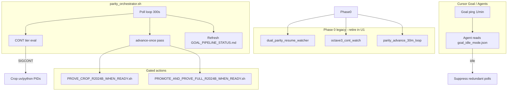

# Parity Automation Loops - Plan

## Goal Capsule

- **Objective:** Consolidate fragmented Mac R2024b parity scratch automation into one orchestrator, tiered CONT policy, and goal-friendly idle mode so LoveSSD crop+full evaluated prove-exact advances with minimal agent spam and no duplicate writers.
- **Authority:** Active goal is Mac R2024b crop + full evaluated prove-exact on LoveSSD. ONE TRUTH Phase 1 closure on Windows claim roots is unchanged. This plan owns scratch automation only.
- **Stop when:** Single orchestrator runs advance+CONT+prove/promote wiring; agents honor `goal_idle_mode.json`; dashboard refreshes from live status; ce-optimize first pass (≤4 iterations) records improved CONT latency or documents 8GB tier-2 policy as the fix.
- **Execution profile:** code — scratch scripts first; optional small package hooks only if shared helpers are needed.
- **Hard stops:** Do not kill running MATLAB 27486 or crop writers. Do not promote oracles. Do not mark Cursor goal complete. Do not overwrite frozen claim roots (`180709_E_crop_M_v2`, `180709_E_full_v2`, `crop_M_exact_v3`, `canonical_full_v18`).

---

## Product Contract

### Summary

Mac R2024b parity automation grew as overlapping shell watchers under `workspace/scratch/`. Three loops poll every 180–1800s with duplicated CONT logic. Cursor goal API pings every minute with no pause API; repo-local throttle exists but agents still spam. On 8GB RAM, CONT policy `(free>45% OR free_mb>100) AND octave>=3` may never fire while MATLAB Energy is alive; sequential fallback (CONT on MATLAB exit) works but is easy to miss in ops.

This plan delivers a unified orchestrator stub (Phase 0 shipped), goal idle contract, tiered CONT policy, consolidated prove/promote wiring, dashboard auto-refresh, and GUI loop integration — tuned via ce-optimize spec `parity-loop-tuning`.

### Problem Frame

| Pain | Impact |
|------|--------|
| Fragmented watchers (`dual_parity_resume_watcher`, `octave3_cont_watch`, `parity_advance_30m_loop`) | Redundant polls, PID file races, duplicated Python CONT eval |
| Cursor goal 1/min pings | Agent noise while waiting on MATLAB octave 3 |
| RAM policy deadlock on 8GB | CONT blocked forever while MATLAB alive even after octave≥3 |
| Stale dashboard | `GOAL_PIPELINE_STATUS.md` manual; `poll_sec` drift (720 vs 300) |
| GUI loop RAM skip | Streamlit heartbeat skips ticks silently under pressure |

### Requirements

**Orchestration**

- R1. One orchestrator entry point (`workspace/scratch/parity_orchestrator.sh`) owns poll scheduling and delegates advance passes until legacy watchers are retired.
- R2. Orchestrator must not kill or replace running watcher PIDs during Phase 0 cutover.
- R3. Prove and promote actions remain idempotent one-shot scripts; orchestrator invokes them only through existing gates.

**CONT policy**

- R4. CONT stays `sigcont_in_process` only; `do_not_resume_exact_run_on_cont` remains true.
- R5. Tier-1 (unchanged): hold CONT while MATLAB alive, octave < 3, or intentional_stop without matlab_dead branch.
- R6. Tier-2 (new): after octave ≥ 3, allow CONT on relaxed memory floor (e.g. `free_mb > 50`) when tier-1 never fires on 8GB hosts — configurable in `PYTHON_STOP_CONT_POLICY.json`.
- R7. Tier-3 (unchanged): immediate CONT when full MATLAB `vectorize_180709_E_full` exits or crashes.

**Goal / agent idle**

- R8. `goal_idle_mode.json` declares idle state, wake conditions, and suppress/allow lists for Cursor goal pings.
- R9. Agents read `goal_idle_mode.json` and `GOAL_AGENT_THROTTLE.json` before parity polls; recommended interval ≥900s while idle.
- R10. Idle mode does not mark goal complete and does not disable automation watchers.

**Dashboard**

- R11. `GOAL_PIPELINE_STATUS.md` regenerates from `RESUME_LIVE_STATUS.json`, policy JSON, and process sample on orchestrator tick.
- R12. Status JSON fields reflect actual poll intervals (no hardcoded drift).

**GUI integration**

- R13. Streamlit GUI heartbeat reads orchestrator idle/RAM state; skip reason logged to `STREAMLIT_GUI_LOOP.json`.
- R14. GUI loop remains subordinate to parity (no app launch while MATLAB hungry).

**Safety**

- R15. No duplicate `resume-exact-run` on crop dest while writer lease or intentional_stop chain is alive.
- R16. Frozen claim roots and oracle paths are never overwritten by automation.

### Scope Boundaries

**In scope:** `workspace/scratch/*.sh`, scratch JSON status files, ce-optimize tuning spec, optional `scripts/monitor/` helper for dashboard refresh.

**Deferred:** Package-level parity CLI changes, Streamlit feature work beyond RAM-aware skip, replacing Cursor goal API behavior.

**Outside identity:** Phase 1 ONE TRUTH updates, oracle promotion decisions, MATLAB batch content.

### Acceptance Examples

- AE1. **Idle agent ping**
  - **Covers:** R8, R9
  - **Given:** `goal_idle_mode.json` has `"idle": true` and MATLAB octave 2
  - **When:** Cursor goal fires a poll
  - **Then:** Agent reads idle file, skips redundant status scrape, does not launch subagents or CONT

- AE2. **MATLAB dead CONT**
  - **Covers:** R7, R4
  - **Given:** crop PIDs stopped (T), intentional_stop true, MATLAB PID gone
  - **When:** orchestrator advance-once runs
  - **Then:** `kill -CONT` on policy targets; `intentional_stop` cleared; no new resume-exact-run

- AE3. **Tier-2 CONT on 8GB**
  - **Covers:** R6
  - **Given:** octave 3+, free_pct 35%, free_mb 55, MATLAB alive
  - **When:** tier-2 enabled in policy
  - **Then:** CONT allowed; crop runs alone after SIGCONT

---

## Planning Contract

### Key Technical Decisions

- KTD1. **Phased orchestrator cutover.** Phase 0 stub delegates to `dual_parity_resume_watcher.sh advance-once` without stopping legacy PIDs. Phase 1 merges CONT eval from `octave3_cont_watch.sh` into orchestrator and retires redundant loops. (session-settled: user-directed — chosen over big-bang kill-and-replace: running MATLAB/crop jobs must survive.)
- KTD2. **Tiered CONT policy in JSON.** Extend `PYTHON_STOP_CONT_POLICY.json` with `cont_tiers`: `strict` (current), `octave3_relaxed_mb` (tier-2), `matlab_dead_immediate` (tier-3). Single Python eval function shared by orchestrator. Governs R4–R7.
- KTD3. **Repo-local goal idle contract.** Cursor goal API has no pause; `goal_idle_mode.json` + throttle JSON are the agent-readable workaround. Orchestrator updates `idle` flag when CONT gate or prove gate changes. Governs R8–R10.
- KTD4. **Dashboard as generated artifact.** `refresh_goal_pipeline_status.sh` (or orchestrator inline) renders markdown from JSON mirrors; manual edits discouraged. Governs R11–R12.
- KTD5. **ce-optimize serial tuning.** First pass max 4 iterations, mutable scratch only, measure via `parity_loop_measure.sh`. Governs tuning loop for poll intervals and tier-2 thresholds.

### High-Level Technical Design

**Sequencing:** U3 (idle) and Phase 0 stub → U2 (CONT tiers) → U1 (orchestrator merge) → U5 (prove wiring) → U4 (dashboard) → U6 (GUI) → ce-optimize iterations.

### Assumptions

- LoveSSD remains mounted at `/Volumes/LoveSSD/slavv2python`.
- Full MATLAB batch `batch_260831-211917` (or successor) continues Energy octaves without operator kill.
- Bootstrap crop oracle vs promoted crop oracle fingerprint mismatch remains solved via SIGCONT-only resume (no force-rerun-from energy on CONT).

### Risks

| Risk | Mitigation |
|------|------------|
| Killing legacy watchers mid-MATLAB FFT | Phase 0 stub only; U1 documents PID retirement after batch completes |
| Tier-2 CONT OOM during concurrent MATLAB+crop | Tier-2 optional; default off until ce-optimize validates; tier-3 still matlab_dead |
| Duplicate resume-exact-run | degenerate gate in optimize spec; orchestrator checks lease + intentional_stop |

---

## Implementation Units

### U1. Single orchestrator (merge watchers)

- **Goal:** Replace three overlapping poll loops with one orchestrator after Phase 0 validation.
- **Requirements:** R1, R2, R15
- **Files:** `workspace/scratch/parity_orchestrator.sh`, `workspace/scratch/dual_parity_resume_watcher.sh`, `workspace/scratch/octave3_cont_watch.sh`, `workspace/scratch/parity_advance_30m_loop.sh`
- **Approach:** Phase 0 stub exists. U1 inlines `poll_eval` from octave watch + `run_advance_pass` from dual watcher; add `ORCHESTRATOR_MODE=primary` env to skip legacy PID writes; retire legacy loops only when operator confirms MATLAB/crop safe window.
- **Test Scenarios:**
  - Dry-run: `bash workspace/scratch/parity_orchestrator.sh status` lists legacy PIDs without side effects.
  - `bash workspace/scratch/parity_orchestrator.sh once` exits 0 while legacy watchers still running.
  - No second `resume-exact-run` PID after once pass (pgrep count ≤2 for crop dest).
- **Verification:** Manual pgrep audit; log lines in `parity_orchestrator.log`.

### U2. Tiered CONT policy

- **Goal:** Prevent 8GB RAM deadlock after octave≥3 while preserving tier-1 safety during early Energy.
- **Requirements:** R4, R5, R6, R7
- **Files:** `workspace/scratch/PYTHON_STOP_CONT_POLICY.json`, shared eval in orchestrator / dual watcher
- **Approach:** Add `cont_tiers.octave3_relaxed_mb: { min_free_mb: 50, require_octave: 3 }`; extract duplicated Python from `octave3_cont_watch.sh` and `dual_parity_resume_watcher.sh` into `workspace/scratch/_parity_cont_eval.py`; both call shared module until U1 merge.
- **Test Scenarios:**
  - Mock policy JSON with octave=3, free_mb=55, free_pct=30 → eval returns ALLOW tier-2.
  - Mock matlab_dead → ALLOW tier-3 regardless of RAM.
  - Mock octave=2 → HOLD tier-1.
- **Verification:** `python3 workspace/scratch/_parity_cont_eval.py --dry-run` (to be added in U2).

### U3. Goal-friendly idle mode

- **Goal:** Stop agent poll spam while automation holds CONT gate.
- **Requirements:** R8, R9, R10
- **Files:** `workspace/scratch/goal_idle_mode.json`, `workspace/scratch/GOAL_AGENT_THROTTLE.json`, `AGENTS.md` optional one-line pointer
- **Approach:** Shipped `goal_idle_mode.json`. Orchestrator sets `idle: true` when intentional_stop && crop stat T && !CROP_PROVE_DONE; sets `idle: false` on CONT or prove flag. Align throttle `next_manual_poll_after` with recommended 900s interval.
- **Test Scenarios:**
  - Agent prompt: "check goal" with idle true → response cites idle file, no slavv launch.
  - After CONT in log → orchestrator clears idle (manual JSON update until U1 wires auto).
- **Verification:** File present; agents instructed in `agent_instructions` block.

### U4. Dashboard auto-refresh

- **Goal:** Keep `GOAL_PIPELINE_STATUS.md` synchronized with live JSON without manual edits.
- **Requirements:** R11, R12
- **Files:** `workspace/scratch/GOAL_PIPELINE_STATUS.md`, new `workspace/scratch/refresh_goal_pipeline_status.sh`, `dual_parity_resume_watcher.sh` write_status
- **Approach:** Script reads `RESUME_LIVE_STATUS.json`, `PYTHON_STOP_CONT_POLICY.json`, `goal_idle_mode.json`, `STREAMLIT_GUI_LOOP.json`; renders markdown template matching current dashboard sections. Hook from orchestrator once pass. Fixed `poll_sec: $POLL_SEC` in write_status (quick win applied).
- **Test Scenarios:**
  - Run refresh script → markdown updated_at advances; poll_sec matches watcher POLL_SEC.
  - Diff shows no manual PID table drift vs RESUME_LIVE_STATUS.
- **Verification:** `grep poll_sec workspace/scratch/RESUME_LIVE_STATUS.json` equals 300.

### U5. Prove/promote wiring consolidation

- **Goal:** Single code path invokes crop prove and full promote scripts when gates pass.
- **Requirements:** R3, R15, R16
- **Files:** `workspace/scratch/PROVE_CROP_R2024B_WHEN_READY.sh`, `workspace/scratch/PROMOTE_AND_PROVE_FULL_R2024B_WHEN_READY.sh`, orchestrator
- **Approach:** Already centralized in `run_advance_pass`; document call graph; remove dead `crop_prove_when_ready.sh` waiter from default path (keep file, add DEPRECATED header); ensure advance-once never overwrites watcher PID file (patched: advance-once skips PIDFILE write).
- **Test Scenarios:**
  - Missing checkpoints → prove script exits 0 WAIT, no prove-exact invoked.
  - `CROP_PROVE_DONE.flag` present → prove script skips.
- **Verification:** Log inspection; lock file prevents duplicate prove.

### U6. GUI loop integration

- **Goal:** Streamlit heartbeat respects orchestrator idle and RAM policy consistently.
- **Requirements:** R13, R14
- **Files:** `workspace/scratch/streamlit_gui_heartbeat.sh`, `workspace/scratch/STREAMLIT_GUI_LOOP.json`
- **Approach:** Heartbeat reads `goal_idle_mode.json` and `RESUME_LIVE_STATUS.json` ram_action; if idle && MATLAB alive && free_pct < 35, skip with reason `parity_idle_and_ram`; surface skip in GUI loop JSON for dashboard section.
- **Test Scenarios:**
  - Dry-run heartbeat with mock low RAM → action skipped_for_ram in JSON.
  - idle false + RAM ok → tick proceeds (read-only ops only).
- **Verification:** `STREAMLIT_GUI_LOOP.json` action field after tick.

---

## Verification Contract

| Check | Command / artifact | When |
|-------|-------------------|------|
| Measure harness | `bash workspace/scratch/parity_loop_measure.sh` | Before/after each ce-optimize iteration |
| Orchestrator status | `bash workspace/scratch/parity_orchestrator.sh status` | After U1 changes |
| CONT dry-run | `python3 workspace/scratch/_parity_cont_eval.py --dry-run` | After U2 (when added) |
| Dashboard sync | `grep poll_sec workspace/scratch/RESUME_LIVE_STATUS.json` | After U4 |
| No duplicate writers | `pgrep -fc 'resume-exact-run.*crop_M_r2024b'` ≤ 2 | Every advance pass |
| Idle contract | `test -f workspace/scratch/goal_idle_mode.json` | U3 |
| Optimize spec valid | `.context/compound-engineering/ce-optimize/parity-loop-tuning/spec.yaml` | Part B complete |

No pytest required for scratch-only shell changes. Do not run prove-exact or promote-oracle as part of plan verification unless checkpoints exist.

---

## Definition of Done

**Global**

- Phase 0 orchestrator stub and `goal_idle_mode.json` exist and are documented in dashboard.
- ce-optimize spec and measure harness committed under `.context/` and `workspace/scratch/`.
- No running MATLAB/crop jobs were killed during implementation.
- Frozen claim roots untouched.

**Per unit**

| Unit | Done when |
|------|-----------|
| U1 | Legacy loops retired OR documented blockers; single poll owner |
| U2 | Tier-2 policy opt-in tested on mock; shared eval module |
| U3 | Idle JSON auto-updated by orchestrator |
| U4 | Dashboard refresh script runs on orchestrator tick |
| U5 | Prove/promote call graph documented; no PID file clobber |
| U6 | GUI heartbeat reads idle + RAM consistently |

**Cleanup:** Remove experimental duplicate poll loops and dead `_patch_cont_policy.py` after U1 merge; do not leave three watchers running indefinitely after cutover.

---

## Appendix

### Current automation inventory (2026-09-01)

| Script | Poll | Role |
|--------|------|------|
| `dual_parity_resume_watcher.sh` | 300s | Status JSON, CONT, prove, promote, recover |
| `octave3_cont_watch.sh` | 180s | CONT gate duplicate |
| `parity_advance_30m_loop.sh` | 1800s | advance-once delegate |
| `PROVE_CROP_R2024B_WHEN_READY.sh` | one-shot | Crop prove-exact |
| `PROMOTE_AND_PROVE_FULL_R2024B_WHEN_READY.sh` | one-shot | Full promote + prove |
| `streamlit_gui_heartbeat.sh` | 7200s | GUI ops tick |

### Quick wins applied (Part C)

- `workspace/scratch/goal_idle_mode.json` — agent idle contract
- `workspace/scratch/parity_orchestrator.sh` — Phase 0 stub
- `workspace/scratch/parity_loop_measure.sh` — ce-optimize measure harness
- Fixed `poll_sec` hardcode 720 → `$POLL_SEC` in `dual_parity_resume_watcher.sh` write_status

### ce-optimize

- Spec: `.context/compound-engineering/ce-optimize/parity-loop-tuning/spec.yaml`
- Serial mode, max 4 iterations, primary metric minimize `primary_metric_value` from measure harness

### Sources

- `workspace/scratch/GOAL_PIPELINE_STATUS.md`
- `workspace/scratch/RESUME_LIVE_STATUS.json`
- `workspace/scratch/PYTHON_STOP_CONT_POLICY.json`
- `AGENTS.md` parity workflows and learned preferences (LoveSSD, frozen roots, detached jobs)
