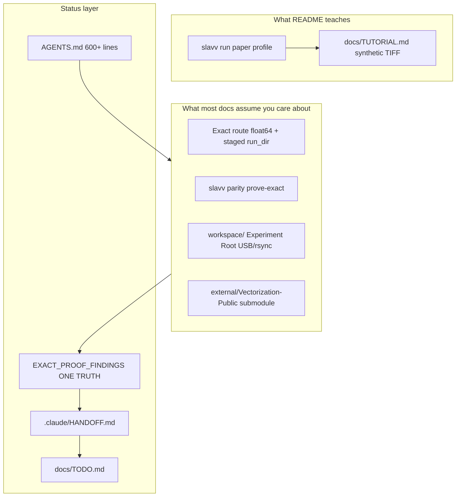

# New engineer confusion map

[Up: Reference Docs](../README.md) · [Documentation Index](../../README.md) · [AGENTS.md § Work Decision Tree](../../../AGENTS.md#-work-decision-tree)

## In short

You can `pip install` and `slavv run` in an hour. That path is the **paper**
product demo. Most of the repo docs, `workspace/`, and `slavv parity` exist for
a separate **exact-route certification** track (MATLAB-faithful, float64,
staged run dirs, oracles). **Pick a track below** — then follow the first-week
path. Live pass/fail is always [ONE TRUTH](EXACT_PROOF_FINDINGS.md#one-truth--phase-1-parity-validated-from-disk), not this file.

If you clone without USB/rsync of Experiment Root binaries, parity commands will
fail until `slavv parity inspect-experiment-root` passes. That is expected.

### Pick your track

| If you want to… | Start here | Skip for now |
|-----------------|------------|--------------|
| Run the pipeline, add features, use Streamlit | [Product path](#product-engineer-run-pipeline-add-feature) | `workspace/`, ONE TRUTH, HANDOFF |
| Prove MATLAB parity, run exact route, operate dests | [Parity path](#parity--exact-route-engineer) | Investigations diary, ADR v5/v6 addenda |

**Paper = product demo.** **Exact = certification / science truth.** They share a repo but not the same profile, edge discovery, or proof gates ([STRATEGY.md](../../../STRATEGY.md)).

### On this page

1. [Two products, one README](#1-two-products-one-readme-highest-confusion)
2. [Documentation surface area](#2-documentation-surface-area-vs-one-front-door-very-high)
3. [Domain language](#3-domain-language-wall-very-high)
4. [Experiment Root / clone](#4-experiment-root-and-clone-completeness-very-high-practical)
5. [Run dirs and versioning](#5-run-directory-layout-and-versioning-high)
6. [Code navigation](#6-code-navigation-where-is-the-pipeline-high)
7. [Status semantics](#7-status-semantics-closed-but-not-100-high)
8. [MATLAB submodule](#8-matlab-submodule-and-parity-rule-medium-high)
9. [Tooling footguns](#9-tooling-footguns-medium)
10. [What works well](#10-what-is-not-confusing-credit-where-due)
- [First-week paths](#first-week-paths) · [Bottom line](#bottom-line)

---

## Mental model



---

## 1. Two products, one README (highest confusion)

**What you see:** [README.md](../../../README.md) leads with `slavv run`, paper profile, synthetic tutorial.

**What the lab built:** A MATLAB-faithful **exact route** (`float64`, `[Y,X,Z]` Fortran tie-breaking, watershed discovery, `slavv parity`) certified on full volume `180709_E`. Paper profile is **not** certified at the same bar.

**Why it hurts:** Bug fixes on `slavv run` may not touch the exact route (different profile, edge discovery, energy backend, proof gates — [ADR 0011](../../adr/0011-energy-float-certification-policy.md) / [ADR 0012](../../adr/0012-edge-watershed-parity-bar.md)). “Shipped” and “100%” are different bars ([QUICK_REFERENCE.md](../../QUICK_REFERENCE.md) plain-English table).

---

## 2. Documentation surface area vs. one front door (very high)

**What you see:** Short README, then [docs/README.md](../../README.md) authority map (~15 canonical homes), [AGENTS.md](../../../AGENTS.md) (600+ lines, 40+ glossary terms), [HANDOFF.md](../../../.claude/HANDOFF.md), [TODO.md](../../TODO.md), [ONE TRUTH](EXACT_PROOF_FINDINGS.md), ADRs, plans, investigations, solutions, `.claude/` skills.

**Why it hurts:** The map is honest (“ONE TRUTH wins”) but teaches bureaucracy before code. Hard to tell operator runbooks from historical diary, live terms from closed residual classes, or whether `.claude/` is human-required.

**What works:** [docs/README.md](../../README.md) authority map + [FOLDER_PURPOSE_GUIDE.md](FOLDER_PURPOSE_GUIDE.md) if you already know you are doing parity. For product work: [TUTORIAL.md](../../TUTORIAL.md) + [TECHNICAL_ARCHITECTURE.md](TECHNICAL_ARCHITECTURE.md).

**Trap:** [investigations/](../../investigations/) and [exact-proof-findings-diary](../../investigations/exact-proof-findings-diary/README.md) read like current status; they are archaeology (v6/v10/v16/v17, retired 80% crop gate).

---

## 3. Domain language wall (very high)

| Term | New engineer guess | Actual meaning |
|------|-------------------|----------------|
| **Candidate Set** vs **Edge Set** | synonyms | Raw watershed emission vs finalized edges after selection/cleanup |
| **Claimed Trace Energy** | logging detail | Ranking surface for Edge Selection; wrong provenance = wrong pairs shipped |
| **Oracle** | test mock | Preserved MATLAB truth vectors under `workspace/oracles/` |
| **Certification** vs **Stretch** | both “parity” | Close enough to ship (allclose + ADR 0012 bars) vs identical last digits |
| **Parity Experiment** vs **prove-exact** | same thing | Cheap same-class compare vs full coordinator after checkpoints exist |
| **Experiment Root** | “the repo” | `workspace/` binaries; **not** in GitHub; USB/rsync after clone |
| **dest / claim run root / crop guard** | folder names | Named run dirs (`canonical_full_v18`, `crop_M_exact_v3`, …) with different roles |

Canonical definitions: [AGENTS.md § Domain Glossary](../../../AGENTS.md#domain-glossary). Browsable mirror: [GLOSSARY.md](GLOSSARY.md). Use as reference, not a day-one read.

---

## 4. Experiment Root and clone completeness (very high, practical)

**Git gives you:** Code, docs, proof JSON, manifests, Vectorization-Public gitlink.

**Git does not give you:** Multi-GB checkpoints, oracles, datasets under [workspace/](../../../workspace/README.md).

**First-week failure mode:** Run parity from docs → missing checkpoint errors → assume the project is broken.

After USB/rsync of Experiment Root binaries:

```powershell
pip install -e ".[app,workspace]"
slavv parity inspect-experiment-root
```

Freeze JSON `do_not_overwrite` is [LIVE_DEST_NAMES](../../../slavv_python/analytics/parity/constants.py) only; writer blocklist `PROTECTED_DEST_NAMES` also includes historical `canonical_full_v16`. See [Experiment Root](../../../AGENTS.md#experiment-root).

---

## 5. Run directory layout and versioning (high)

Staged layout (`00_Refs/`, `01_Params/`, `02_Output/.../checkpoints/`, `04_Edges/candidates.pkl`, `99_Metadata/`) is the real API between stages — not `slavv_output/` from the tutorial.

**Version soup:** `canonical_full_v4` (Energy proof archive), `v16` (historical fail), `v18` (claim), `crop_M_exact` (retired) vs `crop_M_exact_v3` (live guard), `crop_M_stretch_engine_v2` (stretch). Live names: ONE TRUTH only.

**Proof JSON pairing:** A proof under one folder may describe another dest ([Parity Experiments](../../../AGENTS.md#parity-experiments)). Use `slavv parity inspect-proof`.

---

## 6. Code navigation: where is “the pipeline”? (high)

| Entry | Role |
|-------|------|
| `SlavvPipeline` + `slavv run` | Public CLI ([TECHNICAL_ARCHITECTURE.md](TECHNICAL_ARCHITECTURE.md)) |
| `EnergyManager`, `VertexManager`, `EdgeManager`, `NetworkManager` | Stage lifecycle + checkpoints |
| `slavv_python/pipeline/slavv_vectorize.py` | High-level facade (exact parity lives in stage managers + `matlab_get_*`) |
| `pipeline/*/matlab_get_*.py` | MATLAB-shaped parity ports |
| `slavv_python/analytics/parity/` | Proof harness (`slavv parity`) |
| `scripts/` | Developer probes (HANDOFF); not public CLI |

Exact-route behavior is policy-driven (`pipeline/policy.py`). Parity tests may assume workspace artifacts you do not have on a fresh clone.

---

## 7. Status semantics: CLOSED but not 100% (high)

README: **Phase 1 CLOSED** — close enough to ship, not identical last digits.

Also: stretch Energy on crop is **`blocked_float_path`**; [TODO.md](../../TODO.md) has open stretch rows; [HANDOFF.md](../../../.claude/HANDOFF.md) operating sequence A is stretch isolation.

| Question | Answer |
|----------|--------|
| Phase 1 certification? | Yes (ONE TRUTH) |
| Stretch / identical last digits? | No (stretch subsection + dest `stretch_status.json`) |
| Paper profile certified? | Not yet ([STRATEGY.md](../../../STRATEGY.md)) |

---

## 8. MATLAB submodule and parity rule (medium-high)

[external/Vectorization-Public](../../../external/Vectorization-Public) is canonical MATLAB source. Parity is proved against **executed oracles**, not transpilers ([Exact MATLAB Parity Rule](../../../AGENTS.md#exact-matlab-parity-rule)).

Do not diff production parity against uncommitted local `.m` edits. Optional watershed trace hooks: [matlab-watershed-env-trace-hooks.md](../../solutions/parity/matlab-watershed-env-trace-hooks.md) (re-apply patch; do not commit into submodule).

---

## 9. Tooling footguns (medium)

- PowerShell-first; `.venv\Scripts\slavv.exe` after `pip install -e .`
- `slavv jobs list` can hang; prefer run-dir `parity_job.pid`, lease, `slavv monitor --once`
- Long exact Energy: joblib `Done N tasks` log leads `resume_state.json`
- Energy shape `(512,64,512)` on full volume = orientation bug, not float noise
- Ruff `target-version` in `pyproject.toml` may differ from Python 3.11+ docs

---

## 10. What is not confusing (credit where due)

- [README.md](../../../README.md) repo table + Experiment Root pointer
- [workspace/README.md](../../../workspace/README.md) staged layout, `slavv parity`, LIVE vs PROTECTED dest note
- [docs/README.md](../../README.md) authority map + deprecated surfaces
- [QUICK_REFERENCE.md](../../QUICK_REFERENCE.md) Oracle/Crop/Stretch plain English
- [TUTORIAL.md](../../TUTORIAL.md) — explicitly not the MATLAB proof track
- [ONE TRUTH](EXACT_PROOF_FINDINGS.md) once you are on the parity track

---

## First-week paths

### Product engineer (run pipeline, add feature)

~Day 1–3 · no Experiment Root required

1. [TUTORIAL.md](../../TUTORIAL.md) → [TECHNICAL_ARCHITECTURE.md](TECHNICAL_ARCHITECTURE.md)
2. One stage manager + `tests/unit/pipeline/` tests for that stage
3. Ignore `workspace/` and ONE TRUTH until touching parity-sensitive code (energy, vertices, edges, network)

### Parity / exact-route engineer

~Day 1 · need Experiment Root on disk before `prove-exact`

1. [QUICK_REFERENCE.md](../../QUICK_REFERENCE.md) plain-English section
2. [ONE TRUTH](EXACT_PROOF_FINDINGS.md) → [HANDOFF.md](../../../.claude/HANDOFF.md)
3. USB/rsync Experiment Root → `slavv parity inspect-experiment-root` (see [§4](#4-experiment-root-and-clone-completeness-very-high-practical))
4. [AGENTS.md § Domain Glossary](../../../AGENTS.md#domain-glossary) as reference
5. [Cheap Parity Ladder](../../../AGENTS.md#cheap-parity-ladder) before any full-volume writer

### Do not read first

- [investigations/](../../investigations/) diary and ADR addenda with v5/v6 ops names
- [UNPRODUCTIVE_LOOPS.md](UNPRODUCTIVE_LOOPS.md) until you need “what not to redo”

---

## Bottom line

The hardest parts are **(1)** two products in one repo, **(2)** parity vocabulary and filesystem culture, **(3)** status spread across ONE TRUTH / HANDOFF / TODO / AGENTS, and **(4)** an intentionally incomplete clone without Experiment Root binaries. Pick a track first; the codebase is navigable once you do.

---

## Maintainers

When updating this map: run the [Docs Link Auditor](../../../.claude/agents/docs-link-auditor.agent.md) on links you touch; use [consolidate-concepts](../../../.claude/skills/consolidate-concepts/SKILL.md) if terminology drifts from AGENTS.md / GLOSSARY.md. Live status stays in [ONE TRUTH](EXACT_PROOF_FINDINGS.md) only — do not freeze KPIs or dest names here.
